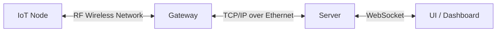
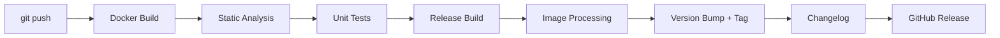

# Park Sense — Full-Stack IoT Parking Occupancy System

**An end-to-end embedded systems project: from system planning and hardware selection, through layered firmware architecture and cybersecurity, to CI/CD pipelines and a live dashboard.**

---
## 1. Purpose

Demonstrate a complete, industry-standard embedded development lifecycle — not just code, but the **planning, architecture decisions, security implementation, and automation** that professional embedded teams deliver.

### Who Is This For?

| Audience                             | What You'll Find                                                             |
| ------------------------------------ | ---------------------------------------------------------------------------- |
| **Hiring managers / Embedded roles** | Layered firmware architecture, HAL abstraction, secure boot, CI/CD pipeline  |
| **Master's admissions committees**   | Systems-level thinking, requirement traceability, architecture documentation |
| **Students & engineers**             | A reference on how to build a complete embedded solution from scratch        |

---

## 2. Portfolio Scope

This project demonstrates stages of professional embedded development:

### A) Planning & Documentation

- Development Guidelines
- System Requirements Specification (SyRS)
- Hardware selection and trade-off analysis
- Firmware architecture design
- System and interface diagrams

### B) Implementation

- Hardware integration and bring-up
- Portable, hardware-agnostic firmware (layered architecture)
- Embedded cybersecurity (secure boot, signed images, encrypted communication)

### C) CI/CD Pipeline

- Build automation
- Static analysis
- Unit testing
- Firmware image processing: binary signing, CRC, versioning, and metadata injection into the image header
- Automatic semantic version bump from commit types (Conventional Commits)
- Auto-generated CHANGELOG from commit history
- Automated release publishing and artifact delivery

> **Note:** A Python server and React dashboard are included to demonstrate end-to-end integration. The primary focus of this portfolio is the embedded system itself.

---

## 3. Application Overview

IoT sensor nodes are deployed in parking spaces. Each node detects whether its space is **occupied** or **unoccupied** and broadcasts its state wirelessly to a gateway. The gateway relays all parking space states to a server, and a dashboard displays real-time lot availability.



---

## 4. Repository Structure

```
parksense/
├── firmware/
│   ├── libs/
│   │   └── STM32CubeU5/    # git submodule — ST HAL + BSP + Network Library
│   ├── targets/            # Per-binary entry points (node / gateway / bootloader)
│   └── src/                # Shared modules compiled into all applicable targets
├── tools/             # Code signing, header injection, version generation
├── server/            # Python Flask backend (parking occupancy server)
├── gui/               # React dashboard
├── docs/              # All design documentation
├── .github/
├── .gitmodules        # Submodule entries (STM32CubeU5)
├── .gitignore
├── LICENSE
└── README.md
```

---

## 5. Firmware Architecture

> Sensor node and gateway share the same source tree. Compile-time macros (`TARGET_NODE` / `TARGET_GATEWAY`) select the appropriate build configuration, enabling code reuse.

**Key design principles:**
- **Portability** — Swapping a sensor or RF module requires only a new driver at Layer 3; Layers 4–5 remain unchanged.
- **Abstraction** — Application code never touches hardware registers directly.
- **Scalability** — New sensor types or radio protocols plug in through the driver API.
### 5.1 Sensor Node

```
┌─────────────────────────────────────────────────────────────────┐
│  LAYER 5 — APPLICATION                                          │
│  main.c — Super loop: Init → [Wake → Detect → Encrypt → TX →    │
│  RX ACK (10 ms) → Sleep (30 s)] → repeat                        │
├───────────────────────────────┬─────────────────────────────────┤
│  LAYER 4a — PARKING DETECTION │  LAYER 4b — COMMUNICATIONS      │
│  MODULE (PDM)                 │  PROTOCOL MODULE (CPM)          │
├───────────────────────────────┼─────────────────────────────────┤
│  LAYER 3a — SENSOR DRIVER API │  LAYER 3b — RF DRIVER API       │
├──────────────┬────────────────┼─────────────────────────────────┤
│ ToF          │ Magnetometer   │ RF Module                       │
│ driver       │ driver         │ driver                          │
│ (I2C)        │ (I2C)          │ (BLE 5.4 / Thread / Zigbee)     │
├──────────────┴────────────────┴─────────────────────────────────┤
│  LAYER 2 — BOOTLOADER                                           │
├─────────────────────────────────────────────────────────────────┤
│  LAYER 1 — HAL / BSP / Crypto                                   │
├─────────────────────────────────────────────────────────────────┤
│  LAYER 0 — HARDWARE                                             │
│  MCU 32 bits    │ RF Module        │ Magnetometer │ Battery     │
│  (ArmCortex)    │ (BLE/Thread/Zig) │ + ToF        │             │
└─────────────────────────────────────────────────────────────────┘
```

### 5.2 Gateway

```
┌─────────────────────────────────────────────────────────────────┐
│  LAYER 5 — APPLICATION                                          │
│  main.c — Super loop: Init → [RX from nodes → Decrypt →         │
│  Forward to server → TX ACK] → repeat                           │
├─────────────────────────────────────────────────────────────────┤
│  LAYER 4 — COMMUNICATIONS PROTOCOL MODULE (CPM)                 │
├────────────────────────────────┬────────────────────────────────┤
│  LAYER 3b — RF DRIVER API      │  LAYER 3c — NETWORK DRIVER API │
│  (node ↔ gateway link)         │  (gateway ↔ server link)       │
├────────────────────────────────┼────────────────────────────────┤
│ RF Module                      │ Wifi module   │ Ethernet module│
│ driver                         │ driver        │ driver         │
│ (BLE 5.4 / Thread / Zigbee)    │ (WiFi / SPI)  │ (Ethernet/SPI) │
├────────────────────────────────┴────────────────────────────────┤
│  LAYER 2 — BOOTLOADER                                           │
├─────────────────────────────────────────────────────────────────┤
│  LAYER 1 — HAL / BSP / Crypto                                   │
├─────────────────────────────────────────────────────────────────┤
│  LAYER 0 — HARDWARE                                             │
│  MCU 32 bits    │ RF Module        │ Ethernet Module │ Power    │
│  (ArmCortex)    │ (BLE/Thread/Zig) │ + Wifi Module   │          │
└─────────────────────────────────────────────────────────────────┘
```

### 5.3 Module Responsibilities

| Module                             | Layer | Target         | Key Responsibilities                                                                                                                                                                                                                                |
| ---------------------------------- | ----- | -------------- | --------------------------------------------------------------------------------------------------------------------------------------------------------------------------------------------------------------------------------------------------- |
| **HAL / BSP**                      | 1     | Node + Gateway | Peripheral init (clocks, GPIO, SPI, I2C, timers); low-power mode control; hardware crypto access (AES, RNG, PKA); TrustZone / MPU configuration; board-specific pin mapping                                                                         |
| **Bootloader**                     | 2     | Node + Gateway | Power-on self-test; CRC and FW signature verification; secure boot chain enforcement; image slot management (primary / fallback); jumps to application on success                                                                                   |
| **RF Driver**                      | 3b    | Node + Gateway | Hardware-specific RF driver; exposes `rf_api.h` to upper layers. Node: STM32WB5MMGH6TR as Zigbee SED. Gateway: STM32WB5MMGH6TR as Zigbee Coordinator.                                                                                               |
| **Network Driver**                 | 3c    | Gateway only   | Abstract `net_api.h` interface with two compile-time implementations: `wifi_driver.c` (EMW3080B via STM32_Network_Library, Phase 1) and `eth_driver.c` (WIZnet W5500 via ioLibrary, Phase 2). Selected via `-DNET_TRANSPORT_WIFI` / `-DNET_TRANSPORT_ETHERNET`. CPM calls `NET_connect / NET_send / NET_recv` — transport is invisible to upper layers. |
| **Sensor Drivers**                 | 3a    | Node only      | VL53L5CX ToF driver (I2C), IIS2MDCTR magnetometer driver (I2C); expose `sensor_api.h` to PDM.                                                                                                                                                        |
| **Parking Detection Module (PDM)** | 4a    | Node only      | Occupancy state machine (IDLE → DETECTING → OCCUPIED / UNOCCUPIED); sensor fusion via Sensor Driver API (ToF distance + magnetometer field strength); threshold calibration.                                                                        |
| **Comm. Protocol Module (CPM)**    | 4b    | Node + Gateway | Packet assembly / disassembly; AES-128/256 payload encryption; CRC computation and validation; TX/RX sequencing; ACK / NACK handling; retransmission policy; replay protection; mutual authentication handshake.                                    |
| **Application**                    | 5     | Node + Gateway | Super loop orchestration; system init sequence; power management strategy (wake → detect → transmit → sleep); fault handling and recovery; watchdog management                                                                                      |

---

## 6. Tech Stack

| Component       | Technology                                                  |
| --------------- | ----------------------------------------------------------- |
| MCU             | STM32U585AII6Q (Cortex-M33, TrustZone) — B-U585I-IOT02A Kit |
| ToF Sensor      | VL53L5CXV0GC/1                                              |
| Magnetometer    | IIS2MDCTR                                                   |
| RF / Wireless   | STM32WB5MMGH6TR (BLE 5.4 / Thread / Zigbee)                 |
| Gateway Network | EMW3080B (Phase 1 — WiFi / SPI) / WIZnet W5500 breakout (Phase 2 — Ethernet / SPI) |
| Compiler        | `arm-none-eabi-gcc` 13.x (free, open-source)                |
| Build System    | CMake ≥ 3.25 + Ninja                                        |
| Static Analysis | cppcheck                                                    |
| Unit Testing    | Unity + CMock                                               |
| Containers      | Docker (reproducible builds — same image in local + CI)     |
| CI/CD           | GitHub Actions                                              |
| Server          | TBD                                                         |
| UI              | TBD                                                         |

---

## 7. Cybersecurity

| Feature                 | Description                                           |
| ----------------------- | ----------------------------------------------------- |
| Secure Boot             | Verified boot chain via bootloader signature check    |
| Signed Firmware Images  | Binary signing with asymmetric keys before deployment |
| Encrypted Communication | Payload encryption over RF link (AES-128/256)         |
| Firmware Integrity      | CRC and version metadata embedded in image header     |

---

## 8. CI/CD Pipeline

> Full details: [[1.7-build-and-cicd]]

All builds run inside a Docker container (`parksense-build`) to guarantee reproducibility across local WSL and GitHub Actions runners.



| Stage            | Tool                                 | Gate Rule                                                                   |
| ---------------- | ------------------------------------ | --------------------------------------------------------------------------- |
| Static Analysis  | cppcheck                             | Any error → pipeline stops                                                  |
| Unit Tests       | Unity + CMock                        | Any failure → pipeline stops                                                |
| Release Build    | CMake + arm-none-eabi-gcc            | Parallel: `TARGET_NODE` + `TARGET_GATEWAY`. Any warning → fails (`-Werror`) |
| Image Processing | `inject_header.py` + `sign_image.py` | Prepend 256-byte header (version, CRC-32, ECDSA P-256 signature)            |
| Version Bump     | Conventional Commits analysis        | `fix:` → PATCH, `feat:` → MINOR, `BREAKING CHANGE:` → MAJOR                 |
| Changelog        | `gen_changelog.py`                   | Auto-generated from commit history between tags                             |
| Release          | GitHub Actions                       | Tag + publish signed `.bin` artifacts for both targets                      |

---

## 9. Documentation

| Document                                 | Description                                  |
| ---------------------------------------- | -------------------------------------------- |
| System Architecture Diagrams             | High-level system and interface diagrams     |
| System Requirements Specification (SyRS) | Functional and non-functional requirements   |
| Hardware Architecture                    | MCU selection rationale, schematic, BOM      |
| Firmware Architecture                    | Layer-by-layer design documentation          |
| — Bootloader                             | Secure boot flow, image validation           |
| — HAL / BSP                              | Peripheral abstraction layer specification   |
| — Drivers                                | Sensor and RF driver API documentation       |
| — Comm. Protocol Module (CPM)            | Packet assembly, encryption, ACK/NACK, retransmission, replay protection, mutual auth |
| — Parking Detection Module               | Detection algorithm and state machine        |
| — Application                            | Super loop design, power management strategy |

---

## 10. Getting Started

> **Hardware bring-up and toolchain setup instructions will be added once the custom PCB is ready.**

```bash
# Clone the repository
git clone https://github.com/AVargas-C/park_sense.git
cd park_sense

# Fetch submodules:
git submodule sync --recursive
git submodule update --init --recursive
```

---

## 11. Project Status & Roadmap

> **Current phase: Architecture** — Completing design documentation before implementation begins.

| #   | Milestone                    | Description                                                                                             | Status         |
| --- | ---------------------------- | ------------------------------------------------------------------------------------------------------- | -------------- |
| 1   | System Requirements (SyRS)   | Functional & non-functional requirements                                                                | ✅ Done         |
| 2   | Hardware Selection           | MCU, sensor, RF module trade-off analysis                                                               | ✅ Done         |
| 3   | Firmware Architecture Design | Layer definitions, API contracts, state machines, cybersecurity                                         | ✅ Done         |
| 4   | Design Documentation         | Complete remaining design docs (BSP/HAL, power management, network driver, OTA) before any code         | 🔄 In Progress |
| 5   | HAL / BSP                    | STM32CubeU5 integration; clock tree, pin table, peripheral ownership for custom PCB                     | ⬜ Not Started  |
| 6   | CI/CD Build Pipeline         | CMake build + static analysis + unit test stages; enables continuous validation from this point forward | ⬜ Not Started  |
| 7   | Bootloader                   | Secure boot chain, ECDSA P-256 image validation, OTA slot swap — board-start verification               | ⬜ Not Started  |
| 8   | Sensor Drivers               | VL53L5CX (ToF) + IIS2MDCTR (magnetometer)                                                               | ⬜ Not Started  |
| 9   | Parking Detection Module     | Occupancy FSM, sensor fusion, threshold calibration                                                     | ⬜ Not Started  |
| 10  | RF Drivers                   | STM32WB5MMGH6TR Zigbee SED (Node) / Coordinator (Gateway)                                               | ⬜ Not Started  |
| 11  | Communication Layer (CPM)    | Packet assembly, AES encryption, ACK/retry, replay protection                                           | ⬜ Not Started  |
| 12  | Application Layer            | Super loop, power management, watchdog, full node + gateway integration                                 | ⬜ Not Started  |
| 13  | CI/CD Full Pipeline          | Image signing, version bump, changelog, GitHub Release artifacts                                        | ⬜ Not Started  |
| 14  | Server & UI                  | Python Flask backend + React dashboard                                                                  | ⬜ Not Started  |

---

## License

This project is licensed under the **Apache License 2.0**.
See the [LICENSE](LICENSE) file for full terms.
