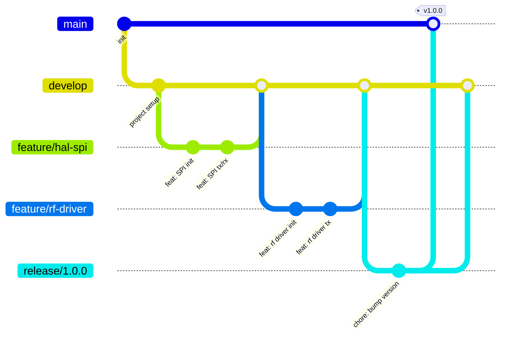

# 1. Version Control & Branching
> **Project:** ParkSense — Full-Stack IoT Parking Occupancy System
> **Date:** 2026-01-24
> **Author:** Arturo Vargas Cuevas
> **↑ Parent:** [[1-development-guidelines]]
---
## Branch Model

This project uses a simplified **Git Flow** model adapted for a solo/small-team embedded project.



## Branch Naming

| Prefix | Purpose | Example |
|---|---|---|
| `main` | Production-ready releases (tagged) | `main` |
| `develop` | Integration branch for ongoing work | `develop` |
| `feature/` | New functionality | `feature/hal-spi-driver` |
| `bugfix/` | Fix for a bug found during development | `bugfix/sensor-i2c-timeout` |
| `hotfix/` | Urgent fix applied directly to `main` | `hotfix/crc-calculation-fix` |
| `release/` | Stabilization before a tagged release | `release/1.0.0` |

**Rules:**
- Use lowercase, hyphen-separated names: `feature/parking-detection-fsm`
- Keep names short but descriptive
- Include the layer or module when relevant: `feature/layer3-tof-driver`

## Merge Strategy

**Rebase before merge** — keeps a linear, readable history.

```bash
# On your feature branch, before merging into develop:
git fetch origin
git rebase origin/develop
# Resolve conflicts if any, then:
git checkout develop
git merge feature/your-branch --no-ff
```

- `--no-ff` creates a merge commit so the feature boundary is visible in history.
- Never rebase `main` or `develop` after they've been pushed.

## Commit Conventions

All commits follow **[Conventional Commits](https://www.conventionalcommits.org/)**.

The commit message should be structured as follows:

```
<type>[optional scope]: <description>

[optional body]

[optional footer(s)]
```

The commit contains the following structural elements, to communicate intent to the consumers of your library:

| Type | When to Use | Example |
|---|---|---|
| `feat` | New feature or functionality | `feat(hal): add SPI DMA transfer support` |
| `fix` | Bug fix | `fix(rf-driver): correct RF module CE pin timing` |
| `refactor` | Code restructure, no behavior change | `refactor(cal): simplify TX packet builder` |
| `chore` | Build scripts, config, tooling | `chore(cmake): add static analysis target` |
| `docs` | Documentation only | `docs(readme): update firmware architecture diagram` |
| `test` | Adding or updating tests | `test(parking): add unit tests for FSM transitions` |
| `style` | Formatting, whitespace (no logic change) | `style(hal): fix indentation in gpio.c` |
