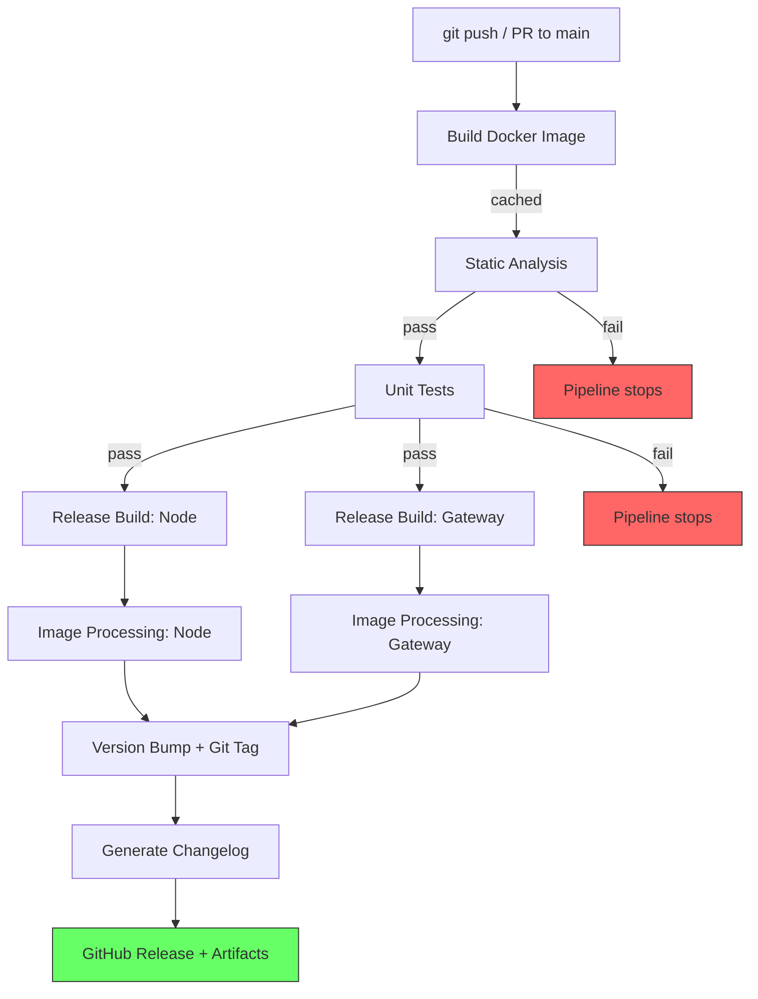

# 7. Build & CI/CD
> **Project:** ParkSense — Full-Stack IoT Parking Occupancy System
> **Date:** 2026-01-31
> **Author:** Arturo Vargas Cuevas
> **↑ Parent:** [[1-development-guidelines]]
---

## Design Goals

| Principle               | Implementation                                                                                                   |
| ----------------------- | ---------------------------------------------------------------------------------------------------------------- |
| **No IDE dependency**   | No vendor IDE, no autogenerated code. All source — startup, HAL, drivers, bootloader, application — is hand-written and version-controlled. |
| **No vendor lock-in**   | Free, open-source toolchain only (`arm-none-eabi-gcc`, CMake, Ninja).                                            |
| **Reproducible builds** | Docker container pins every toolchain version. Builds on any machine with Docker — local and CI are identical.    |
| **Single source tree**  | One repo, two firmware targets (`TARGET_NODE` / `TARGET_GATEWAY`) selected at CMake configure time.              |
| **Automated pipeline**  | GitHub Actions: build → analyze → test → version → sign → changelog → release. No manual steps after `git push`. |

---

## 1. Toolchain

| Tool                   | Version (pinned in Docker) | Purpose                                                     |
| ---------------------- | -------------------------- | ----------------------------------------------------------- |
| `arm-none-eabi-gcc`    | 13.x                       | Cross-compiler for Arm Cortex-M MCU                          |
| `arm-none-eabi-newlib` | matched to GCC              | C library (nano variant for size-optimized builds)           |
| CMake                  | ≥ 3.25                     | Meta-build system                                            |
| Ninja                  | ≥ 1.11                     | Build backend (faster than Make)                             |
| `gcc` (host)           | matched to system           | Native host compiler for unit tests                          |
| cppcheck               | ≥ 2.13                     | Static analysis                                              |
| Unity + CMock          | latest                     | Unit testing framework (C, embedded-friendly)                |
| Python 3               | ≥ 3.10                     | Image processing scripts (CRC, signing, header injection)    |
| `openocd`              | ≥ 0.12                     | On-chip debug (not in Docker — runs on host WSL)             |
| Docker                 | ≥ 24.x                     | Containerized build environment                              |
| GitHub Actions         | —                          | CI/CD runner                                                 |

---

## 2. Development Environment

```
┌─────────────────────────────────────────────────────┐
│  Windows Host                                       │
│  ┌───────────────────────────────────────────────┐  │
│  │  WSL 2 (Ubuntu)                               │  │
│  │  ┌─────────────────────────────────────────┐  │  │
│  │  │  Docker Container (parksense-build)     │  │  │
│  │  │  arm-none-eabi-gcc + CMake + Ninja      │  │  │
│  │  │  cppcheck + Unity/CMock + Python 3      │  │  │
│  │  └─────────────────────────────────────────┘  │  │
│  │  openocd (host-side — USB passthrough)        │  │
│  │  VSCode (Remote-WSL)                          │  │
│  └───────────────────────────────────────────────┘  │
└─────────────────────────────────────────────────────┘
```

**Local workflow:** Developer runs builds inside Docker via a wrapper script (`./build.sh`). OpenOCD and GDB run on the WSL host for on-chip debugging (Docker has no USB access). VSCode connects to WSL via Remote-WSL extension.

---

## 3. Docker Build Environment

The Dockerfile installs all build-time dependencies in a single image. The image is used identically in local development and in GitHub Actions runners — guaranteeing that a local build matches a CI build byte-for-byte (deterministic builds).

**Location:** `firmware/docker/Dockerfile`

**Contents:**

| Layer       | What it installs                                           |
| ----------- | ---------------------------------------------------------- |
| Base image  | Ubuntu 22.04 (LTS, minimal)                               |
| System      | `build-essential`, `wget`, `git`, `ninja-build`, `python3` |
| ARM GCC     | `arm-gnu-toolchain` (pinned version via build arg)         |
| CMake       | Pinned version installed from official release             |
| Test        | Unity + CMock cloned from upstream                         |
| Python deps | `pycryptodome`, `intelhex` (for image processing scripts)  |

> **Implementation note:** The Dockerfile, build wrapper script, and all Docker usage commands will be implemented alongside the first firmware build.

---

## 4. CMake Build System

### 4.1 Source Tree Layout

> Full directory detail is in [[1.3-project-structure]]. This is the CMake-relevant subset.

```
firmware/
├── cmake/
│   ├── arm-cortex-m.cmake            # Cross-compilation toolchain file
│   └── version.cmake                 # Version extraction from Git tags
├── docker/
│   └── Dockerfile
├── libs/
│   └── vendor_sdk/                   # Vendor HAL, BSP, network library (git submodule)
├── targets/                          # Per-binary entry points
│   ├── node/        main_node.c      # Layer 5 — Node super loop
│   ├── gateway/     main_gw.c        # Layer 5 — Gateway super loop
│   └── bootloader/  btl_main.c      # Layer 2 — Bootloader entry
├── src/                              # Shared modules compiled into applicable targets
│   ├── bsp/                          # Project BSP — wraps vendor HAL (Layer 1)
│   ├── drivers/
│   │   ├── sensor/                   # Sensor drivers (Layer 3a)
│   │   ├── rf/                       # RF module driver (Layer 3b)
│   │   └── net/                      # Network driver: WiFi / Ethernet (Layer 3c)
│   ├── cpm/                          # Communications Protocol Module (Layer 4b)
│   ├── pdm/                          # Parking Detection Module (Layer 4a)
│   ├── bootloader/                   # Bootloader logic (Layer 2)
│   └── ota/                          # OTA update module
├── include/                          # Shared public headers
├── test/
│   ├── mocks/                        # CMock-generated mocks from driver API headers
│   ├── unity/                        # Unity + CMock (git submodule)
│   └── CMakeLists.txt
├── tools/
│   ├── sign_image.py                 # ECDSA P-256 firmware signing
│   ├── inject_header.py              # Version + CRC + signature → image header
│   └── gen_changelog.py              # Changelog generation from Conventional Commits
├── build.sh                          # Docker wrapper script
└── CMakeLists.txt                    # Root CMake file
```

### 4.2 Toolchain File

A CMake toolchain file (`cmake/arm-cortex-m.cmake`) configures the cross-compilation environment:

| Setting                    | Value                                              |
| -------------------------- | -------------------------------------------------- |
| System                     | `Generic` (bare-metal, no OS)                      |
| C / ASM compiler           | `arm-none-eabi-gcc`                                |
| CPU flags                  | MCU-specific — confirmed after hardware selection (e.g., `-mcpu=<target> -mthumb -mfpu=<fpu> -mfloat-abi=hard`) |
| Section optimization       | `-fdata-sections -ffunction-sections`              |
| Warnings                   | `-Wall -Wextra -Werror`                            |
| Linker                     | `--gc-sections -specs=nano.specs -specs=nosys.specs` |


### 4.3 Build Matrix

Two dimensions: **Target** × **Build Type**

| Build Type  | Compiler Flags                    | Linker Script          | Output                          | Purpose                                      |
| ----------- | --------------------------------- | ---------------------- | ------------------------------- | --------------------------------------------- |
| **Test**    | `-O0 -g` (host compiler, not ARM) | N/A (host executable)  | `build/test/test_runner`        | Unit tests + static analysis (host-compiled)  |
| **Debug**   | `-Og -g3 -DDEBUG`                 | `mcu_*.ld`             | `build/debug/parksense_*.elf`   | On-chip debugging via OpenOCD / GDB           |
| **Release** | `-Os -DNDEBUG -flto`              | `mcu_*.ld`             | `build/release/parksense_*.bin` | Signed, CRC'd production firmware             |

| Target       | CMake Define       | Preprocessor Macro | Compiled modules                         |
| ------------ | ------------------ | ------------------ | ---------------------------------------- |
| **IoT Node** | `-DTARGET=NODE`    | `TARGET_NODE`      | vendor_sdk (HAL), bsp, drivers/sensor, drivers/rf, pdm, cpm, ota |
| **Gateway**  | `-DTARGET=GATEWAY` | `TARGET_GATEWAY`   | vendor_sdk (HAL), bsp, drivers/rf, drivers/net, cpm, ota |
| **Bootloader** | `-DTARGET=BTL`   | `TARGET_BOOTLOADER`| vendor_sdk (HAL), bsp, src/bootloader |

### 4.4 Build Wrapper Script

A shell script (`build.sh`) wraps Docker + CMake into a single command:

```
Usage: ./build.sh <target> <build_type>

  ./build.sh node debug       → cross-compiled, debug symbols
  ./build.sh gateway release  → cross-compiled, signed binary
  ./build.sh test test        → host-compiled, runs unit tests
```

The wrapper selects the appropriate CMake toolchain file (ARM cross for node/gateway, host native for test), target defines, and build directory.

---

## 5. Static Analysis

Static analysis runs in the **Test** build stage, before unit tests. Both tools execute inside the Docker container.

| Tool         | Scope                        | Configuration                                                    |
| ------------ | ---------------------------- | ---------------------------------------------------------------- |
| `cppcheck`   | All `.c` / `.h` under `src/` | `--enable=all --error-exitcode=1 --suppress=missingIncludeSystem` |
| GCC warnings | Full source tree             | `-Wall -Wextra -Werror -Wpedantic -Wshadow -Wconversion`         |

**Gate rule:** Any cppcheck error or GCC warning-as-error fails the pipeline. No artifacts are produced.

---

## 6. Unit Testing

### 6.1 Framework: Unity + CMock

| Component | Role                                                     |
| --------- | -------------------------------------------------------- |
| **Unity** | Lightweight C test runner (single `.c`/`.h`, no OS dep.) |
| **CMock** | Auto-generates mock functions from header files           |

Tests compile and run on the **host** (native `gcc`, not ARM), using mocked HAL/BSP/driver interfaces. This enables testing PDM logic, CPM packet assembly, CRC computation, and state machines without hardware.

### 6.2 Test Coverage Plan

| Test File                        | Module Under Test | What It Validates                          |
| -------------------------------- | ----------------- | ------------------------------------------ |
| `test_pdm_state_machine.c`       | PDM               | Occupancy state transitions                |
| `test_cpm_packet_assembly.c`     | CPM               | Packet build / parse / CRC                 |
| `test_cpm_encryption.c`          | CPM               | AES encrypt/decrypt round-trip             |
| `test_cpm_retransmission.c`      | CPM               | Retransmission policy / ACK handling       |
| `test_bootloader_crc.c`          | Bootloader        | CRC-32 on image slot                       |

Mocked interfaces:

| Mock                         | Replaces                          |
| ---------------------------- | --------------------------------- |
| `mock_sensor_driver_api.c`   | ToF + magnetometer driver API     |
| `mock_rf_driver_api.c`       | RF module driver API              |
| `mock_hal_crypto.c`          | Hardware crypto accelerator API   |

**Gate rule:** Any test failure fails the pipeline. No version bump, no artifacts.

---

## 7. Version Management

### 7.1 Semantic Versioning from Conventional Commits

Version is derived automatically from Git tags and commit history. No manual version editing.

| Commit Prefix      | Version Increment | Example                                              |
| ------------------ | ----------------- | ---------------------------------------------------- |
| `fix:`             | PATCH             | `fix: correct CRC endianness` → 1.2.**3**            |
| `feat:`            | MINOR             | `feat: add magnetometer fusion` → 1.**3**.0           |
| `BREAKING CHANGE:` | MAJOR             | `BREAKING CHANGE: new packet format` → **2**.0.0      |

### 7.2 Version Injection

CMake extracts the version from the latest Git tag at configure time and generates a `version_config.h` header with `FW_VERSION_MAJOR`, `FW_VERSION_MINOR`, `FW_VERSION_PATCH`, and `FW_VERSION_STRING` defines. This header is included by the application and embedded into the firmware image header.

---

## 8. Firmware Image Processing Pipeline

After a successful Release build, three post-processing steps produce the final deployable binary.

```
parksense_<target>.elf
        |
        v
  +──────────────+
  | objcopy      |  --> parksense_<target>.bin (raw binary)
  +──────┬───────+
         |
         v
  +──────────────+
  | inject_header|  --> Prepend 256-byte image header
  |  .py         |     (version, target ID, build metadata)
  +──────┬───────+
         |
         v
  +──────────────+
  | sign_image   |  --> Calculate CRC-32 over image body
  |  .py         |     Sign with ECDSA P-256 private key
  +──────┬───────+     Write CRC + signature into header
         |
         v
  parksense_<target>_v<M.m.p>_signed.bin  (release artifact)
```

### 8.1 Image Header Format

The first 256 bytes of the binary image are reserved for the firmware header. The bootloader reads this header to validate the image before jumping to the application.

| Offset | Size (bytes) | Field                                            |
| ------ | ------------ | ------------------------------------------------ |
| 0x00   | 4            | Magic number (0x504B5346 — "PKSF")               |
| 0x04   | 1            | Version Major                                    |
| 0x05   | 1            | Version Minor                                    |
| 0x06   | 2            | Version Patch                                    |
| 0x08   | 4            | Image size (bytes, excluding header)             |
| 0x0C   | 4            | CRC-32 (over image body, excluding header)       |
| 0x10   | 4            | Build timestamp (Unix epoch)                     |
| 0x14   | 1            | Target (0x01 = NODE, 0x02 = GATEWAY)             |
| 0x15   | 1            | Build type (0x01 = Debug, 0x02 = Release)        |
| 0x16   | 2            | Reserved                                         |
| 0x18   | 8            | Git commit hash (first 8 hex chars, ASCII)       |
| 0x20   | 64           | ECDSA P-256 signature (r ∥ s, 32 + 32 bytes)     |
| 0x60   | 160          | Reserved (pad to 256 bytes)                      |

### 8.2 Signing Design

An ECDSA P-256 key pair is generated once and stored securely:
- **Private key** — stored in a GitHub Actions secret (`FIRMWARE_SIGNING_KEY`). Never committed to the repository.
- **Public key** — embedded in the bootloader source at compile time. The bootloader verifies the signature before accepting an image.

The signing script reads the image body (excluding header), signs it with the private key, and writes the 64-byte signature into the header at offset 0x20.

---

## 9. Changelog Generation

Changelog is auto-generated from Conventional Commits between the previous Git tag and HEAD.

**Output format:**

```
## [1.3.0] — 2026-04-03

### Features
- feat: add magnetometer fusion to PDM (#42)
- feat: implement RF sleepy end device polling (#38)

### Bug Fixes
- fix: correct CRC endianness in image header (#41)
- fix: handle ACK timeout in CPM retransmission (#39)
```

A Python script (`tools/gen_changelog.py`) parses `git log` between two tags and groups each commit by its Conventional Commit prefix (`feat:`, `fix:`, `refactor:`, etc.).

---

## 10. GitHub Actions Pipeline

### 10.1 Pipeline Flow



### 10.2 Stage Descriptions

| Stage              | What Happens                                                                                     |
| ------------------ | ------------------------------------------------------------------------------------------------ |
| **Docker Image**   | Build and cache the `parksense-build` image. Rebuilds only when `Dockerfile` changes.            |
| **Static Analysis**| Run `cppcheck` over all source. Any error → pipeline stops.                                      |
| **Unit Tests**     | Build tests with host `gcc` + Unity/CMock. Run all tests via `ctest`. Any failure → pipeline stops. |
| **Release Build**  | Cross-compile both targets (NODE + GATEWAY) in parallel using Release flags (`-Os -flto`).       |
| **Image Processing**| For each target: `objcopy` → `inject_header.py` → `sign_image.py`. Produces signed `.bin`.      |
| **Version Bump**   | Analyze commits since last tag. Bump MAJOR/MINOR/PATCH per Conventional Commits spec. Create Git tag. |
| **Changelog**      | Generate release notes from commits between old and new tag.                                     |
| **GitHub Release** | Publish a GitHub Release with tag, changelog body, and signed `.bin` artifacts for both targets.  |

### 10.3 Gate Rules

| Stage            | Fail Condition              | Effect                              |
| ---------------- | --------------------------- | ----------------------------------- |
| Static Analysis  | Any cppcheck error          | Pipeline stops. No build triggered. |
| Unit Tests       | Any test failure            | Pipeline stops. No build triggered. |
| Release Build    | Compilation error / warning | No artifacts. No release.           |
| Image Processing | Sign/CRC script error       | No artifacts. No release.           |
| Release          | Only on `main` branch push  | PRs get analysis + tests only.      |

### 10.4 PR vs. Main Branch Behavior

| Trigger        | Stages Executed                                                                                                    | Artifacts Published? |
| -------------- | ------------------------------------------------------------------------------------------------------------------ | -------------------- |
| PR to `main`   | Docker → Static Analysis → Unit Tests                                                                              | No                   |
| Push to `main` | Docker → Static Analysis → Unit Tests → Release Build → Image Processing → Version Tag → Changelog → GitHub Release | Yes                  |

---

## 11. Debug Workflow (Local Only)

Debug builds are **not** part of the CI pipeline — they are used locally for on-chip debugging.

```
  Developer workstation (WSL)
         |
         v
  +──────────────+
  | ./build.sh   |  Build inside Docker container
  | node debug   |  (cross-compiled with -Og -g3)
  +──────┬───────+
         |
         v
  +──────────────+
  | openocd      |  Runs on WSL host (USB passthrough to probe)
  +──────┬───────+  Connects to on-chip debug interface
         |
         v
  +──────────────+
  | GDB          |  Loads .elf, sets breakpoints, steps through code
  | (arm-none-   |
  |  eabi-gdb)   |  VSCode Cortex-Debug extension provides GUI
  +──────────────+
```

**VSCode integration:** The Cortex-Debug extension connects to OpenOCD as a GDB server, enabling breakpoints, watch expressions, register views, and peripheral inspection via SVD files — all within the editor.

