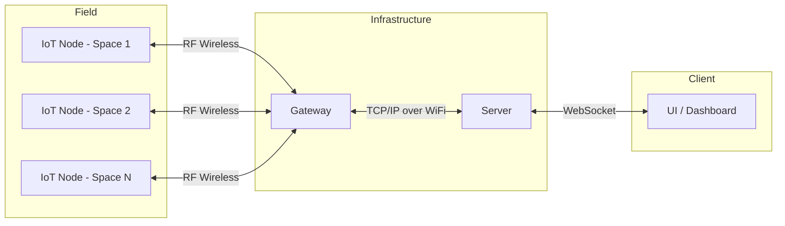

# System Requirements Specification (SyRS)
# Park Sense — Full-Stack IoT Parking Occupancy System

> **Project:** ParkSense — Full-Stack IoT Parking Occupancy System
> **Date:** 2026-02-07
> **Author:** Arturo Vargas Cuevas
> **↑ Parent:** [[README]]

---

## Revision History

| Version | Date       | Author               | Description   |
| ------- | ---------- | -------------------- | ------------- |
| 0.1     | 2026-02-01 | Arturo Vargas Cuevas | Initial draft |
|         |            |                      |               |

---

## 1. Introduction

### 1.1 Purpose

This document defines the system-level requirements for the ParkSense IoT parking occupancy system. It covers functional, performance, interface, security, and physical constraints for all system components: the IoT sensor node, gateway, server, and UI dashboard.

This document follows the IEEE 29148-2018 standard for requirements engineering.

### 1.2 Scope

The ParkSense system monitors parking space occupancy in real time. IoT sensor nodes deployed in individual parking spaces detect occupancy state and communicate wirelessly to a gateway. The gateway forwards aggregated state to a server, which serves real-time data to a web dashboard.

**In scope:**
- IoT sensor node firmware (detection, communication, security, power management)
- Gateway firmware (RF reception, WiFi forwarding, security)
- Server (occupancy state management, WebSocket API)
- UI dashboard (real-time occupancy display)
- CI/CD pipeline (build, test, signing, release)

**Out of scope:**
- Physical installation infrastructure
- Network infrastructure provisioning
- Cloud hosting configuration

### 1.3 Definitions, Acronyms, and Abbreviations

| Term       | Definition                                                               |
| ---------- | ------------------------------------------------------------------------ |
| ACK        | Acknowledgement — positive confirmation of received packet               |
| AES        | Advanced Encryption Standard                                             |
| BLE        | Bluetooth Low Energy                                                     |
| BSP        | Board Support Package                                                    |
| CPM        | Communications Protocol Module — secure RF protocol handler              |
| CRC        | Cyclic Redundancy Check                                                  |
| FSM        | Finite State Machine                                                     |
| GW         | Gateway                                                                  |
| HAL        | Hardware Abstraction Layer                                               |
| IoT        | Internet of Things                                                       |
| MCU        | Microcontroller Unit                                                     |
| NACK       | Negative Acknowledgement                                                 |
| PDM        | Parking Detection Module                                                 |
| RF         | Radio Frequency                                                          |
| RTM        | Requirement Traceability Matrix                                          |
| SyRS       | System Requirements Specification                                        |
| ToF        | Time-of-Flight (distance sensor principle)                               |
| TrustZone  | ARM security extension for hardware-enforced isolation between secure and non-secure domains |
| UI         | User Interface / Web Dashboard                                           |
| HMAC       | Hash-based Message Authentication Code                                   |
| MIC        | Message Integrity Code                                                   |
| PDR        | Packet Delivery Ratio — proportion of packets successfully delivered     |

### 1.4 References

| Reference        | Document                                                    |
| ---------------- | ----------------------------------------------------------- |
| IEEE 29148-2018  | Systems and software engineering — Requirements engineering |
| README.md        | Park Sense project overview and architecture                |
| HW Selection Doc | `docs/3-hardware-selection/`                                |
| Dev Guidelines   | `docs/1-development-guidelines/`                            |

### 1.5 Overview

Section 2 provides system context. Sections 3–7 define requirements by category. Section 8 provides the Requirement Traceability Matrix.

---

## 2. System Overview

### 2.1 System Description

ParkSense is a battery-powered IoT system for real-time parking occupancy monitoring. Sensor nodes are deployed one per parking space. Each node periodically wakes, samples detection sensors, and transmits occupancy state over a wireless RF link to a gateway. The gateway forwards data over WiFi to a server, which pushes state updates to a web dashboard via WebSocket.

### 2.2 System Context

### 2.3 Assumptions and Dependencies

- Each parking space has one sensor node deployed.
- Gateway is mains-powered and continuously available.
- Server is reachable over a local area network or the internet.
- The RF wireless environment is subject to interference but not adversarial jamming beyond replay attacks.
- Battery replacement is performed during scheduled maintenance cycles.

### 2.4 Constraints

#### MCU
- ARM architecture with hardware-enforced security isolation (TrustZone) and a Memory Protection Unit (MPU).
- Hardware cryptographic accelerators: AES, SHA, and PKA (Public Key Accelerator) required — software-only crypto is not acceptable for this application.
- Minimum 512 KB flash storage to accommodate bootloader, application firmware, and OTA image slots.
- Deep sleep capability with a Global Real-Time Clock (RTC) for timed wake-up, enabling the 30-second sampling cycle at minimal power cost.
- Low-power active modes sufficient to sustain target battery life (≥ 5 years on a single charge).

#### Occupancy Detection — Magnetometer
- 3-axis magnetic field sensor capable of detecting ferromagnetic vehicle presence.
- I2C interface.
- Operating range and sensitivity sufficient to discriminate between an occupied and unoccupied space under outdoor magnetic noise conditions.
- Low-power consumption compatible with battery-operated duty-cycled operation.

#### Occupancy Detection — Time-of-Flight (ToF) Sensor
- Multi-zone ranging sensor capable of measuring distance to an object above the sensor (vehicle undercarriage detection).
- I2C interface.
- Range sufficient to cover the clearance height between ground level and the underside of a vehicle (approximately 100–500 mm typical).
- Low-power consumption compatible with battery-operated duty-cycled operation.

#### RF Wireless (Node ↔ Gateway)
- Low-power RF transceiver supporting a standard short-range wireless protocol (e.g., BLE, Thread, or Zigbee).
- Range sufficient to cover the deployment area from node to gateway.
- Compatible with the security requirements defined in Section 7 (encrypted, authenticated communication).

#### Gateway Connectivity
- WiFi transceiver module capable of TCP/IP communication to a server over a standard 2.4 GHz or 5 GHz network.

#### Power
- Sensor node is battery-powered with no wired power connection.
- Power budget constrains RF TX duty cycle, sampling frequency, and sleep current draw.
- Hardware selection shall be validated against the 5-year battery life requirement (SYS-P-004) via power budget analysis.

---

## 3. Stakeholders

| Stakeholder             | Interest / Need                                                      |
| ----------------------- | -------------------------------------------------------------------- |
| Parking facility operator | Real-time visibility of lot occupancy                              |
| End user (driver)       | Accurate dashboard showing available spaces                          |
| Embedded developer      | Clear firmware architecture, portable and maintainable codebase      |
| Security reviewer       | Firmware integrity, encrypted comms, no unauthorized access          |

---

## 4. Functional Requirements

**Numbering convention:** `SYS-F-XXX`
**Priority:** Must / Should / Could / Won't (MoSCoW)
**Verification:** Test (T) | Analysis (A) | Inspection (I) | Demo (D)

### 4.1 Sensor Node

| ID        | Requirement                                                                                           | Priority | Verification |
| --------- | ----------------------------------------------------------------------------------------------------- | -------- | ------------ |
| SYS-F-001 | The node shall detect whether its parking space is **occupied** or **unoccupied**.                    | Must     | T            |
| SYS-F-002 | The node shall use a Time-of-Flight (ToF) distance sensor and a magnetometer for occupancy detection.  | Must     | I            |
| SYS-F-003 | The node shall fuse ToF distance and magnetometer field strength to determine occupancy state.        | Must     | T            |
| SYS-F-004 | The node shall suppress transmission when occupancy state has not changed since the last cycle.       | Should   | T            |
| SYS-F-005 | The node shall execute the following super loop cycle: Wake → Detect → Encrypt → TX → RX ACK → Sleep. | Must     | T            |
| SYS-F-006 | The node shall enter low-power sleep mode between sampling cycles.                                    | Must     | T            |
| SYS-F-007 | The node shall transmit occupancy state to the gateway over the RF wireless link.                     | Must     | T            |
| SYS-F-008 | The node shall wait for an ACK from the gateway after each transmission.                              | Must     | T            |
| SYS-F-009 | The node shall retransmit the packet if no ACK is received within the ACK timeout window.             | Must     | T            |
| SYS-F-010 | The node shall support threshold calibration for occupancy detection.                                 | Should   | T            |

### 4.2 Gateway

| ID          | Requirement                                                                                                  | Priority | Verification |
| ----------- | ------------------------------------------------------------------------------------------------------------ | -------- | ------------ |
| SYS-F-020   | The gateway shall receive occupancy state packets from one or more sensor nodes over the RF wireless link.   | Must     | T            |
| SYS-F-021   | The gateway shall forward received occupancy state to the server over WiFi.                                  | Must     | T            |
| SYS-F-022   | The gateway shall transmit an ACK to the node upon successful packet reception.                              | Must     | T            |
| SYS-F-023   | The gateway shall continuously listen for incoming RF packets without a fixed polling interval.              | Must     | T            |

### 4.3 Server

| ID          | Requirement                                                                                                  | Priority | Verification |
| ----------- | ------------------------------------------------------------------------------------------------------------ | -------- | ------------ |
| SYS-F-030   | The server shall receive occupancy state updates from the gateway.                                           | Must     | T            |
| SYS-F-031   | The server shall maintain the current occupancy state for each parking space.                                | Must     | T            |
| SYS-F-032   | The server shall push state updates to connected UI clients via WebSocket.                                   | Must     | T            |

### 4.4 UI Dashboard

| ID          | Requirement                                                                                                  | Priority | Verification |
| ----------- | ------------------------------------------------------------------------------------------------------------ | -------- | ------------ |
| SYS-F-040   | The UI shall display the real-time occupancy state (occupied / unoccupied) for each parking space.           | Must     | D            |
| SYS-F-041   | The UI shall update the displayed state within 2 seconds of a state change occurring at the node.            | Should   | T            |

---

## 5. Performance Requirements

| ID          | Requirement                                                                                         | Priority | Verification |
| ----------- | --------------------------------------------------------------------------------------------------- | -------- | ------------ |
| SYS-P-001   | The node shall complete one full super loop cycle (wake → detect → TX → sleep) within 1 second.    | Must     | T            |
| SYS-P-002   | The node ACK receive window shall be 10 ms after packet transmission.                               | Must     | T            |
| SYS-P-003   | The node sleep interval between cycles shall be 30 seconds (configurable at compile time).          | Must     | I            |
| SYS-P-004   | The node shall operate on battery for a minimum of 5 years under normal operating conditions.       | Should   | A            |
| SYS-P-005   | The node shall detect an occupancy state change within one sampling cycle (≤ 30 s latency).         | Must     | T            |
| SYS-P-006   | The gateway shall forward a received packet to the server within 500 ms of reception.               | Should   | T            |

---

## 6. Interface Requirements

### 6.1 Node ↔ Gateway (RF Wireless)

#### Network Topology

| ID        | Requirement                                                                                                                                                                                                                                                     | Priority | Verification |
| --------- | --------------------------------------------------------------------------------------------------------------------------------------------------------------------------------------------------------------------------------------------------------------- | -------- | ------------ |
| SYS-I-001 | The RF wireless network shall use a **star topology**: each sensor node communicates directly with a single gateway. Mesh relay operation by sensor nodes is not permitted, in order to preserve node sleep cycles and minimise battery consumption. | Must     | I            |

#### RF Transceiver

| ID        | Requirement                                                                                                                                                         | Priority | Verification |
| --------- | ------------------------------------------------------------------------------------------------------------------------------------------------------------------- | -------- | ------------ |
| SYS-I-002 | The node and gateway shall each include a low-power RF wireless transceiver capable of short-range communication within the deployment area.                         | Must     | I            |
| SYS-I-003 | The RF link shall operate over a standard short-range wireless protocol (e.g., BLE, Thread, or Zigbee). Protocol selection to be confirmed during hardware and firmware architecture phases. | Must     | I            |
| SYS-I-004 | The RF packet shall contain at minimum: node ID, occupancy state, sequence number, and CRC.                                                                         | Must     | I            |

#### Protocol Reliability Requirements

| ID        | Requirement                                                                                                                                                                        | Priority | Verification |
| --------- | ---------------------------------------------------------------------------------------------------------------------------------------------------------------------------------- | -------- | ------------ |
| SYS-I-005 | The CPM shall implement an ACK/NACK mechanism: the gateway shall transmit an ACK upon successful packet reception; absence of ACK shall be treated by the node as a failed delivery. | Must     | T            |
| SYS-I-006 | The CPM shall implement a retransmission policy with a defined backoff strategy on ACK timeout.                                                                                     | Must     | T            |
| SYS-I-007 | All RF packets shall include a CRC field; packets failing CRC validation shall be silently discarded by the receiver.                                                               | Must     | T            |
| SYS-I-008 | The system shall achieve a Packet Delivery Ratio (PDR) of ≥ 98% under normal operating RF conditions.                                                                              | Must     | T            |
| SYS-I-009 | The CPM shall define a maximum retransmission count; if the maximum is reached without ACK, the node shall record the failure and proceed to the sleep phase.                       | Must     | T            |

#### Protocol Performance Requirements

| ID        | Requirement                                                                                                                                                                        | Priority | Verification |
| --------- | ---------------------------------------------------------------------------------------------------------------------------------------------------------------------------------- | -------- | ------------ |
| SYS-I-010 | **Throughput:** The RF link throughput requirement shall be determined during the firmware architecture phase based on packet size and transmission frequency. *(TBD)*              | Must     | A            |
| SYS-I-011 | **Latency:** The end-to-end RF transmission latency (node TX to gateway ACK received) shall be defined during the firmware architecture phase. *(TBD)*                             | Must     | T            |
| SYS-I-012 | **Duty Cycle Compliance:** The node RF transmitter duty cycle shall comply with applicable regional RF regulations (e.g., ISM band duty cycle limits). Specific limit TBD based on selected RF protocol and region. | Must     | A            |
| SYS-I-013 | **Maximum Concurrent Nodes:** The system shall support a minimum number of concurrent sensor nodes per gateway. Specific capacity to be determined during architecture design. *(TBD)* | Must     | T            |

### 6.2 Gateway ↔ Server (Network)

| ID          | Requirement                                                                                         | Priority | Verification |
| ----------- | --------------------------------------------------------------------------------------------------- | -------- | ------------ |
| SYS-I-014   | The gateway shall communicate with the server over TCP/IP via a WiFi module.                        | Must     | T            |
| SYS-I-015   | The gateway-to-server protocol shall be defined during firmware architecture design.                | Must     | I            |

### 6.3 Server ↔ UI (WebSocket)

| ID          | Requirement                                                                                         | Priority | Verification |
| ----------- | --------------------------------------------------------------------------------------------------- | -------- | ------------ |
| SYS-I-020   | The server shall expose a WebSocket interface for real-time state push to UI clients.               | Must     | T            |

### 6.4 Hardware Interfaces (Node)

| ID          | Requirement                                                                                                                    | Priority | Verification |
| ----------- | ------------------------------------------------------------------------------------------------------------------------------ | -------- | ------------ |
| SYS-I-030   | The ToF distance sensor shall interface with the MCU via I2C.                                                                  | Must     | I            |
| SYS-I-031   | The magnetometer shall interface with the MCU via I2C.                                                                         | Must     | I            |
| SYS-I-032   | The RF wireless module shall interface with the MCU via a hardware serial bus (SPI or UART), as defined by the selected module. | Must     | I            |

---

## 7. Security Requirements

| ID          | Requirement                                                                                                        | Priority | Verification |
| ----------- | ------------------------------------------------------------------------------------------------------------------ | -------- | ------------ |
| SYS-S-001   | The bootloader shall verify the digital signature of the firmware image before jumping to the application.         | Must     | T            |
| SYS-S-002   | The firmware image shall be signed with an asymmetric key pair prior to deployment.                                | Must     | I            |
| SYS-S-003   | The bootloader shall reject and halt boot if firmware signature verification fails.                                | Must     | T            |
| SYS-S-004   | The firmware image shall include a CRC and version metadata in its image header.                                   | Must     | T            |
| SYS-S-005   | All RF payloads transmitted between node and gateway shall be encrypted using AES-128 minimum.                     | Must     | I            |
| SYS-S-006   | The CPM shall implement replay protection using a sequence counter; duplicate or replayed packets shall be rejected.| Must     | T            |
| SYS-S-007   | The CPM shall implement mutual authentication between node and gateway before accepting application data.          | Must     | T            |
| SYS-S-008   | The MCU shall configure TrustZone and MPU regions to isolate secure and non-secure execution domains.              | Must     | I            |
| SYS-S-009   | Cryptographic keys shall not be stored in plaintext in firmware or non-volatile memory.                                                                                              | Must     | I            |
| SYS-S-010   | All RF payloads shall include a Message Integrity Code (MIC) or HMAC to detect tampering or corruption in transit.                                                                   | Must     | T            |
| SYS-S-011   | Cryptographic keys shall be managed under a defined key management policy covering: generation, secure storage, distribution, rotation, and revocation.                               | Must     | I            |
| SYS-S-012   | The CPM shall establish a secure session between node and gateway before exchanging application data, including a session key negotiation step.                                        | Must     | T            |
| SYS-S-013   | Node commissioning shall follow a secure enrollment process; an unconfigured node shall not be permitted to join the network without explicit authorization by a trusted authority.    | Must     | I            |

---

## 8. Physical and Environmental Constraints

| ID          | Requirement                                                                                         | Priority | Verification |
| ----------- | --------------------------------------------------------------------------------------------------- | -------- | ------------ |
| SYS-C-001   | The sensor node shall be battery-powered with no wired power connection required.                   | Must     | I            |
| SYS-C-002   | The sensor node shall operate reliably in an outdoor parking environment (temperature, humidity TBD).| Should   | A            |
| SYS-C-003   | The gateway shall be mains-powered and permanently installed.                                       | Must     | I            |

---

## 9. Non-Functional Requirements

| ID          | Requirement                                                                                              | Priority | Verification |
| ----------- | -------------------------------------------------------------------------------------------------------- | -------- | ------------ |
| SYS-NF-001  | Swapping a sensor or RF driver shall require changes only at Layer 3; Layers 4–5 shall remain unchanged. | Must     | I            |
| SYS-NF-002  | Application code shall never access hardware registers directly.                                         | Must     | I            |
| SYS-NF-003  | All C source files shall comply with MISRA-C guidelines as enforced by static analysis.                  | Should   | T            |
| SYS-NF-004  | The firmware build system shall produce a reproducible binary given the same source and toolchain.       | Should   | T            |
| SYS-NF-005  | All firmware modules shall have unit tests executable on the host (no hardware required).                | Should   | T            |

---

## 10. Requirement Traceability Matrix (RTM)

> **Note:** Implementation and test columns will be populated as the project progresses.

| Req. ID     | Category    | Description (short)                          | Priority | Verification | Impl. Module       | Test / Artifact |
| ----------- | ----------- | -------------------------------------------- | -------- | ------------ | ------------------ | --------------- |
| SYS-F-001   | Functional  | Detect occupied / unoccupied state           | Must     | T            | PDM                | TBD             |
| SYS-F-002   | Functional  | Use ToF sensor + magnetometer                | Must     | I            | Layer 3 Drivers    | TBD             |
| SYS-F-003   | Functional  | Sensor fusion for occupancy                  | Must     | T            | PDM                | TBD             |
| SYS-F-004   | Functional  | Suppress TX on no state change               | Should   | T            | PDM / Application  | TBD             |
| SYS-F-005   | Functional  | Super loop: Wake→Detect→TX→Sleep             | Must     | T            | Application        | TBD             |
| SYS-F-006   | Functional  | Low-power sleep between cycles               | Must     | T            | HAL / Application  | TBD             |
| SYS-F-007   | Functional  | Transmit occupancy state over RF             | Must     | T            | CPM                | TBD             |
| SYS-F-008   | Functional  | Wait for ACK after TX                        | Must     | T            | CPM                | TBD             |
| SYS-F-009   | Functional  | Retransmit on ACK timeout                    | Must     | T            | CPM                | TBD             |
| SYS-F-010   | Functional  | Detection threshold calibration              | Should   | T            | PDM                | TBD             |
| SYS-F-020   | Functional  | Gateway receives RF packets from nodes       | Must     | T            | CPM (GW)           | TBD             |
| SYS-F-021   | Functional  | Gateway forwards state to server             | Must     | T            | Application (GW)   | TBD             |
| SYS-F-022   | Functional  | Gateway sends ACK to node                    | Must     | T            | CPM (GW)           | TBD             |
| SYS-F-023   | Functional  | Gateway continuous RF listening              | Must     | T            | CPM (GW)           | TBD             |
| SYS-F-030   | Functional  | Server receives state from gateway           | Must     | T            | Server             | TBD             |
| SYS-F-031   | Functional  | Server maintains per-space state             | Must     | T            | Server             | TBD             |
| SYS-F-032   | Functional  | Server pushes updates via WebSocket          | Must     | T            | Server             | TBD             |
| SYS-F-040   | Functional  | UI displays occupancy per space              | Must     | D            | UI                 | TBD             |
| SYS-F-041   | Functional  | UI updates within 2 s of state change        | Should   | T            | UI / Server        | TBD             |
| SYS-P-001   | Performance | Full cycle completes within 1 s              | Must     | T            | Application        | TBD             |
| SYS-P-002   | Performance | ACK window: 10 ms post-TX                    | Must     | T            | CPM                | TBD             |
| SYS-P-003   | Performance | Sleep interval: 30 s                         | Must     | I            | Application        | TBD             |
| SYS-P-004   | Performance | Battery life ≥ 5 years                       | Should   | A            | HAL / Application  | TBD             |
| SYS-P-005   | Performance | State change detection latency ≤ 30 s        | Must     | T            | PDM / Application  | TBD             |
| SYS-P-006   | Performance | GW forwards packet within 500 ms             | Should   | T            | Application (GW)   | TBD             |
| SYS-I-001   | Interface   | Network topology: Star                       | Must     | I            | CPM / Application  | TBD             |
| SYS-I-002   | Interface   | RF: low-power short-range transceiver        | Must     | I            | Layer 3 RF Driver  | TBD             |
| SYS-I-003   | Interface   | RF: standard wireless protocol               | Must     | I            | Layer 3 RF Driver  | TBD             |
| SYS-I-004   | Interface   | RF packet structure                          | Must     | I            | CPM                | TBD             |
| SYS-I-005   | Interface   | RF Reliability: ACK/NACK mechanism           | Must     | T            | CPM                | TBD             |
| SYS-I-006   | Interface   | RF Reliability: Retransmission policy        | Must     | T            | CPM                | TBD             |
| SYS-I-007   | Interface   | RF Reliability: CRC error detection          | Must     | T            | CPM                | TBD             |
| SYS-I-008   | Interface   | RF Reliability: PDR ≥ 98%                    | Must     | T            | CPM                | TBD             |
| SYS-I-009   | Interface   | RF Reliability: Max retransmissions defined  | Must     | I            | CPM                | TBD             |
| SYS-I-010   | Interface   | RF Performance: Throughput (TBD)             | Must     | A            | CPM / RF Driver    | TBD             |
| SYS-I-011   | Interface   | RF Performance: Latency (TBD)               | Must     | T            | CPM / RF Driver    | TBD             |
| SYS-I-012   | Interface   | RF Performance: Duty cycle compliance        | Must     | A            | CPM / RF Driver    | TBD             |
| SYS-I-013   | Interface   | RF Performance: Max concurrent nodes (TBD)  | Must     | T            | CPM / RF Driver    | TBD             |
| SYS-I-014   | Interface   | GW→Server over WiFi                          | Must     | T            | Layer 3 WiFi Driver| TBD             |
| SYS-I-015   | Interface   | GW→Server protocol (defined in 5.x)         | Must     | I            | CPM (GW)           | TBD             |
| SYS-I-020   | Interface   | Server WebSocket interface                   | Must     | T            | Server             | TBD             |
| SYS-I-030   | Interface   | ToF sensor on I2C                            | Must     | I            | ToF Driver         | TBD             |
| SYS-I-031   | Interface   | Magnetometer on I2C                          | Must     | I            | Magnetometer Driver| TBD             |
| SYS-I-032   | Interface   | RF module on hardware serial bus             | Must     | I            | RF Driver          | TBD             |
| SYS-S-001   | Security    | Bootloader verifies FW signature             | Must     | T            | Bootloader         | TBD             |
| SYS-S-002   | Security    | FW signed before deployment                  | Must     | I            | CI/CD tools/       | TBD             |
| SYS-S-003   | Security    | Boot halts on signature failure              | Must     | T            | Bootloader         | TBD             |
| SYS-S-004   | Security    | CRC + version in image header                | Must     | T            | CI/CD tools/       | TBD             |
| SYS-S-005   | Security    | RF payload encrypted AES-128 min.            | Must     | I            | CPM                | TBD             |
| SYS-S-006   | Security    | Replay protection via sequence counter       | Must     | T            | CPM                | TBD             |
| SYS-S-007   | Security    | Mutual authentication node ↔ gateway         | Must     | T            | CPM                | TBD             |
| SYS-S-008   | Security    | TrustZone + MPU isolation                    | Must     | I            | HAL / BSP          | TBD             |
| SYS-S-009   | Security    | No plaintext key storage                     | Must     | I            | HAL / Bootloader   | TBD             |
| SYS-S-010   | Security    | MIC/HMAC integrity on RF payloads            | Must     | T            | CPM                | TBD             |
| SYS-S-011   | Security    | Key management policy                        | Must     | I            | CPM / HAL          | TBD             |
| SYS-S-012   | Security    | Secure session establishment                 | Must     | T            | CPM                | TBD             |
| SYS-S-013   | Security    | Commissioning security                       | Must     | I            | CPM / Application  | TBD             |
| SYS-C-001   | Constraint  | Node is battery-powered                      | Must     | I            | Hardware           | TBD             |
| SYS-C-002   | Constraint  | Node operates in outdoor environment         | Should   | A            | Hardware           | TBD             |
| SYS-C-003   | Constraint  | Gateway is mains-powered                     | Must     | I            | Hardware           | TBD             |
| SYS-NF-001  | Non-Func.   | Driver swap at Layer 3 only                  | Must     | I            | All layers         | TBD             |
| SYS-NF-002  | Non-Func.   | No direct register access in app code        | Must     | I            | All layers         | TBD             |
| SYS-NF-003  | Non-Func.   | MISRA-C compliance                           | Should   | T            | All C sources      | TBD             |
| SYS-NF-004  | Non-Func.   | Reproducible builds                          | Should   | T            | CI/CD              | TBD             |
| SYS-NF-005  | Non-Func.   | Host-executable unit tests                   | Should   | T            | All FW modules     | TBD             |
