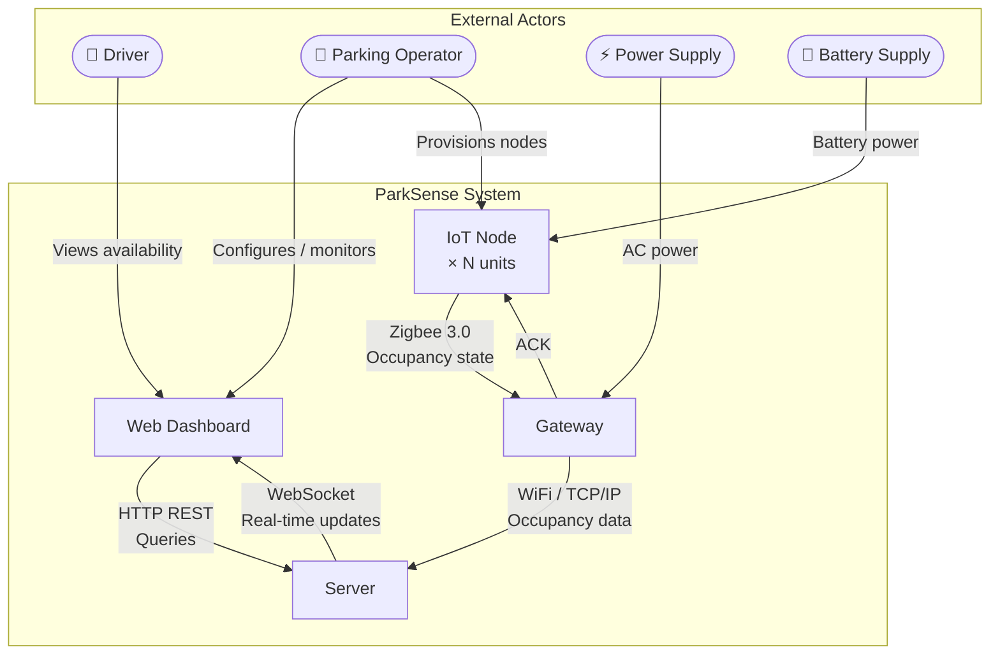

# 4.1 System Context

> **Project:** ParkSense — Full-Stack IoT Parking Occupancy System
> **Date:** 2026-02-28
> **Author:** Arturo Vargas Cuevas
> **↑ Parent:** [[4-system-architecture-design]]

---

## 1. Purpose of This View

The System Context view defines the boundary of the ParkSense system and identifies all external entities (actors and systems) that interact with it. Per IEEE 42010:2011, this view establishes what is inside the system of interest and what exists outside it, forming the basis for all subsequent architectural views.

**Concerns addressed:**
- What does ParkSense do at the system level?
- Who interacts with the system, and how?
- What does the system consume and produce?
- What are the system's external dependencies?

---

## 2. System Boundary Definition

```
┌─────────────────────────────────────────────────────────────────────────┐
│                         PARKSENSE SYSTEM                                │
│                                                                         │
│   ┌────────────┐     Zigbee 3.0     ┌────────────┐    WiFi / TCP/IP     │
│   │  IoT Node  │  ◄────────────────►│  Gateway   │ ────────────────►    │
│   │  (× N)     │    Star topology   │            │                      │
│   └────────────┘                    └────────────┘                      │
│                                                                         │
│   ┌──────────────────────────────────────────────────────────────────┐  │
│   │                        Server                                    │  │
│   └──────────────────────────────────────────────────────────────────┘  │
│                                                                         │
│   ┌──────────────────────────────────────────────────────────────────┐  │
│   │                    Web Dashboard (UI)                            │  │
│   └──────────────────────────────────────────────────────────────────┘  │
│                                                                         │
└──────────────────────────────────────┬──────────────────────────────────┘
                                       │
              External boundary ───────┘
```

Everything inside the dashed rectangle is within the ParkSense system boundary. External actors interact with the system across this boundary.

---

## 3. Context Diagram



---

## 4. External Actors

### 4.1 Human Actors

| Actor | Type | Interaction | Interface |
| ----- | ---- | ----------- | --------- |
| **Driver** | End user | Views real-time parking availability | Web browser → Dashboard |
| **Parking Operator** | Administrator | Monitors lot occupancy; manages nodes and alerts | Web browser → Dashboard |
| **Field Technician** | Installer | Deploys and commissions IoT nodes in parking spaces | Physical proximity + commissioning procedure |

### 4.2 External Systems

| System | Type | Interaction | Protocol |
| ------ | ---- | ----------- | -------- |
| **Power Supply (AC)** | Infrastructure | Provides mains power to the gateway | Physical (AC → DC converter on gateway) |
| **Battery Pack** | Power source | Powers each IoT node autonomously | Physical (battery terminals on node PCB) |
| **Local WiFi Network** | Infrastructure | Carries data from gateway to server | IEEE 802.11 (WiFi) |
| **CI/CD Infrastructure** | Development | Builds, tests, and releases firmware | GitHub Actions + Docker |

---

## 5. System Interface Summary

| Interface | Direction | From | To | Protocol | Description |
| --------- | --------- | ---- | -- | -------- | ----------- |
| **SIF-001** | Bidirectional | IoT Node | Gateway | Zigbee 3.0 (IEEE 802.15.4) | Occupancy state uplink + ACK downlink |
| **SIF-002** | Outbound | Gateway | Server | WiFi / TCP/IP | Aggregated occupancy data |
| **SIF-003** | Bidirectional | Server | Dashboard | WebSocket | Real-time occupancy push |
| **SIF-004** | Inbound | Dashboard | Server | HTTP REST | Historical queries, configuration |
| **SIF-005** | Inbound | Technician | IoT Node | Zigbee commissioning (Install Code) | Secure node onboarding |

Full interface specifications are in [[4.4-interface-architecture]].

---

## 6. System Outputs

| Output | Consumer | Description |
| ------ | -------- | ----------- |
| Parking space occupancy state (OCCUPIED / UNOCCUPIED) | Server → Dashboard | Primary system output. Binary state per space, updated on each change detection. |
| Occupancy timestamp | Server | When the state last changed. |
| Gateway health status | Server | Connectivity watchdog, packet delivery rate. |
| Firmware update artifacts | CI/CD → Devices | Signed `.bin` files for OTA or manual flashing. |

---

## 7. System Inputs

| Input | Source | Description |
| ----- | ------ | ----------- |
| Time-of-Flight distance measurement | VL53L5CX sensor | Proximity reading per parking zone (8×8 grid). |
| Magnetic field vector | IIS2MDCTR magnetometer | Detects ferromagnetic signature of a vehicle. |
| RF uplink packet | Zigbee coordinator | Node-to-gateway occupancy message. |
| WiFi network credentials | Parking operator | Pre-configured in gateway firmware before deployment. |

---

## 8. Assumptions and Constraints

| ID | Statement |
| -- | --------- |
| AC-001 | Each IoT node is deployed in a fixed parking space and does not move after installation. |
| AC-002 | The gateway has access to a local WiFi network with internet connectivity. |
| AC-003 | The parking lot environment is an open surface lot; range ≤ 300 m from gateway to farthest node. |
| AC-004 | Nodes are battery-powered; AC mains is not available at parking spaces. |
| AC-005 | The server is reachable from the gateway over TCP/IP (LAN or internet). |
| AC-006 | The system supports up to 100 IoT nodes per gateway (SYS-I-001). |
| AC-007 | Battery replacement is a maintenance activity accepted by the parking operator (target interval ≥ 5 years). |
