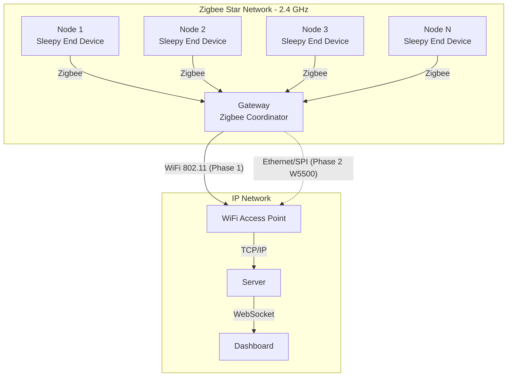

# 4.2 Physical Architecture

> **Project:** ParkSense — Full-Stack IoT Parking Occupancy System
> **Date:** 2026-02-28
> **Author:** Arturo Vargas Cuevas
> **↑ Parent:** [[4-system-architecture-design]]

---

## 1. Purpose of This View

The Physical Architecture view describes how the hardware components of ParkSense are deployed in the real world — the network topology, the physical devices, and the board-level connections within each device. It bridges the system context (what the system does) and the logical architecture (how software is structured) by grounding both in concrete hardware.

**Concerns addressed:**
- What physical hardware makes up the system?
- How are devices connected and where are they deployed?
- What is the on-board component topology of each device type?
- What are the physical communication paths?

---

## 2. Deployment Topology

### 2.1 Parking Lot Overview

```
                           PARKING LOT
 ┌──────────────────────────────────────────────────────────────┐
 │                                                              │
 │  [Node 1]    [Node 2]    [Node 3]    ...    [Node N ≤ 100]  │
 │     │            │           │                    │          │
 │     └────────────┴───────────┴────────────────────┘          │
 │                         Zigbee 3.0                           │
 │                       Star Topology                          │
 │                        (≤ 300 m)                            │
 │                             │                               │
 │                         [Gateway]                           │
 │                             │                               │
 │                         WiFi (TCP/IP)                       │
 │                             │                               │
 └─────────────────────────────┼────────────────────────────── ┘
                               │
                          [Server / Cloud]
                               │
                          [Web Dashboard]
```

### 2.2 Network Topology

**RF Layer (Node ↔ Gateway):** Zigbee 3.0 — IEEE 802.15.4 MAC, star topology.

- The gateway acts as the **Zigbee Coordinator** (PAN coordinator).
- Each IoT node operates as a **Zigbee Sleepy End Device**.
- All nodes communicate directly with the gateway — no mesh routing.
- Maximum 100 end devices per coordinator (SYS-I-001).
- Operating frequency: 2.4 GHz ISM band (channel selection: channels 11–26, IEEE 802.15.4).

**IP Layer (Gateway ↔ Server):** Phase 1 — WiFi 802.11 (EMW3080B, pre-installed on dev kit). Phase 2 — WIZnet W5500 Ethernet breakout (SPI). Both implementations share the same `net_api.h` interface and are selected at compile time via `-DNET_TRANSPORT_WIFI` / `-DNET_TRANSPORT_ETHERNET`.

- **Phase 1 (WiFi):** The gateway connects to a local WiFi access point as a station (STA mode). Data is forwarded to the server via HTTPS over TCP on the EMW3080B’s onboard TCP/IP stack.
- **Phase 2 (Ethernet):** A WIZnet W5500 breakout (SPI) replaces WiFi for a wired uplink. The W5500’s hardware TCP/IP stack (8 sockets) is used via the WIZnet ioLibrary. Eliminates 2.4 GHz co-interference with the Zigbee node link.



---

## 3. IoT Node — Hardware Architecture

### 3.1 Development Board

**Selected board:** B-U585I-IOT02A Discovery Kit (STMicroelectronics)

All hardware components are integrated on a single development board. No external breakout boards are required for Phase 1.

### 3.2 Component Map

```
┌──────────────────────────────────────────────────────────────────────┐
│                    B-U585I-IOT02A (IoT Node)                         │
│                                                                      │
│  ┌──────────────────────┐    I2C1    ┌──────────────────────────┐    │
│  │  STM32U585AII6Q      │ ─────────► │  VL53L5CXV0GC/1          │    │
│  │  Cortex-M33 @ 160MHz │            │  ToF Sensor (8×8 zones)  │    │
│  │  TrustZone + HW Crypt│            └──────────────────────────┘    │
│  │  2 MB Flash, 786KB RAM│                                           │
│  │                      │    I2C1    ┌──────────────────────────┐    │
│  │                      │ ─────────► │  IIS2MDCTR               │    │
│  │                      │            │  3-axis Magnetometer     │    │
│  │                      │            └──────────────────────────┘    │
│  │                      │                                            │
│  │                      │    IPCC    ┌──────────────────────────┐    │
│  │                      │ ─────────► │  STM32WB5MMGH6TR         │    │
│  │                      │  Mailbox   │  Zigbee 3.0 / BLE 5.4   │    │
│  │                      │            │  2.4 GHz radio           │    │
│  └──────────────────────┘            └──────────────────────────┘    │
│                                                                      │
│  Power:  Battery (TBD chemistry) → LDO → 3.3 V rail                 │
└──────────────────────────────────────────────────────────────────────┘
```

### 3.3 Node Component Summary

| Component | Part | Interface | Role |
| --------- | ---- | --------- | ---- |
| Application MCU | STM32U585AII6Q | — (host) | Main processor; runs PDM + CPM + App |
| ToF Sensor | VL53L5CXV0GC/1 | I2C1 | Detects vehicle presence by proximity |
| Magnetometer | IIS2MDCTR | I2C1 | Detects vehicle ferromagnetic signature |
| RF Module | STM32WB5MMGH6TR | IPCC mailbox (internal) | Zigbee 3.0 Sleepy End Device radio |
| Battery | TBD | Power rail | Autonomous power source |

**I2C Bus:** Both VL53L5CX and IIS2MDCTR share I2C1. Each device has a distinct 7-bit address:
- VL53L5CX default: `0x29`
- IIS2MDCTR: `0x1E` (SA0 = 0) or `0x1F` (SA0 = 1)

**STM32WB5MMG Integration:** The STM32WB5MMGH6TR is a dual-core SiP (System-in-Package) soldered onto the B-U585I-IOT02A. The Cortex-M4 RF application core communicates with the STM32U585 via IPCC (Inter-Processor Communication Controller) mailbox over a direct bus connection. The Cortex-M0+ runs the ST Zigbee 3.0 binary stack.

---

## 4. Gateway — Hardware Architecture

### 4.1 Development Board

**Selected board:** B-U585I-IOT02A Discovery Kit (same board as node — single hardware platform for both roles)

The gateway role is selected at compile time via `TARGET_GATEWAY`. Sensors (VL53L5CX, IIS2MDCTR) are not used in gateway mode.

### 4.2 Component Map

```
┌──────────────────────────────────────────────────────────────────────┐
│                   B-U585I-IOT02A (Gateway)                           │
│                                                                      │
│  ┌──────────────────────┐    IPCC    ┌──────────────────────────┐    │
│  │  STM32U585AII6Q      │ ─────────► │  STM32WB5MMGH6TR         │    │
│  │  Cortex-M33 @ 160MHz │  Mailbox   │  Zigbee 3.0 Coordinator │    │
│  │  TrustZone + HW Crypt│            │  2.4 GHz radio           │    │
│  │  2 MB Flash, 786KB RAM│           └──────────────────────────┘    │
│  │                      │                                            │
│  │                      │    SPI2    ┌──────────────────────────┐    │
│  │                      │ ─────────► │  EMW3080B (Phase 1)     │    │
│  │                      │  + IRQ     │  WiFi Module (STA mode) │    │
│  │                      │            │  802.11 b/g/n           │    │
│  │                      │            └──────────────────────────┘    │
│  │                      │   (Phase 2: W5500 breakout wired to same SPI2)     │
│  └──────────────────────┘            └──────────────────────────┘    │
│                                                                      │
│  Power:  USB or external 5 V → 3.3 V rail (AC-powered)              │
└──────────────────────────────────────────────────────────────────────┘
```

### 4.3 Gateway Component Summary

| Component | Part | Interface | Role |
| --------- | ---- | --------- | ---- |
| Application MCU | STM32U585AII6Q | — (host) | Main processor; runs CPM + App; aggregates node data |
| RF Module | STM32WB5MMGH6TR | IPCC mailbox (internal) | Zigbee 3.0 Coordinator radio |
| Network Module (Phase 1) | EMW3080B (MX-WIFI) | SPI2 + IRQ pin | TCP/IP uplink to server via WiFi (pre-installed on dev kit) |
| Network Module (Phase 2) | WIZnet W5500 breakout | SPI2 + IRQ + RST pins | TCP/IP uplink to server via wired Ethernet; eliminates 2.4 GHz co-interference |

**Network Module Interface:** Both Phase 1 (EMW3080B) and Phase 2 (W5500) connect via SPI2 with a dedicated chip-select and IRQ pin. Phase 1: EMW3080B uses ST X-CUBE-MXCHIP middleware at up to 20 MHz, interrupt-driven. Phase 2: W5500 uses WIZnet ioLibrary at up to 80 MHz, INTn pin for packet-received interrupt. The `net_api.h` abstraction layer means the SPI bus assignment and BSP pin mapping are the only differences between the two at the hardware level; all CPM code above remains unchanged.

---

## 5. Physical Constraints

| Constraint | Value | Source |
| ---------- | ----- | ------ |
| Max nodes per gateway (RF) | 100 | SYS-I-001 |
| RF range (open lot) | ≤ 300 m | SYS-P-003 |
| Node battery life target | ≥ 5 years | SYS-C-001 |
| Node operating temperature | −20°C to +70°C | SYS-C-004 |
| Gateway power | AC mains (USB or external) | Deployment constraint |
| Node power | Battery only | SYS-C-003 |

---

## 6. Hardware Portability

The B-U585I-IOT02A is the Phase 1 development platform. The layered firmware architecture (Layer 3 driver API boundary) isolates hardware-specific code. Future hardware variants are accommodated by:

- Replacing `drivers/tof/`, `drivers/magnetometer/`, `drivers/rf/`, `drivers/net/wifi/` or `drivers/net/ethernet/` with new driver implementations
- Updating `bsp/` for pin remapping
- Layers 4 and 5 (PDM, CPM, Application) remain unchanged

The STEVAL-MKBOXPROA (STM32U585AII6 + LIS2MDL + BlueNRG-355AC) is documented as a candidate Phase 2 node platform demonstrating this portability. See [[3.7-board-vs-custom-pcb-selection]].
