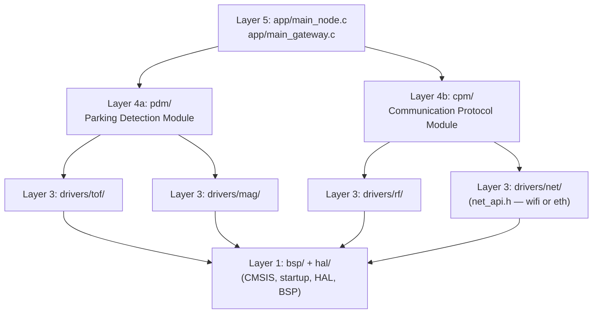

# 4.3 Logical Architecture

> **Project:** ParkSense — Full-Stack IoT Parking Occupancy System
> **Date:** 2026-03-7
> **Author:** Arturo Vargas Cuevas
> **↑ Parent:** [[4-system-architecture-design]]

---

## 1. Purpose of This View

The Logical Architecture view describes how the firmware is organized into software modules and layers. It defines the responsibilities of each layer, the interfaces between layers, and how a single firmware codebase produces two distinct targets — the IoT Node and the Gateway — through compile-time selection.

**Concerns addressed:**
- What software modules exist?
- What is each module responsible for?
- Which layers consume which interfaces?
- How are IoT Node and Gateway differentiated at compile time?
- What is the source repository structure?

---

## 2. Layered Architecture Overview

ParkSense firmware uses a **five-layer cooperative bare-metal architecture**. The design principle is strict upward dependency: each layer depends only on the layer immediately below it. No cross-layer calls, no circular dependencies.

```
Layer 5 ┌─────────────────────────────────────────────────────────┐
        │  APPLICATION LAYER                                      │
        │  Main control loop, RTC-driven measure cycle, FSM      │
Layer 4b├─────────────────────────────────────────────────────────┤
        │  COMMUNICATION PROTOCOL MODULE (CPM)                   │
        │  Packet serialization, Zigbee TX/RX, WiFi forwarding   │
Layer 4a├─────────────────────────────────────────────────────────┤
        │  PARKING DETECTION MODULE (PDM)                        │
        │  Sensor fusion, state machine, occupancy decision      │
Layer 3 ├─────────────────────────────────────────────────────────┤
        │  DRIVER LAYER                                          │
        │  ToF, Magnetometer, RF (Zigbee), Net (WiFi/Ethernet)  │
Layer 2 ├─────────────────────────────────────────────────────────┤
        │  BOOTLOADER                                            │
        │  ECDSA P-256 verification, CRC-32, OTA region select  │
Layer 1 ├─────────────────────────────────────────────────────────┤
        │  BSP / HAL LAYER                                       │
        │  CMSIS, startup, HAL drivers, board pin mapping        │
        └─────────────────────────────────────────────────────────┘
```

**Architectural constraints:**
- No dynamic memory allocation (MISRA-C aligned)
- No RTOS — cooperative super loop in Layer 5
- All inter-layer communication via function calls (no shared globals on public API)
- ISR-to-application communication uses volatile flags and circular buffers

---

## 3. Compile-Time Target Selection

The same monorepo produces two firmware images. The build system passes one of two preprocessor defines:

```
TARGET_NODE     → builds parking sensor firmware
TARGET_GATEWAY  → builds coordinator/forwarding firmware
```

```
┌─────────────────────────────────────────────────────────────┐
│                  Shared Codebase                            │
│                                                             │
│   Layer 1:   Always compiled (CMSIS, HAL, BSP)             │
│   Layer 2:   Bootloader (TARGET_BOOTLOADER only)           │
│   Layer 3:   Drivers compiled per target (see table)       │
│   Layer 4:   PDM (NODE only), CPM (both targets)           │
│   Layer 5:   main_node.c (NODE) or main_gateway.c (GW)     │
│                                                             │
│   TARGET_NODE               TARGET_GATEWAY                 │
│   ─────────────             ──────────────                  │
│   tof_driver                rf_driver (coordinator mode)   │
│   magnetometer_driver       wifi_driver                    │
│   rf_driver (end device)    main_gateway.c                 │
│   main_node.c                                              │
└─────────────────────────────────────────────────────────────┘
```

---

## 4. Layer Definitions

### 4.1 Layer 1 — BSP / HAL Layer

| Module | Description |
| ------ | ----------- |
| CMSIS core | ARM Cortex-M33 register definitions, NVIC, SysTick |
| Startup assembly | Stack initialization, interrupt vector table setup |
| Linker script | Flash/SRAM region mapping for node, gateway, and bootloader |
| System clock | Clock tree setup (HSI16 / MSI / PLL to 160 MHz) |
| STM32U5 HAL | ST-provided driver wrappers: `HAL_I2C_*`, `HAL_SPI_*`, `HAL_GPIO_*`, `HAL_UART_*` |
| BSP (board.c) | Pin definitions, GPIO configuration, peripheral enable for the target board |

**Dependencies:** None (uses only hardware resources)

**Exposes:**
- `SystemInit()` — called by startup before `main()`
- `BSP_Init()` — configure all GPIO, clocks, and peripheral clocks
- SysTick interrupt at 1 ms for HAL tick
- HAL function wrappers used by Layer 3

---

### 4.2 Layer 2 — Bootloader

| Module | Description |
| ------ | ----------- |
| `btl_validate.c` | ECDSA P-256 signature verification + CRC-32 image integrity check |
| `btl_jump.c` | OTA slot selection and jump-to-application |

The bootloader is a separate compiled binary (`TARGET_BOOTLOADER`). It runs before the application and validates the firmware image header (`ps_image_header_t`, magic `0x504B5346`) before jumping. It depends on the HAL to access flash and is therefore above Layer 1.

**Dependencies:** Layer 1 (HAL flash API, CMSIS)

**Exposes:** No runtime API — control is transferred to the application via a direct branch.

---

### 4.3 Layer 3 — Driver Layer

Each driver is a standalone module with a fixed C API. Drivers are the only layer that directly calls HAL functions.

#### Node drivers

| Module | Source | Interface Used | Description |
| ------ | ------ | -------------- | ----------- |
| `tof_driver` | `drivers/tof/` | I2C1 | VL53L5CX ULD driver; configures 8×8 ranging mode; returns `VL53L5CX_ResultsData` |
| `magnetometer_driver` | `drivers/mag/` | I2C1 | IIS2MDCTR driver; configures continuous measurement; returns 3-axis field mGauss |
| `rf_driver` (node mode) | `drivers/rf/` | IPCC mailbox | Wraps STM32WB Zigbee stack; configures node as Sleepy End Device; exposes TX/RX API |

#### Gateway drivers

| Module | Source | Interface Used | Description |
| ------ | ------ | -------------- | ----------- |
| `rf_driver` (coordinator mode) | `drivers/rf/` | IPCC mailbox | Wraps STM32WB Zigbee stack; configures gateway as PAN Coordinator; exposes joining and RX/TX API |
| `net_driver` | `drivers/net/` | SPI2 + IRQ | Abstract Layer 3c interface (`net_api.h`). Two compile-time implementations: `wifi/wifi_driver.c` (EMW3080B via STM32_Network_Library, Phase 1) and `ethernet/eth_driver.c` (WIZnet W5500 via ioLibrary, Phase 2). Selected via `-DNET_TRANSPORT_WIFI` / `-DNET_TRANSPORT_ETHERNET`. Exposes `NET_Connect()`, `NET_Send()`, `NET_Recv()`, `NET_Disconnect()`. |

**Dependencies:** Layer 1 (HAL functions for I2C, SPI, GPIO)

**Exposes:** Typed C function APIs (see [[4.4-interface-architecture]] for detail)

---

### 4.4 Layer 4 — PDM and CPM

#### 4.4a Layer 4a — Parking Detection Module (PDM)

> **Target:** `TARGET_NODE` only

The PDM is the intelligence layer of the IoT node. It fuses sensor data from the ToF and magnetometer to produce a single occupancy determination.

```
              ┌──────────────────────────────────────────────────────┐
              │            PARKING DETECTION MODULE (PDM)           │
              │                                                      │
  tof_read()─►│  tof_processor    ToF frame → min-distance → zoned  │
              │       │                                              │
              │       ▼                                              │
              │  pdm_fusion    Weighted OR: ToF trigger ∨ Mag trigger│──► pdm_occupancy_t
              │       ▲                                              │
  mag_read()─►│  mag_processor  B-field delta → threshold compare   │
              │                                                      │
              └──────────────────────────────────────────────────────┘
```

| Sub-module | Description |
| ---------- | ----------- |
| `pdm_tof.c` | Averages 8×8 ToF zones; compares minimum distance to threshold; outputs `TOF_OCCUPIED` / `TOF_FREE` |
| `pdm_mag.c` | Computes magnitude delta from calibration baseline; outputs `MAG_DISTURBED` / `MAG_CLEAR` |
| `pdm_fsm.c` | State machine with 3 states: `FREE`, `OCCUPIED`, `DEBOUNCE`; applies hysteresis (N consecutive matches required) |

**Dependencies:** Layer 3 (`tof_driver`, `magnetometer_driver`)

**Exposes:** `pdm_state_t PDM_GetOccupancy(void)`  · `void PDM_Update(void)`

---

#### 4.4b Layer 4b — Communication Protocol Module (CPM)

The CPM defines the packet format exchanged between nodes and gateway over Zigbee. It handles serialization, deserialization, and queuing for both directions.

```
              ┌──────────────────────────────────────────────────────┐
              │         COMMUNICATION PROTOCOL MODULE (CPM)         │
              │                                                      │
              │  cpm_serialize  occupancy → CPM packet (binary)     │──► rf_driver (TX)
              │  cpm_deserialize ◄── binary CPM packet              │◄── rf_driver (RX)
              │  cpm_queue      Circular TX queue (gateway uplink)  │
              │  cpm_encrypt    AES-128-CCM payload encryption hook │
              └──────────────────────────────────────────────────────┘
```

**CPM Packet Format:**

| Field | Size | Description |
| ----- | ---- | ----------- |
| `MSG_TYPE` | 1 B | `0x01` = occupancy report, `0x02` = heartbeat, `0x03` = ACK |
| `NODE_ID` | 2 B | Unique node identifier (16-bit short address) |
| `SPACE_ID` | 2 B | Parking space identifier (configured at provisioning) |
| `OCCUPANCY` | 1 B | `0x00` = free, `0x01` = occupied, `0xFF` = error |
| `TIMESTAMP` | 4 B | Seconds since epoch (gateway time-stamps on reception) |
| `CRC16` | 2 B | CRC-16/CCITT-FALSE over preceding bytes |

**Dependencies:** Layer 3 (`rf_driver` on both targets; `net_driver` on gateway — abstract transport, invisible to CPM)

**Exposes:**
- `cpm_err_t CPM_SendReport(pdm_state_t state)` (node)
- `cpm_err_t CPM_ReceiveReport(cpm_packet_t *pkt)` (gateway)
- `cpm_err_t CPM_ForwardToServer(cpm_packet_t *pkt)` (gateway)

---

### 4.5 Layer 5 — Application Layer

The application layer owns the main super loop, system initialization sequence, and error handling.

#### IoT Node (`main_node.c`)

```
main()
 ├─ BSP_Init()
 ├─ PDM_Init()
 ├─ CPM_Init()
 ├─ RF_JoinNetwork()         ← blocking until joined or timeout
 │
 └─ loop()
     ├─ PDM_Update()         ← reads sensors, runs fusion FSM
     ├─ if (PDM_StateChanged())
     │    CPM_SendReport()   ← serialize + Zigbee TX
     ├─ CPM_Heartbeat()      ← if heartbeat timer expired
     └─ WFI() / EnterStop2() ← sleep until next measurement period
```

#### Gateway (`main_gateway.c`)

```
main()
 ├─ BSP_Init()
 ├─ RF_InitCoordinator()     ← start PAN, open join window
 ├─ NET_Connect()           ← connect to AP or obtain DHCP lease; retry on fail
 ├─ CPM_Init()
 │
 └─ loop()
     ├─ CPM_ReceiveReport()  ← poll Zigbee RX queue
     ├─ if (packet_available)
     │    CPM_ForwardToServer() ← net_driver TCP uplink (WiFi or Ethernet)
     ├─ RF_ManageJoining()   ← allow new nodes to join
     └─ WFI()                ← wait for interrupt (Zigbee, net_driver IRQ, or SysTick)
```

---

## 5. Module Dependency Graph



> Arrows represent "depends on" (calls API of). All dependency direction is strictly downward.
