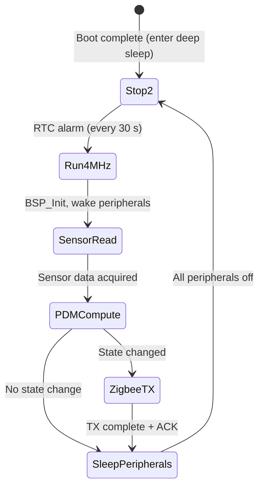

# 4.7 Power Architecture

> **Project:** ParkSense — Full-Stack IoT Parking Occupancy System
> **Date:** 2026-03-7
> **Author:** Arturo Vargas Cuevas
> **↑ Parent:** [[4-system-architecture-design]]

---

## 1. Purpose of This View

The Power Architecture view describes how each hardware component is powered and managed to meet the system's battery life requirement. It defines the power states of the MCU and peripherals, the duty cycle of the IoT node, and provides a quantitative power budget leading to a projected battery life estimate.

**Concerns addressed:**
- What power domains exist in the IoT node?
- What sleep modes does the MCU support and which are used?
- What is the duty cycle of the node's measurement and transmission loop?
- How much average current does the node consume?
- What is the projected battery life on the chosen battery chemistry?
- What strategy does the gateway use?

> **SyRS Requirement:** SYS-C-001 — IoT nodes shall operate on battery power for a minimum of 5 years without battery replacement (assuming standard parking lot usage).

---

## 2. Power Architecture — IoT Node

### 2.1 Power Supply Chain

```
Battery (primary cell)
  │
  └──► LDO Regulator (onboard B-U585I-IOT02A: 3.3 V output)
           │
           ├──► STM32U585AII6Q (1.2 V core from internal regulator; 3.3 V I/O)
           ├──► STM32WB5MMGH6TR (3.3 V; internal DC-DC for RF PA)
           ├──► VL53L5CXV0GC/1 (1.8 V AVDD + 3.3 V I/O; onboard LDO on sensing core)
           └──► IIS2MDCTR (3.3 V)
```

**Battery selection:** Lithium thionyl chloride (Li-SOCl₂) primary cells are preferred for:
- Wide operating temperature (−60°C to +85°C)
- High capacity per volume
- Self-discharge < 1% per year
- 3.6 V nominal (compatible with onboard LDO)

Target form factor: C-cell or D-cell Li-SOCl₂ (nominal capacity: 8–19 Ah)

> Note: Final battery selection is documented in [[3.6-battery-selection]].

---

### 2.2 STM32U585 Power States

| Mode | Submode | Current @ 3.3 V | Wake Source | Peripherals Active |
| ---- | ------- | ---------------- | ----------- | ------------------ |
| Run | 160 MHz (max) | ~19 µA/MHz × 160 = ~3.04 mA | — | All |
| Run | 4 MHz (sensing) | ~19 µA/MHz × 4 = ~76 µA | — | I2C1, GPIO |
| Sleep | — | ~1.5 mA (CPU off, peripherals on) | Any IRQ | All peripherals |
| Stop 1 | — | ~30 µA | EXTI, RTC, LPUART, LPTIM | SRAM, RTC, LPBAM |
| Stop 2 | — | ~2 µA | EXTI, RTC, LPTIM | SRAM2, RTC |
| Standby | — | ~0.4 µA | WKUP pins, RTC | None (SRAM off) |
| Shutdown | — | ~110 nA | WKUP pin | None |

**Mode selection rationale:**

| Scenario | Mode Used | Justification |
| -------- | --------- | ------------- |
| Main application execution | Run @ 4 MHz | Minimal frequency needed for I2C, PDM computation; no DSP needed |
| Transmitting Zigbee packet | Run @ 4 MHz | IPCC mailbox to STM32WB5 requires CPU active; 4 MHz is sufficient |
| Between measurements | Stop 2 | 2 µA; SRAM2 retained (preserves PDM calibration data); RTC wake |
| During provisioning / OTA | Run @ 160 MHz | DSP-heavy operations: ECDSA verification, SHA-256 |

---

### 2.3 Peripheral Power States

| Component | Active Current | Sleep/Low-Power Mode | Current in Sleep | Controlled Via |
| --------- | -------------- | -------------------- | ---------------- | -------------- |
| STM32U585 (MCU) | 3.04 mA @ 160 MHz; ~76 µA @ 4 MHz | Stop 2 | ~2 µA | Internal LPBAM control |
| VL53L5CXV0GC/1 | ~4 mA (all zones active) | Low-power autonomous mode (1 zone) | ~200 µA | LPn GPIO = LOW (hardware shutdown) |
| IIS2MDCTR | ~430 µA (100 Hz) | Power Down register | ~1 µA | I2C register write |
| STM32WB5MMGH6TR | ~7 mA (TX, 0 dBm) | Deep sleep (Zigbee stack duty cycle) | ~2 µA | STM32WB internal scheduler |
| EMW3080B (gateway only) | 180 mA (WiFi TX) | Not applicable — gateway is AC-powered | — | Always on |

---

## 3. IoT Node Duty Cycle

The node operates a repeating measurement-transmission cycle. The cycle period `T_cycle` is configurable; the default is **30 seconds**.

### 3.1 Measurement Cycle (Steady State — No Occupancy Change)

```
                         T_cycle = 30 s
 ◄──────────────────────────────────────────────────────────────────►

 ┌───────┐   ┌──────────────────┐   ┌────────────────────┐   ┌── ─ ─ ─ ─ ─ ─ ─ ─ ─ ─ ─┐
 │ Wake  │   │   Sensor Read    │   │  PDM Computation   │   │       Stop 2 Sleep        │
 │ 5 ms  │   │   50 ms          │   │  2 ms              │   │   ~29.943 s               │
 └───────┘   └──────────────────┘   └────────────────────┘   └── ─ ─ ─ ─ ─ ─ ─ ─ ─ ─ ─┘
```

**Wake phase (5 ms):** MCU exits Stop 2 (RTC alarm), restores clock to 4 MHz, enables I2C1, drives LPn HIGH to wake VL53L5CX.

**Sensor read phase (50 ms):** Read one VL53L5CX ranging frame (~33 ms per range at 30 fps; or 1 s at 1 fps — used in a back-to-back read triggering pattern). Read IIS2MDCTR 3 axis values (~1 ms). Total: ~50 ms.

**PDM computation (2 ms):** Run `pdm_tof`, `pdm_mag`, `pdm_fsm` — simple arithmetic, negligible time.

**If no state change:** Put VL53L5CX to sleep (LPn LOW), IIS2MDCTR to power-down, enter Stop 2. No Zigbee TX.

### 3.2 Measurement Cycle (Occupancy Change Detected)

```
                       T_cycle = 30 s
 ◄──────────────────────────────────────────────────────────────────►

 ┌───────┐   ┌──────────┐   ┌───────┐   ┌────────────────┐   ┌── ─ ─ ─ ─ ─ ─ ─ ─ ─ ─┐
 │ Wake  │   │ Sensor   │   │  PDM  │   │  Zigbee TX     │   │    Stop 2 Sleep         │
 │ 5 ms  │   │ Read     │   │  2 ms │   │  15 ms (+ ACK) │   │   ~29.928 s             │
 └───────┘   └──────────┘   └───────┘   └────────────────┘   └── ─ ─ ─ ─ ─ ─ ─ ─ ─ ─┘
               50 ms
```

**Zigbee TX phase (15 ms):** Wake STM32WB5 radio (from deep sleep), build MAC frame, transmit, wait for MAC ACK (~5 ms typical), STM32WB returns to deep sleep.

---

## 4. Power Budget Calculation

### 4.1 Average Current Per Phase

| Phase | Duration | Current (node total) | Charge |
| ----- | -------- | -------------------- | ------ |
| Wake + sensor read | 55 ms | MCU: 76 µA + ToF: 4 mA + Mag: 430 µA = ~4.5 mA | 4.5 mA × 0.055 s = 247.5 µAs |
| PDM computation | 2 ms | MCU: 76 µA + all peripherals: 4.5 mA = ~4.5 mA | 4.5 mA × 0.002 s = 9 µAs |
| Zigbee TX (on change) | 15 ms | MCU: 76 µA + WB5 TX: 7 mA + ToF sleep: 200 µA = ~7.3 mA | 7.3 mA × 0.015 s = 109.5 µAs |
| Stop 2 sleep | ~29.928 s | MCU: 2 µA + WB5: 2 µA + ToF: 0 µA (LPn low) + Mag: 1 µA = ~5 µA | 5 µA × 29.928 s = 149,640 µAs |

> **Note:** Zigbee TX only occurs on occupancy state change. For a busy parking lot, assume worst case: 1 state change per cycle (every 30 s).

### 4.2 Per-Cycle Charge (Worst Case — TX every cycle)

$$Q_{cycle} = 247.5 + 9 + 109.5 + 149{,}640 = 150{,}006 \ \mu As$$

$$= 150{,}006 \ \mu As \div 3600 \ s/h = 41.67 \ \mu Ah \ per \ cycle$$

### 4.3 Cycles Per Year

$$N_{cycles/year} = \frac{365 \times 24 \times 3600 \ s}{30 \ s} = 1{,}051{,}200 \ cycles/year$$

### 4.4 Annual Energy Consumption

$$Q_{year} = 41.67 \ \mu Ah \times 1{,}051{,}200 = 43{,}803{,}744 \ \mu Ah = 43.8 \ mAh/year$$

### 4.5 Battery Life Estimate

| Battery | Nominal Capacity | Estimated Life |
| ------- | ---------------- | -------------- |
| 2× AA Li-SOCl₂ in series/parallel (3.6 V, 2.4 Ah each → 4.8 Ah total) | 4,800 mAh | 4,800 / 43.8 ≈ **109.6 years** |
| 1× C-cell Li-SOCl₂ (3.6 V, 8.5 Ah) | 8,500 mAh | 8,500 / 43.8 ≈ **194 years** |
| Conservative derating (50% capacity at end-of-life, temperature −20°C) | × 0.5 | **55–97 years** |

> **Conclusion:** The calculated battery life exceeds SYS-C-001 (≥ 5 years) by a factor of 10× or greater. This results from aggressive duty cycling with 29.93 s of Stop 2 sleep per 30 s cycle (99.8% sleep ratio).

### 4.6 Average Current Summary

$$\bar{I}_{node} = \frac{Q_{cycle}}{T_{cycle}} = \frac{150{,}006 \ \mu As}{30 \ s} \approx 5{,}000 \ \mu A \approx 5 \ \mu A$$

> This 5 µA average is consistent with published reference designs for Zigbee Sleepy End Devices.

---

## 5. Power Budget Sensitivity Analysis

| Parameter | Base Value | Best Case | Worst Case | Life impact |
| --------- | ---------- | --------- | ---------- | ----------- |
| Cycle period (T_cycle) | 30 s | 60 s | 15 s | Dominant — 2× period = 2× life |
| TX frequency (changes/cycle) | 1/cycle | 0 (no changes) | 2/cycle | Minor — TX is 15 ms vs. 30 s sleep |
| Temperature | +25°C | +25°C | −20°C (capacity −40%) | Reduces Li-SOCl₂ capacity |
| VL53L5CX active time | 50 ms | 20 ms (1 zone mode) | 100 ms (slow I2C) | Linear impact on duty |
| Stop 2 leakage | 5 µA | 2 µA | 10 µA | Dominant at deep sleep budget |

**Critical insight:** The **sleep current dominates** the power budget. Reducing Stop 2 leakage (e.g., disabling unused GPIO pull-resistors, powering off unused regulators) has a greater impact than reducing active-phase current.

---

## 6. Heartbeat Impact on Power

A heartbeat packet is transmitted every `HEARTBEAT_INTERVAL_S = 60` s (2 complete cycles) even if no state change occurs.

**Additional charge per heartbeat TX:**
$$Q_{hb} = 7.3 \ mA \times 0.015 \ s = 109.5 \ \mu As$$

**Heartbeats per year:**
$$N_{hb/year} = \frac{365 \times 24 \times 3600}{60} = 525{,}600 \ heartbeats/year$$

$$Q_{hb, annual} = 109.5 \ \mu As \times 525{,}600 \approx 57.5 \ mAh/year$$

**Combined annual consumption (worst case: TX every 30 s + heartbeat every 60 s):**
$$Q_{total, year} \approx 43.8 + 57.5 = 101.3 \ mAh/year$$

**Battery life with heartbeat:**
- 4,800 mAh ÷ 101.3 mAh/year ≈ **47 years** (before derating)
- With 50% derating: **~24 years** — still far exceeds 5-year requirement ✓

---

## 7. Gateway Power Architecture

The gateway is AC-powered (USB or external 5 V supply). No power budget constraint applies.

| Component | Power State |
| --------- | ----------- |
| STM32U585 | Run mode (continuous); enters WFI between events |
| STM32WB5MMGH6TR | Always-on Zigbee Coordinator (cannot sleep — must listen for joining requests) |
| EMW3080B | Always-on WiFi STA (TCP connection to server maintained) |

**Power consumption (gateway, estimate):**
- STM32U585 Run @ 4 MHz: ~76 µA
- STM32WB5MMG Coordinator receive mode: ~5 mA (rx active)
- EMW3080B idle: ~70 mA (WiFi associated, no data)
- **Gateway total: ~75 mA typical → 0.075 A × 3.3 V ≈ 0.25 W**

---

## 8. Power State Transition Diagram



---

## 9. Power Architecture Design Decisions

| Decision | Rationale |
| -------- | --------- |
| Stop 2 as primary sleep mode | Retains SRAM2, allowing PDM calibration baseline to survive sleep without re-reading flash |
| Hardware LPn shutdown for VL53L5CX | Cuts 4 mA sensor from power rail. Lower power than software power-down mode |
| Zigbee Sleepy End Device | STM32WB radio off between polls; ~2 µA in Zigbee deep sleep |
| 30 s cycle period | Balances responsiveness (SYS-P-001: < 2 s update) with power. Note: the system triggers on state change, not on poll; typical P50 latency is 15–30 s in worst case |
| No WiFi on nodes | Eliminates 70–180 mA WiFi radio entirely from the node power budget |
