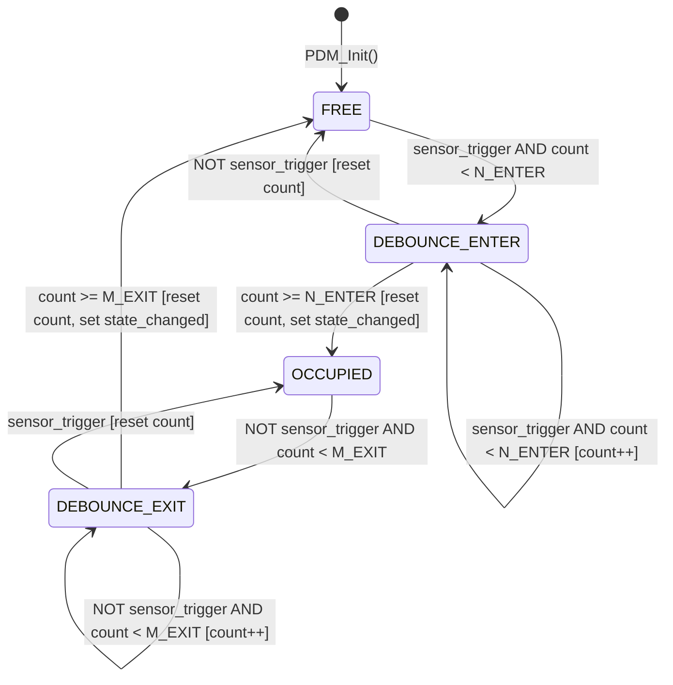
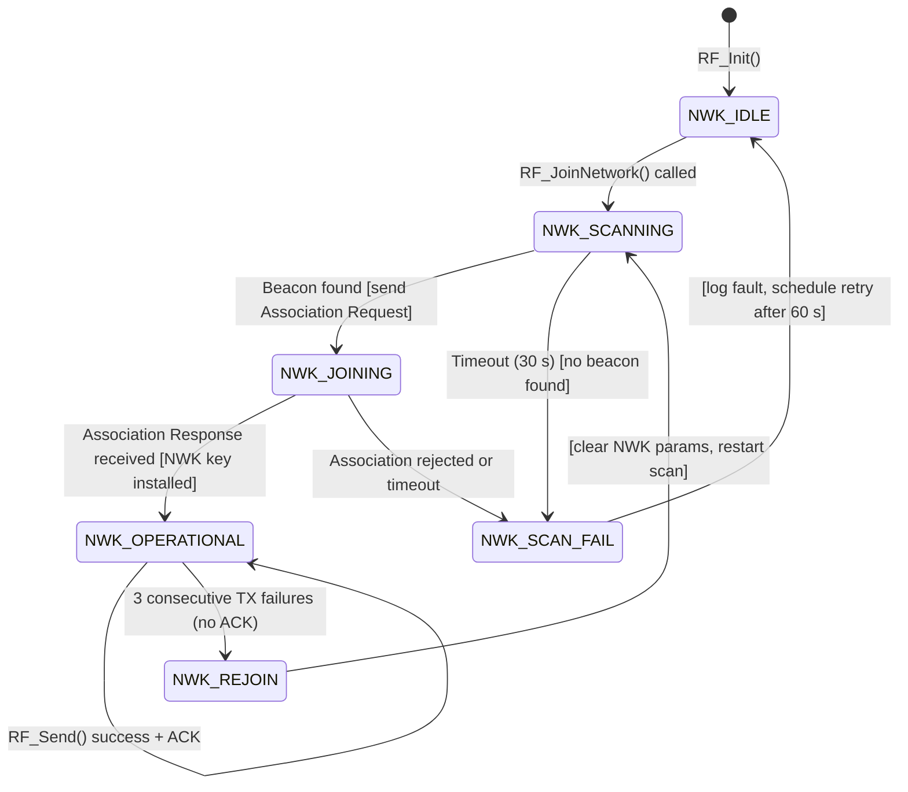
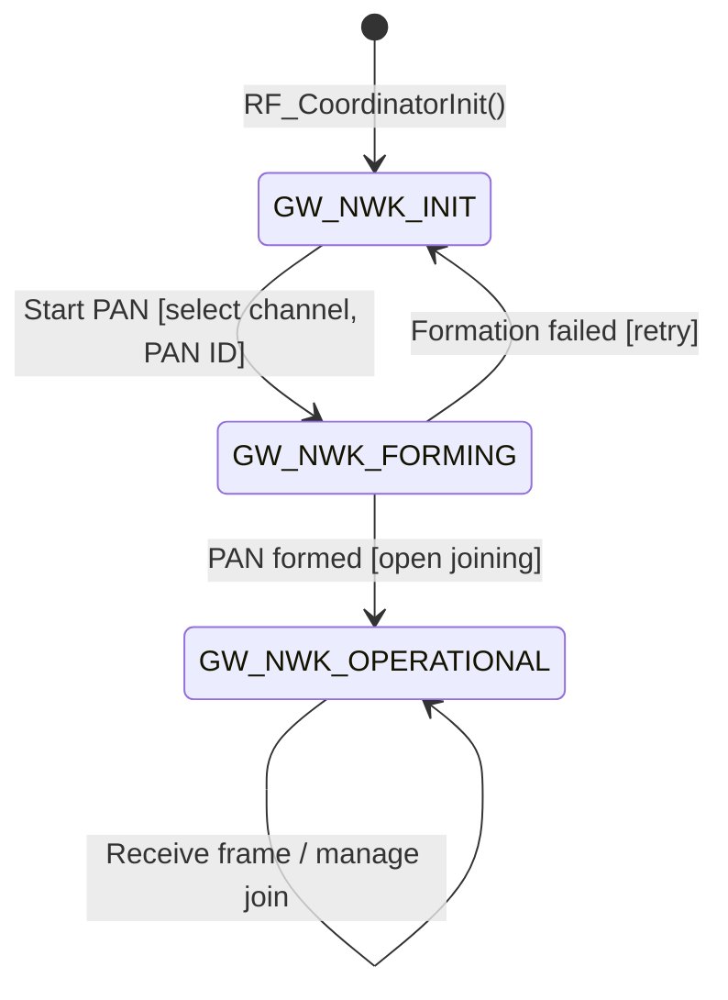
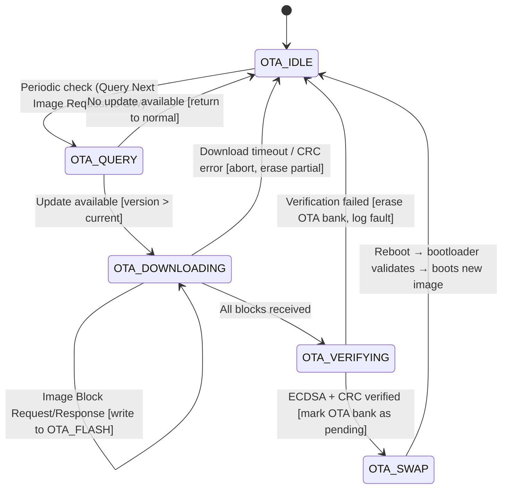
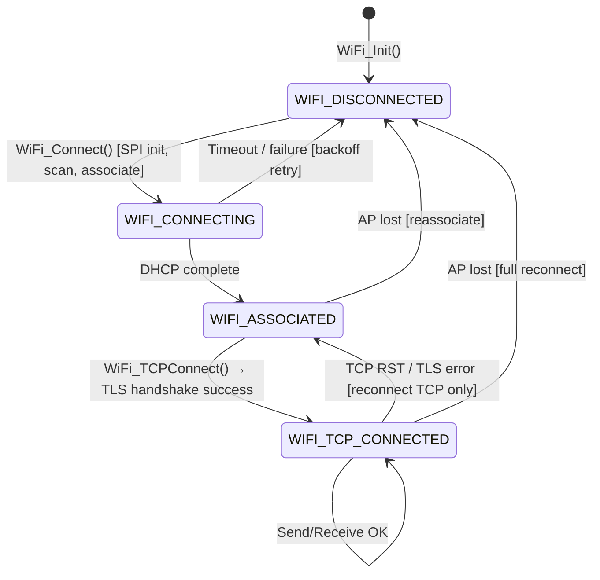

# 5.4 State Machines

> **Project:** ParkSense — Full-Stack IoT Parking Occupancy System
> **Date:** 2026-03-14
> **Author:** Arturo Vargas Cuevas
> **↑ Parent:** [[5-firmware-architecture-design]]
> **↑ Upstream:** [[4.5-data-flow]] (PDM stages), [[4.4-interface-architecture]] (Zigbee join)

---

## 1. Purpose

This view specifies every finite state machine (FSM) in the ParkSense firmware at implementation level — enough detail to code them directly. Each FSM is defined by its states, transitions (with guards and actions), initial state, and the data consumed and produced.

---

## 2. FSM Catalog

| FSM | Module | Target | States | Purpose |
|-----|--------|--------|--------|---------|
| PDM Occupancy FSM | `pdm/pdm_fsm.c` | Node | 3 | Vehicle presence decision with hysteresis |
| Network FSM | `drivers/rf/rf_driver.c` | Node | 5 | Zigbee join, operational, rejoin lifecycle |
| Gateway Network FSM | `drivers/rf/rf_coordinator.c` | Gateway | 3 | Coordinator operational lifecycle |
| OTA Update FSM | `bootloader/boot_main.c` + `app/main_*.c` | Both | 5 | Firmware download, verification, swap |
| WiFi Connection FSM | `drivers/wifi/wifi_driver.c` | Gateway | 4 | WiFi association + TCP lifecycle |

---

## 3. PDM Occupancy FSM

### 3.1 State Diagram



### 3.2 State Table

| State | Description | Entry Action |
|-------|-------------|-------------|
| `PDM_STATE_FREE` | Parking space is unoccupied | Clear hysteresis counter |
| `PDM_STATE_DEBOUNCE_ENTER` | Sensor triggered; confirming occupancy | Start enter counter |
| `PDM_STATE_OCCUPIED` | Vehicle confirmed present | Set `state_changed = true` |
| `PDM_STATE_DEBOUNCE_EXIT` | Sensor clear; confirming departure | Start exit counter |

### 3.3 Transition Table

| Current State | Guard | Next State | Action |
|---------------|-------|------------|--------|
| `FREE` | `sensor_trigger == true` | `DEBOUNCE_ENTER` | `enter_count = 1` |
| `FREE` | `sensor_trigger == false` | `FREE` | — |
| `DEBOUNCE_ENTER` | `sensor_trigger == true AND enter_count < N_ENTER` | `DEBOUNCE_ENTER` | `enter_count++` |
| `DEBOUNCE_ENTER` | `sensor_trigger == true AND enter_count >= N_ENTER` | `OCCUPIED` | `enter_count = 0; state_changed = true` |
| `DEBOUNCE_ENTER` | `sensor_trigger == false` | `FREE` | `enter_count = 0` |
| `OCCUPIED` | `sensor_trigger == false` | `DEBOUNCE_EXIT` | `exit_count = 1` |
| `OCCUPIED` | `sensor_trigger == true` | `OCCUPIED` | — |
| `DEBOUNCE_EXIT` | `sensor_trigger == false AND exit_count < M_EXIT` | `DEBOUNCE_EXIT` | `exit_count++` |
| `DEBOUNCE_EXIT` | `sensor_trigger == false AND exit_count >= M_EXIT` | `FREE` | `exit_count = 0; state_changed = true` |
| `DEBOUNCE_EXIT` | `sensor_trigger == true` | `OCCUPIED` | `exit_count = 0` |

### 3.4 Guard Definition: `sensor_trigger`

```c
bool sensor_trigger = (tof_status == TOF_OCCUPIED) || (mag_status == MAG_DISTURBED);
```

**Sensor fusion rule:** OR-logic. Either sensor alone can trigger occupancy. This reduces missed detections (a low-profile vehicle may not disturb the magnetometer but will reduce ToF distance, and vice versa).

### 3.5 Constants

| Constant | Value | Rationale |
|----------|-------|-----------|
| `N_ENTER` | 3 | 3 consecutive triggered samples (90 s at 30 s cycle) before confirming OCCUPIED — filters transient triggers (pedestrians, carts) |
| `M_EXIT` | 5 | 5 consecutive clear samples (150 s) before confirming FREE — prevents flickering on engine vibration stop |

> These values are compile-time configurable in `pdm_fsm.h`. See [[5.7-build-configuration]] §3.

### 3.6 Error Handling

If either sensor returns an error status (`TOF_INVALID` or `MAG_ERROR`):
- `sensor_trigger` is evaluated using only the healthy sensor
- If **both** sensors fail, the FSM enters `PDM_STATE_ERROR` (an implicit terminal state) and the CPM sends an error report (`OCCUPANCY = 0xFF`)

---

## 4. Node Network FSM

### 4.1 State Diagram



### 4.2 State Table

| State | Description |
|-------|-------------|
| `NWK_IDLE` | RF initialized but not connected |
| `NWK_SCANNING` | Scanning channels 11–26 for coordinator beacon |
| `NWK_JOINING` | Association handshake in progress |
| `NWK_OPERATIONAL` | Joined PAN, can transmit/receive |
| `NWK_SCAN_FAIL` | Scan or join failed; waiting to retry |
| `NWK_REJOIN` | Lost connectivity; attempting to rejoin |

### 4.3 Transition Table

| Current | Event / Guard | Next | Action |
|---------|---------------|------|--------|
| `NWK_IDLE` | `RF_JoinNetwork()` called | `NWK_SCANNING` | Start channel scan (channels 11–26) |
| `NWK_SCANNING` | Beacon received | `NWK_JOINING` | Send IEEE 802.15.4 Association Request |
| `NWK_SCANNING` | 30 s timeout, no beacon | `NWK_SCAN_FAIL` | Log `FAULT_NWK_NO_BEACON` |
| `NWK_JOINING` | Association Response (success) | `NWK_OPERATIONAL` | Store short address + NWK key in SRAM2 |
| `NWK_JOINING` | Association rejected / timeout | `NWK_SCAN_FAIL` | Log `FAULT_NWK_JOIN_REJECTED` |
| `NWK_SCAN_FAIL` | Retry timer expired (60 s) | `NWK_IDLE` | Increment retry counter |
| `NWK_SCAN_FAIL` | Retry counter > `MAX_JOIN_RETRIES` (5) | `NWK_IDLE` | Log `FAULT_NWK_PERMANENT`, enter low-power standby |
| `NWK_OPERATIONAL` | `RF_Send()` → ACK received | `NWK_OPERATIONAL` | Reset consecutive-fail counter |
| `NWK_OPERATIONAL` | `RF_Send()` → 3× consecutive no-ACK | `NWK_REJOIN` | Log `FAULT_NWK_LOST` |
| `NWK_REJOIN` | — | `NWK_SCANNING` | Clear cached NWK params, restart scan |

---

## 5. Gateway Network FSM

### 5.1 State Diagram



### 5.2 State Table

| State | Description |
|-------|-------------|
| `GW_NWK_INIT` | RF module initialized, PAN not yet formed |
| `GW_NWK_FORMING` | Channel selection and PAN formation in progress |
| `GW_NWK_OPERATIONAL` | PAN active, accepting joins, receiving data frames |

The gateway has a simpler FSM because the coordinator does not sleep and the Zigbee stack handles most MAC-layer coordination internally.

---

## 6. OTA Update FSM

### 6.1 State Diagram



### 6.2 State Table

| State | Description | Location |
|-------|-------------|----------|
| `OTA_IDLE` | Normal operation; no update in progress | Application (`main_node.c`) |
| `OTA_QUERY` | Polling gateway for available firmware update | Application (Zigbee OTA cluster client) |
| `OTA_DOWNLOADING` | Receiving image blocks, writing to OTA_FLASH sector | Application |
| `OTA_VERIFYING` | Download complete; running ECDSA P-256 + CRC-32 on downloaded image | Application (calls bootloader secure service) |
| `OTA_SWAP` | Marking OTA bank as "boot next"; triggering software reset | Application → Bootloader |

### 6.3 Key Guard Conditions

| Guard | Check |
|-------|-------|
| `version_newer` | Downloaded image header `VERSION > current_version` AND `VERSION >= MIN_VERSION` |
| `ecdsa_valid` | `HAL_PKA_ECDSAVerif()` returns success on SHA-256 digest of downloaded image |
| `crc_valid` | `HAL_CRC_Calculate()` over image bytes matches header `CRC32` field |
| `download_complete` | All blocks received (total bytes == header `IMAGE_LEN`) |

### 6.4 OTA Timing Constraints

| Constraint | Value | Rationale |
|------------|-------|-----------|
| Block request interval | 500 ms | Avoid flooding coordinator; allow other nodes to transmit |
| Download timeout | 30 min | 960 KB / ~100 kbps usable Zigbee throughput ≈ ~80 s theoretical; 30 min allows for retries and contention |
| Verification time | < 2 s | ECDSA P-256 hardware accelerator on STM32U585 |
| Clock during OTA verification | 160 MHz | Full-speed PLL for SHA-256 + PKA performance |

---

## 7. WiFi Connection FSM (Gateway)

### 7.1 State Diagram



### 7.2 State Table

| State | Description |
|-------|-------------|
| `WIFI_DISCONNECTED` | Module initialized but not associated to AP |
| `WIFI_CONNECTING` | SPI active, scanning/associating to AP |
| `WIFI_ASSOCIATED` | WiFi associated + IP obtained; TCP not yet connected |
| `WIFI_TCP_CONNECTED` | TCP + TLS session established to server |

### 7.3 Reconnection Strategy

| Failure | Recovery |
|---------|----------|
| AP not found (scan timeout) | Exponential backoff: 1 s, 2 s, 4 s, 8 s, 16 s, 30 s (max) |
| DHCP failure | Retry association (same backoff) |
| TCP connection refused | Retry TCP connect after 5 s (AP still associated) |
| TLS handshake failure | Retry TCP connect; if 3× consecutive → full WiFi reconnect |
| TCP RST during operation | Reconnect TCP immediately (once); then backoff |

---

## 8. FSM Implementation Pattern

All FSMs in ParkSense follow the same C pattern for consistency and testability:

```c
/* ---------- pdm_fsm.h ---------- */
typedef enum {
    PDM_STATE_FREE,
    PDM_STATE_DEBOUNCE_ENTER,
    PDM_STATE_OCCUPIED,
    PDM_STATE_DEBOUNCE_EXIT,
    PDM_STATE_ERROR
} pdm_state_t;

/* ---------- pdm_fsm.c ---------- */
typedef struct {
    pdm_state_t state;
    uint8_t     enter_count;
    uint8_t     exit_count;
    bool        state_changed;
} pdm_fsm_ctx_t;

static pdm_fsm_ctx_t g_fsm;     /* module-static, zero-initialized */

void PDM_FSM_Init(void)
{
    g_fsm.state         = PDM_STATE_FREE;
    g_fsm.enter_count   = 0;
    g_fsm.exit_count    = 0;
    g_fsm.state_changed = false;
}

void PDM_FSM_Update(tof_status_t tof, mag_status_t mag)
{
    bool trigger = (tof == TOF_OCCUPIED) || (mag == MAG_DISTURBED);
    g_fsm.state_changed = false;

    switch (g_fsm.state) {
        case PDM_STATE_FREE:
            if (trigger) {
                g_fsm.state = PDM_STATE_DEBOUNCE_ENTER;
                g_fsm.enter_count = 1;
            }
            break;

        case PDM_STATE_DEBOUNCE_ENTER:
            if (trigger) {
                g_fsm.enter_count++;
                if (g_fsm.enter_count >= N_ENTER) {
                    g_fsm.state = PDM_STATE_OCCUPIED;
                    g_fsm.enter_count = 0;
                    g_fsm.state_changed = true;
                }
            } else {
                g_fsm.state = PDM_STATE_FREE;
                g_fsm.enter_count = 0;
            }
            break;

        case PDM_STATE_OCCUPIED:
            if (!trigger) {
                g_fsm.state = PDM_STATE_DEBOUNCE_EXIT;
                g_fsm.exit_count = 1;
            }
            break;

        case PDM_STATE_DEBOUNCE_EXIT:
            if (!trigger) {
                g_fsm.exit_count++;
                if (g_fsm.exit_count >= M_EXIT) {
                    g_fsm.state = PDM_STATE_FREE;
                    g_fsm.exit_count = 0;
                    g_fsm.state_changed = true;
                }
            } else {
                g_fsm.state = PDM_STATE_OCCUPIED;
                g_fsm.exit_count = 0;
            }
            break;

        default:
            g_fsm.state = PDM_STATE_ERROR;
            g_fsm.state_changed = true;
            break;
    }
}
```

**Testing pattern:** Unit tests call `PDM_FSM_Init()`, then drive `PDM_FSM_Update()` with sequences of `(tof_status, mag_status)` tuples, and assert on `g_fsm.state` and `g_fsm.state_changed`. No hardware dependencies — fully host-testable.
