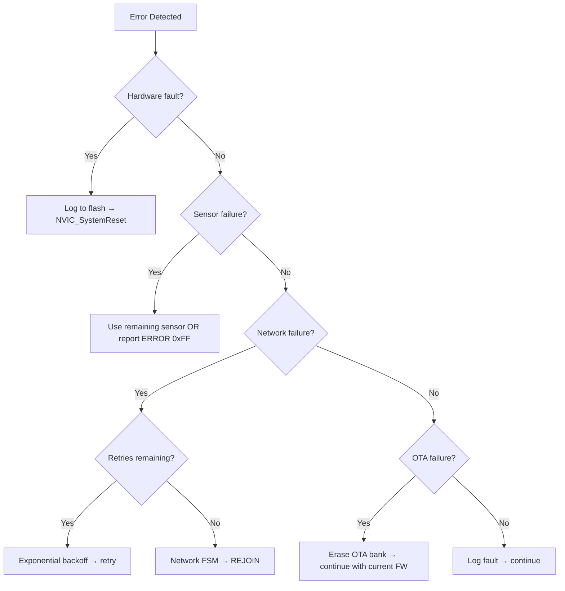

# 5.6 Error Handling

> **Project:** ParkSense — Full-Stack IoT Parking Occupancy System
> **Date:** 2026-03-14
> **Author:** Arturo Vargas Cuevas
> **↑ Parent:** [[5-firmware-architecture-design]]
> **↑ Upstream:** [[4.4-interface-architecture]] (fault recovery), [[4.6-security-architecture]] (boot chain)

---

## 1. Purpose

This view defines how ParkSense firmware detects, reports, and recovers from errors at every layer — from Cortex-M33 hardware faults to sensor I/O timeouts to wireless connectivity loss. The goal is **graceful degradation**: the system must continue operating (or self-recover) even when individual components fail.

---

## 2. Error Handling Philosophy

| Principle | Rule |
|-----------|------|
| **Fail-safe default** | On sensor failure, report `OCCUPANCY = ERROR (0xFF)` — never silently assume free or occupied |
| **Never hang** | Every blocking operation has a timeout. IWDG enforces a 4 s deadline. |
| **Log before reset** | Before a watchdog reset, write a `fault_record_t` to FAULT_LOG flash so post-mortem analysis is possible |
| **Propagate, don't absorb** | Low-level errors (HAL) bubble up to the caller via return codes. Upper layers decide recovery strategy. |
| **No exceptions, no longjmp** | C only. Error codes returned via `ps_status_t` or module-specific enums. |

---

## 3. Error Propagation Model

```
Layer 6 (Application)
   │  Receives: ps_status_t from CPM, PDM
   │  Policy:   Log fault, attempt retry, continue or reset
   │
Layer 5 (CPM)
   │  Receives: rf_err_t / wifi_err_t from drivers
   │  Policy:   Retry TX (up to CPM_MAX_RETRIES); report failure to App
   │
Layer 4 (PDM)
   │  Receives: tof_err_t / mag_err_t from drivers
   │  Policy:   Enter PDM_STATE_ERROR if both sensors fail; report 0xFF
   │
Layer 3 (Drivers)
   │  Receives: HAL_StatusTypeDef from HAL
   │  Policy:   Map HAL error to driver-specific error code; return to caller
   │
Layer 2 (HAL / BSP)
   │  Produces:  HAL_OK, HAL_ERROR, HAL_BUSY, HAL_TIMEOUT
   │
Layer 1 (Platform)
      Produces:  Hardware fault exceptions (HardFault, MemManage, BusFault, UsageFault)
```

**Rule:** Each layer only handles the errors it can meaningfully recover from. All others are propagated upward.

---

## 4. Hardware Fault Handlers

The Cortex-M33 generates synchronous fault exceptions for illegal operations. ParkSense implements dedicated handlers for each.

### 4.1 Handler Implementations

```c
/* stm32u5xx_it.c — Interrupt handlers */

void HardFault_Handler(void)
{
    __disable_irq();
    fault_record_t rec = {0};
    rec.timestamp = HAL_GetTick();
    rec.code      = FAULT_HARDFAULT;
    rec.pc        = __get_PSP();    /* approximate: extract from stack frame */
    rec.lr        = __get_LR();
    rec.cfsr      = SCB->CFSR;
    rec.hfsr      = SCB->HFSR;
    rec.mmfar     = SCB->MMFAR;
    rec.bfar      = SCB->BFAR;
    APP_FaultLog(&rec);             /* write to FAULT_LOG flash */
    NVIC_SystemReset();             /* immediate reset */
}

void MemManage_Handler(void)
{
    __disable_irq();
    fault_record_t rec = {0};
    rec.timestamp = HAL_GetTick();
    rec.code      = FAULT_MEMMANAGE;
    rec.cfsr      = SCB->CFSR;
    rec.mmfar     = SCB->MMFAR;
    APP_FaultLog(&rec);
    NVIC_SystemReset();
}

void BusFault_Handler(void)
{
    __disable_irq();
    fault_record_t rec = {0};
    rec.timestamp = HAL_GetTick();
    rec.code      = FAULT_BUSFAULT;
    rec.cfsr      = SCB->CFSR;
    rec.bfar      = SCB->BFAR;
    APP_FaultLog(&rec);
    NVIC_SystemReset();
}

void UsageFault_Handler(void)
{
    __disable_irq();
    fault_record_t rec = {0};
    rec.timestamp = HAL_GetTick();
    rec.code      = FAULT_USAGEFAULT;
    rec.cfsr      = SCB->CFSR;
    APP_FaultLog(&rec);
    NVIC_SystemReset();
}
```

### 4.2 Stack Overflow Detection

An MPU region (32 bytes, no-access) is configured at the bottom of the stack:

```c
void MPU_ConfigStackGuard(void)
{
    MPU_Region_InitTypeDef mpu;
    mpu.Enable           = MPU_REGION_ENABLE;
    mpu.Number           = MPU_REGION_NUMBER0;
    mpu.BaseAddress      = STACK_BOTTOM_ADDR;   /* linker-provided symbol */
    mpu.Size             = MPU_REGION_SIZE_32B;
    mpu.AccessPermission = MPU_REGION_NO_ACCESS;
    mpu.IsBufferable     = MPU_ACCESS_NOT_BUFFERABLE;
    mpu.IsCacheable      = MPU_ACCESS_NOT_CACHEABLE;
    mpu.IsShareable      = MPU_ACCESS_NOT_SHAREABLE;
    HAL_MPU_ConfigRegion(&mpu);
    HAL_MPU_Enable(MPU_PRIVILEGED_DEFAULT);
}
```

If the stack grows into this guard region, a **MemManage fault** fires → logged as `FAULT_STACK_OVF` → reset.

---

## 5. Sensor Error Handling

### 5.1 I2C Bus Recovery

```
I2C1_Read/Write()
  │
  ├── HAL_OK → success, continue
  │
  ├── HAL_TIMEOUT → I2C bus may be stuck
  │     └── BSP_I2C_BusRecovery()
  │           Toggle SCL pin 9× as GPIO to clear slave SDA hold
  │           Re-initialize HAL_I2C1
  │           Return PS_ERR_IO
  │
  ├── HAL_ERROR → NACK received
  │     └── Reset device via GPIO (LPn toggle for VL53L5CX; no reset pin for IIS2MDCTR)
  │           Return PS_ERR_IO
  │
  └── HAL_BUSY → peripheral busy
        └── Return PS_ERR_BUSY (caller retries on next cycle)
```

### 5.2 Sensor Failure Impact on PDM

| Failure | PDM Behavior |
|---------|-------------|
| ToF fails, Mag OK | PDM uses magnetometer only (`sensor_trigger = mag_disturbed`) |
| ToF OK, Mag fails | PDM uses ToF only (`sensor_trigger = tof_occupied`) |
| Both fail | PDM enters `PDM_STATE_ERROR`; CPM sends error report (`OCCUPANCY = 0xFF`) |
| Both fail for > 10 consecutive cycles | Log `FAULT_TOF_INIT` + `FAULT_MAG_INIT`; node continues sleeping/waking, retrying sensor init each cycle |

**No sensor → no halt.** The node never stops cycling. It continues waking, attempting sensor initialization, and reporting error state until sensors recover or maintenance intervenes.

---

## 6. RF / Network Error Handling

### 6.1 Node Transmission Failures

```
CPM_SendReport()
  │
  ├── RF_Send() → RF_OK + ACK received
  │     └── Success. Reset retry counter.
  │
  ├── RF_Send() → RF_ERR_NACK (no ACK within 10 ms)
  │     └── cpm_retry logic:
  │           Retry 1: wait 100 ms → RF_Send()
  │           Retry 2: wait 200 ms → RF_Send()
  │           Retry 3: wait 400 ms → RF_Send()
  │           All retries exhausted → log FAULT_RF_TX_FAIL
  │           Increment nwk_consecutive_fail_count
  │           If nwk_consecutive_fail_count >= 3:
  │                Network FSM → NWK_REJOIN
  │
  └── RF_Send() → RF_ERR_TIMEOUT (IPCC no response)
        └── Log FAULT_RF_TX_FAIL; treat as no-ACK path
```

### 6.2 Node Join Failures

| Scenario | Recovery |
|----------|----------|
| No beacon found after 30 s scan | Sleep 60 s, retry. Max 5 retries. |
| Association rejected | Sleep 60 s, retry. |
| All retries exhausted (5× join failures) | Log `FAULT_NWK_NO_BEACON`. Enter permanent low-power standby (Shutdown mode, ~110 nA). Requires physical power cycle to retry. |

### 6.3 Gateway WiFi Failures

| Scenario | Recovery |
|----------|----------|
| AP not found | Exponential backoff: 1, 2, 4, 8, 16, 30 s (cap). Indefinite retries. |
| TCP connection lost | Reconnect immediately; if 3× fail, full WiFi reassociate |
| TLS handshake failure | Log `FAULT_WIFI_TCP`. Reconnect TCP. Check server certificate validity. |
| EMW3080B module unresponsive (SPI timeout) | Hardware reset (GPIO toggle reset pin). Re-initialize. Log `FAULT_WIFI_CONNECT`. |

---

## 7. Fault Logging to Flash

### 7.1 FAULT_LOG Region

| Parameter | Value |
|-----------|-------|
| Flash address | `0x081F_E000` |
| Size | 4 KB (4096 bytes) |
| Record size | 64 bytes |
| Max records | 64 |
| Organization | Ring buffer — oldest record overwritten when full |

### 7.2 Write Procedure

```c
void APP_FaultLog(const fault_record_t *rec)
{
    /* 1. Read current write index from first 4 bytes of FAULT_LOG sector */
    uint32_t idx = *(volatile uint32_t *)FAULT_LOG_BASE;
    if (idx >= FAULT_LOG_MAX_RECORDS) idx = 0;

    /* 2. Calculate target address */
    uint32_t addr = FAULT_LOG_BASE + 4 + (idx * FAULT_RECORD_SIZE);

    /* 3. Flash unlock → program 64 bytes → flash lock */
    HAL_FLASH_Unlock();
    for (uint32_t i = 0; i < FAULT_RECORD_SIZE; i += 8) {
        HAL_FLASH_Program(FLASH_TYPEPROGRAM_DOUBLEWORD,
                          addr + i,
                          *(uint64_t *)((uint8_t *)rec + i));
    }

    /* 4. Update write index */
    idx = (idx + 1) % FAULT_LOG_MAX_RECORDS;
    /* Erase sector only when index wraps around to 0 */
    if (idx == 0) {
        FLASH_EraseInitTypeDef erase = {
            .TypeErase = FLASH_TYPEERASE_PAGES,
            .Page      = FAULT_LOG_PAGE,
            .NbPages   = 1
        };
        uint32_t page_err;
        HAL_FLASHEx_Erase(&erase, &page_err);
    }
    HAL_FLASH_Program(FLASH_TYPEPROGRAM_DOUBLEWORD,
                      FAULT_LOG_BASE, (uint64_t)idx);
    HAL_FLASH_Lock();
}
```

### 7.3 Reading Fault Logs

Fault logs are read via:
1. **SWD debugger** — during development, read FAULT_LOG flash directly
2. **OTA telemetry** (future) — gateway requests fault log from node via Zigbee command
3. **Serial console** (development) — UART debug output on boot dumps last 5 records

---

## 8. Boot-Time Fault Detection

On every reset, the application checks the Reset and Clock Control (RCC) flags to determine the reset cause:

```c
void APP_CheckResetCause(void)
{
    if (__HAL_RCC_GET_FLAG(RCC_FLAG_IWDGRST)) {
        /* Watchdog reset — previous execution hung */
        fault_record_t rec = {0};
        rec.timestamp = 0;  /* RTC may not be initialized yet */
        rec.code = FAULT_IWDG_RESET;
        APP_FaultLog(&rec);
    }

    if (__HAL_RCC_GET_FLAG(RCC_FLAG_PORRST)) {
        /* Power-on reset — normal cold boot */
    }

    if (__HAL_RCC_GET_FLAG(RCC_FLAG_SFTRST)) {
        /* Software reset — NVIC_SystemReset() after fault handler */
    }

    __HAL_RCC_CLEAR_RESET_FLAGS();
}
```

---

## 9. OTA Verification Failures

| Check | Failure Action |
|-------|---------------|
| Image header MAGIC mismatch | Log `FAULT_OTA_VERIFY`. Erase OTA bank. Return to normal operation. |
| CRC-32 mismatch | Same as above. Image is corrupt — download retry. |
| SHA-256 digest mismatch | Same. |
| ECDSA P-256 signature invalid | Log `FAULT_OTA_VERIFY`. **Security event** — potentially tampered image. Erase OTA bank. Do NOT boot the image. |
| Version < MIN_VERSION | Log `FAULT_OTA_VERIFY`. Anti-rollback violation. Erase OTA bank. |

The current (known-good) firmware continues running. The node reports the OTA failure to the gateway in the next heartbeat (via an extended status field, future enhancement).

---

## 10. Error Code Summary

### 10.1 Cross-Module Status Codes (`ps_status_t`)

| Code | Value | Meaning |
|------|-------|---------|
| `PS_OK` | 0x00 | Success |
| `PS_ERR_GENERIC` | 0x01 | Unspecified error |
| `PS_ERR_TIMEOUT` | 0x02 | Operation timed out |
| `PS_ERR_BUSY` | 0x03 | Resource busy, try later |
| `PS_ERR_PARAM` | 0x04 | Invalid parameter |
| `PS_ERR_CRC` | 0x05 | CRC validation failed |
| `PS_ERR_INIT` | 0x06 | Module not initialized |
| `PS_ERR_IO` | 0x07 | I/O error (I2C, SPI) |
| `PS_ERR_FULL` | 0x08 | Queue/buffer full |
| `PS_ERR_EMPTY` | 0x09 | Queue/buffer empty |
| `PS_ERR_AUTH` | 0x0A | Authentication/verification failed |

### 10.2 Fault Codes (`fault_code_t`)

| Code | Value | Module | Fatal? |
|------|-------|--------|--------|
| `FAULT_HARDFAULT` | 0x01 | CMSIS | Yes — reset |
| `FAULT_MEMMANAGE` | 0x02 | CMSIS | Yes — reset |
| `FAULT_BUSFAULT` | 0x03 | CMSIS | Yes — reset |
| `FAULT_USAGEFAULT` | 0x04 | CMSIS | Yes — reset |
| `FAULT_STACK_OVF` | 0x05 | MPU | Yes — reset |
| `FAULT_IWDG_RESET` | 0x06 | IWDG | Yes — already reset |
| `FAULT_I2C_LOCKUP` | 0x10 | BSP | No — bus recovery attempted |
| `FAULT_TOF_INIT` | 0x11 | ToF driver | No — retry next cycle |
| `FAULT_TOF_TIMEOUT` | 0x12 | ToF driver | No — retry next cycle |
| `FAULT_MAG_INIT` | 0x13 | Mag driver | No — retry next cycle |
| `FAULT_RF_JOIN` | 0x20 | RF driver | No — retry with backoff |
| `FAULT_RF_TX_FAIL` | 0x21 | CPM | No — retry then rejoin |
| `FAULT_NWK_NO_BEACON` | 0x22 | RF driver | Potentially fatal after 5 attempts |
| `FAULT_NWK_LOST` | 0x23 | RF driver | No — rejoin |
| `FAULT_WIFI_CONNECT` | 0x30 | WiFi driver | No — retry (gateway) |
| `FAULT_WIFI_TCP` | 0x31 | WiFi driver | No — reconnect (gateway) |
| `FAULT_OTA_VERIFY` | 0x40 | Bootloader | No — erase, continue with current FW |
| `FAULT_OTA_DOWNLOAD` | 0x41 | OTA FSM | No — abort, retry later |
| `FAULT_CONFIG_CRC` | 0x50 | BSP config | No — use defaults, log warning |

---

## 11. Recovery Summary Diagram


