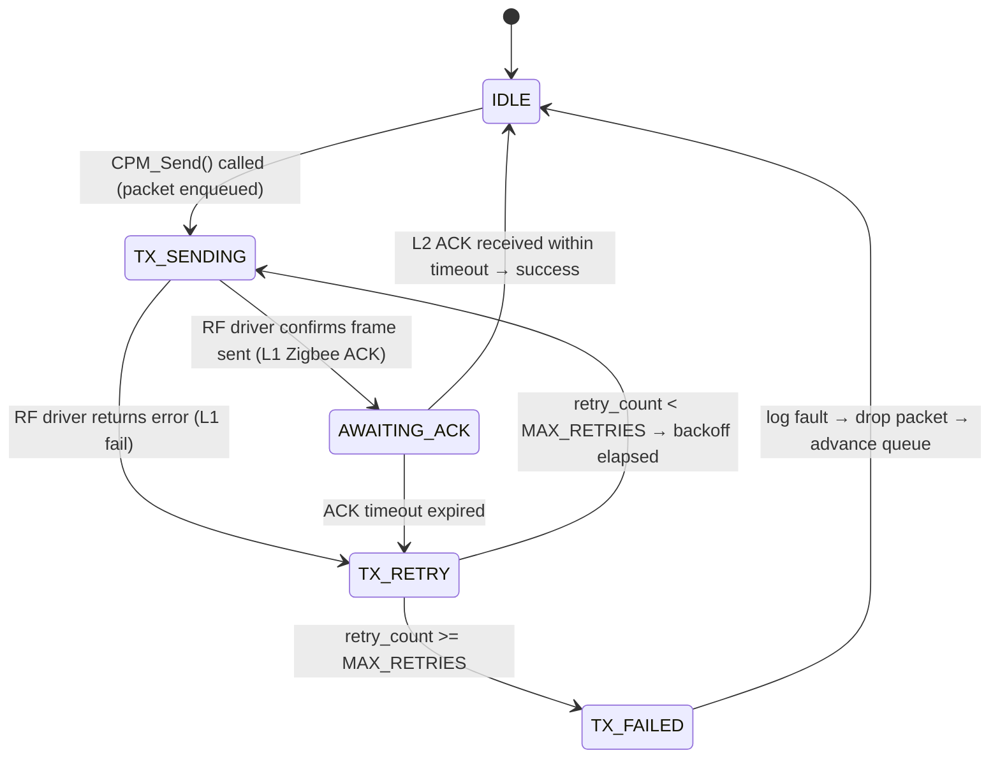

# 5.10 Communication Protocol Module (CPM) Design

> **Project:** ParkSense — Full-Stack IoT Parking Occupancy System
> **Date:** 2026-03-14
> **Author:** Arturo Vargas Cuevas
> **↑ Parent:** [[5-firmware-architecture-design]]
> **↑ Upstream:** [[5.11-rf-driver-api]] (Zigbee TX/RX), [[5.12-rf-packet-design]] (wire format), [[5.2-memory-map]] (buffer placement)
> **↓ Downstream:** [[5.15-application-design]] (caller), [[5.16-server-design]] (receiver)

---

## 1. Purpose and Design Goal

The Communication Protocol Module (CPM) is a **single, reusable C module** that is compiled into both the IoT Node firmware and the Gateway firmware. Its responsibilities differ slightly per target but the code base is shared via compile-time feature flags.

| Responsibility | IoT Node | Gateway |
|----------------|----------|---------|
| Build + serialize CPM packets | ✅ | ✅ |
| CRC-16 computation and validation | ✅ | ✅ |
| TX queue management | ✅ | ✅ |
| ACK tracking and retransmission | ✅ | ✅ |
| Receive and validate incoming packets | ✅ | ✅ |
| Zigbee RF send/receive (via RF Driver API) | ✅ | ✅ |
| Forward occupancy events to server via HTTPS | ❌ | ✅ |
| Accept ACK from server and relay to node | ❌ | ✅ |

**Design principle:** The module is a finite state machine around a TX context and an RX handler. It is not OS-dependent — it runs inside the cooperative scheduler tick (see [[5.3-execution-model]]).

---

## 2. Module Files

```
firmware/
└── cpm/
    ├── cpm.h               ← Public API (included by both node and gateway app)
    ├── cpm.c               ← Module implementation
    ├── cpm_packet.h        ← Packet structs and constants (see §3)
    ├── cpm_queue.h/.c      ← Static TX/RX circular queues
    ├── cpm_crc.h/.c        ← CRC-16/CCITT-FALSE
    ├── cpm_retry.h         ← Retransmission context
    └── cpm_server.h/.c     ← [GATEWAY ONLY] HTTPS forwarding to server
```

Compile-time gating:

```c
/* In CMakeLists.txt — gateway target only */
target_compile_definitions(firmware_gateway PRIVATE CPM_GATEWAY_ENABLE=1)
```

```c
/* cpm_server.c — compiled only for gateway */
#if CPM_GATEWAY_ENABLE
/* ... HTTP POST to server ... */
#endif
```

---

## 3. Packet Types (reference to [[5.12-rf-packet-design]])

| Packet | `msg_type` | Direction | Size |
|--------|-----------|-----------|------|
| OCCUPANCY | `0x01` | Node → GW | 12 B |
| HEARTBEAT | `0x02` | Node → GW | 14 B |
| ACK | `0x03` | GW → Node | 10 B |

All fields: see [[5.12-rf-packet-design]] §3–5.

---

## 4. Reliability Design

### 4.1 Packet Delivery Rate (PDR) Target

| Metric | Target |
|--------|--------|
| PDR (Packet Delivery Rate) | ≥ 98% at the application layer |
| Basis | Zigbee 802.15.4 raw PER ≈ 1% at nominal RSSI; 3 retransmissions bring application PDR to 1 − 0.01^4 ≈ 99.99% on a single hop. Accounting for burst interference: ≥ 98% sustained. |

### 4.2 ACK / NACK Scheme

ParkSense uses a **two-level ACK** system:

| Level | Who | When | Used for |
|-------|-----|------|---------|
| L1 — Zigbee MAC/NWK ACK | STM32WB Zigbee stack | Within ~30 ms after transmission | Confirms frame was received at the Zigbee layer |
| L2 — CPM Application ACK | Gateway application | After CRC validation and acceptance | Confirms packet was valid and accepted (the one that drives retransmit logic) |

The node **does not** use L1 ACK alone as success evidence. It waits for the L2 CPM ACK (`msg_type = 0x03`) before clearing the retransmit context. This guards against a scenario where the Zigbee stack delivers a frame but the application-layer CRC fails.

```
Node                                Gateway
 |                                     |
 |—— OCCUPANCY (msg_type=0x01) ——————>|
 |                             [L1 Zigbee MAC ACK — automatic]
 |                             [Gateway: validate CRC, decode]
 |<—— ACK (msg_type=0x03) ————————————|
 | clear retransmit context            |
```

**NACK:** ParkSense does not transmit explicit NACKs. A missing L2 ACK within `CPM_ACK_TIMEOUT_MS` (500 ms) is treated as an implicit NACK, triggering a retransmission.

### 4.3 Retransmission Policy

```c
/* cpm_retry.h */
#define CPM_MAX_RETRIES      3      /* 3 retransmission attempts after initial TX */
#define CPM_ACK_TIMEOUT_MS   500    /* wait up to 500 ms for L2 ACK */
#define CPM_BACKOFF_BASE_MS  100    /* first retry: 100 ms; second: 200 ms; third: 400 ms */
```

**Exponential backoff schedule:**

| Attempt | Wait before sending |
|---------|-------------------|
| Initial TX | 0 ms |
| Retry 1 | 100 ms |
| Retry 2 | 200 ms |
| Retry 3 | 400 ms |
| Give up | Write `FAULT_RF_TX_FAIL` |

```
Timeline:
  t=0    → TX (initial)
  t=500  → ACK timeout → Retry 1 after 100 ms → TX at t=600
  t=1100 → ACK timeout → Retry 2 after 200 ms → TX at t=1300
  t=1800 → ACK timeout → Retry 3 after 400 ms → TX at t=2200
  t=2700 → ACK timeout → FAIL
```

**Which packets are retransmitted:**

| Packet | Retransmitted? | Reason |
|--------|---------------|--------|
| OCCUPANCY | ✅ Yes | State-change event — must reach gateway |
| HEARTBEAT | ❌ No | Periodic keepalive — next period covers it |
| ACK | ❌ No | Gateway-originated; if lost, node retransmits the original |

### 4.4 Message Integrity (CRC-16)

Every packet includes a 2-byte CRC-16/CCITT-FALSE field computed over all preceding bytes. The receiver rejects packets with an invalid CRC before further processing. This guards against:
- Bit errors from RF (residual errors that AES-CCM MIC might not catch at the application level)
- Partial packet reception
- Memory corruption during de-serialization

Algorithm: see [[5.12-rf-packet-design]] §7.

**Double protection note:** The Zigbee NWK layer already protects frame integrity with AES-128-CCM MIC (4 bytes). The CPM application-layer CRC-16 adds a second, independent integrity check at the application boundary. This is intentional: it catches any corruption that happens between the Zigbee stack APS payload delivery and the application processing it.

### 4.5 TX Queue

The CPM module maintains a static circular TX queue (`cpm_queue_t`) to decouple the PDM (occupancy detection) from the RF transmitter. If RF is busy or in retransmit, the PDM can still enqueue new events without blocking.

```c
/* One TX queue per target (node or gateway) */
/* Queue depth: 16 packets × 12 bytes = 192 bytes */
#define CPM_QUEUE_DEPTH 16

/* Overflow policy: drop oldest (newest event always preserved — latest state is ground truth) */
```

If the queue is full (`PS_ERR_FULL`), the new packet is discarded and a `FAULT_RF_TX_FAIL` is logged. This is acceptable: the next HEARTBEAT will indicate a fault, and repeated occupancy change resolution will eventually drain the queue.

---

## 5. Security Design

Security is enforced at two distinct layers. The CPM module is responsible for application-layer concerns; lower-layer security is provided by the Zigbee stack.

### 5.1 Security Layer Responsibility Map

| Security Property | Where Enforced | Mechanism |
|-------------------|---------------|-----------|
| Encryption (confidentiality) | Zigbee NWK layer | AES-128-CCM (automatic, by STM32WB stack) |
| Message integrity | Zigbee NWK layer + CPM | AES-CCM MIC-4 (NWK) + CRC-16 (CPM) |
| Replay protection | Zigbee NWK layer | NWK frame counter (auto, by stack) |
| Node authentication | Zigbee commissioning | Install Code → Join Link Key (see below) |
| Server authentication | CPM gateway module | TLS certificate validation (mbedTLS on EMW3080B) |
| Server data integrity | HTTPS | TLS MAC |
| API authorization | Server | Bearer token in HTTP header |

### 5.2 Replay Protection Detail

The Zigbee NWK layer tracks a **frame counter** per source node. Any frame arriving with a counter ≤ the last accepted counter is silently dropped by the stack before delivery to the CPM module. The CPM module **does not** need to implement its own sequence counter.

### 5.3 Commissioning and Authentication

New nodes authenticate to the Gateway's Zigbee Trust Center using the **Install Code** workflow:

```
1. Node ships with unique Install Code (128-bit random, TRNG-generated) stored in flash
2. Operator registers (EUI-64, Install Code) with gateway provisioning tool
3. On join: Install Code → AES-MMO → Join Link Key (128-bit, unique per node)
4. Trust Center encrypts NWK Key with Join Link Key → delivers to node
5. Node decrypts → installs NWK Key → participates in encrypted PAN
```

From this point, all CPM packets are authenticated by virtue of being encrypted with the shared NWK Key. A rogue node without a registered Install Code cannot join the PAN.

### 5.4 Server-Side Security (Gateway → Server)

```
Gateway (net_driver — EMW3080B WiFi Phase 1 / W5500 Ethernet Phase 2)
  └── TCP connection to server IP:port
      └── TLS 1.2 handshake
          └── Server certificate validated against embedded CA cert in gateway firmware
              └── HTTPS POST /api/v1/events/occupancy
                  Authorization: Bearer <gateway_token>
```

Details: see [[6.2-cryptographic-design]] §3.4 and [[5.16-server-design]].

---

## 6. Server Forwarding (Gateway Only)

### 6.1 Transport

| Parameter | Value | Rationale |
|-----------|-------|-----------|
| Protocol | HTTPS (TLS 1.2) over TCP | Encrypted transport; standard; compatible with mbedTLS on EMW3080B (Phase 1) or offloaded via W5500 TLS socket (Phase 2) |
| Port | **8443** (HTTPS alt, default for dev) / **443** (prod behind reverse proxy) | Port 443 is standard HTTPS; 8443 avoids root privileges in dev environments |
| Endpoint | `POST /api/v1/events/occupancy` | REST; JSON body |
| Auth | `Authorization: Bearer <gateway_token>` | Token provisioned at gateway deployment (stored in `SRAM3_S`) |
| Content-Type | `application/json` | Structured event data |
| Timeout | 5 s connect; 10 s response | Gateway does not block RF for server round-trip |

### 6.2 Forwarding Flow (Gateway CPM)

```
RF RX interrupt → CPM RX callback
  │
  ▼
CPM_Process_RxFrame():
  1. CRC-16 validate → reject if fail → log FAULT
  2. Decode msg_type
  3. If OCCUPANCY or HEARTBEAT:
       a. Stamp timestamp from gateway NTP clock
       b. Enqueue to server_tx_queue (separate queue from RF TX queue)
       c. Send CPM ACK back to source node via RF
  4. If ACK (from node → shouldn't happen; ignore)
  │
  ▼
CPM_Server_Tick() — called from main scheduler every 100 ms:
  1. If server_tx_queue not empty AND NET transport connected:
       a. Dequeue next event
       b. Serialize to JSON
       c. HTTP POST to server
       d. If HTTP 200: discard from queue
       e. If HTTP 4xx/5xx or timeout: retain in queue, retry up to 3×
  2. If NET transport disconnected: retain events in queue (max 16 buffered)
```

### 6.3 Server TX Queue

```c
/* cpm_server.h — Gateway only */
#define CPM_SERVER_QUEUE_DEPTH  16   /* Buffer up to 16 events during WiFi outage */

typedef struct {
    cpm_packet_t  packet;           /* the CPM packet to forward */
    uint8_t       retry_count;      /* HTTP POST retry count (max 3) */
    uint32_t      enqueue_tick;     /* HAL_GetTick() when enqueued */
} cpm_server_event_t;
```

Events older than `CPM_SERVER_EVENT_MAX_AGE_MS` (30 s) are dropped from the server queue to prevent stale data being posted late.

---

## 7. CPM Module State Machine

The CPM TX state machine runs per-packet. It is driven by the cooperative scheduler tick (every 10 ms).



**State data:**

```c
/* cpm.h */
typedef enum {
    CPM_TX_IDLE         = 0,
    CPM_TX_SENDING      = 1,
    CPM_TX_AWAITING_ACK = 2,
    CPM_TX_RETRY        = 3,
    CPM_TX_FAILED       = 4,
} cpm_tx_state_t;

typedef struct {
    cpm_tx_state_t  state;
    cpm_packet_t    pending_pkt;        /* packet currently in flight */
    uint8_t         retry_count;
    uint32_t        ack_deadline_tick;  /* HAL_GetTick() + CPM_ACK_TIMEOUT_MS */
    uint32_t        retry_at_tick;      /* backoff deadline */
} cpm_tx_ctx_t;
```

---

## 8. Public API (`cpm/cpm.h`)

```c
#ifndef CPM_H
#define CPM_H

#include "ps_types.h"
#include "cpm_packet.h"

/* ── Initialization ───────────────────────────────────────────────────────── */

/**
 * @brief Initialize CPM module. Must be called before any other CPM function.
 *        Initializes queues, retry context, and (on gateway) server context.
 * @param node_id   This device's 16-bit ID (from bsp_config_t)
 * @return PS_OK on success
 */
ps_status_t CPM_Init(uint16_t node_id);

/* ── TX (Node and Gateway) ────────────────────────────────────────────────── */

/**
 * @brief Enqueue an OCCUPANCY event for transmission.
 *        Non-blocking. Packet is queued; actual TX happens in CPM_Tick().
 * @param space_id   Parking space identifier
 * @param occupancy  CPM_OCC_FREE | CPM_OCC_OCCUPIED | CPM_OCC_ERROR
 * @return PS_OK if queued, PS_ERR_FULL if TX queue is full
 */
ps_status_t CPM_SendOccupancy(uint16_t space_id, uint8_t occupancy);

/**
 * @brief Enqueue a HEARTBEAT packet for transmission.
 * @param uptime_sec     Seconds since last reset
 * @param sensor_status  Bitmask: bit0=ToF OK, bit1=Mag OK
 * @param fault_count    Number of faults since last reset (saturating at 255)
 * @return PS_OK if queued, PS_ERR_FULL if TX queue is full
 */
ps_status_t CPM_SendHeartbeat(uint32_t uptime_sec, uint8_t sensor_status,
                               uint8_t fault_count);

/* ── Scheduler Tick ───────────────────────────────────────────────────────── */

/**
 * @brief Drive CPM state machine. Must be called from cooperative scheduler
 *        at regular intervals (recommended: every 10 ms).
 *        Handles: retransmit backoff, ACK timeout, server forwarding (GW only).
 */
void CPM_Tick(void);

/* ── RX Callback (called from RF Driver) ─────────────────────────────────── */

/**
 * @brief Process a received RF frame. Called by RF_Driver from its RX callback.
 *        Validates CRC, decodes packet type, dispatches to RX handler.
 *        On gateway: also enqueues to server TX queue and sends L2 ACK.
 * @param raw   Raw frame bytes
 * @param len   Frame length in bytes
 */
void CPM_OnRxFrame(const uint8_t *raw, uint16_t len);

/* ── Status Queries ───────────────────────────────────────────────────────── */

/** @return true if no packet is currently in the TX pipeline */
bool CPM_IsIdle(void);

/** @return current number of packets pending in TX queue */
uint8_t CPM_GetTxQueueDepth(void);

/** @return total successful TX count since last reset */
uint32_t CPM_GetTxCount(void);

/** @return total TX failure count since last reset */
uint32_t CPM_GetTxFailCount(void);

/* ── RX Registration (Node only — to receive ACKs) ───────────────────────── */

/**
 * @brief Register callback invoked when a valid ACK is received.
 *        Typically used by the application to know when TX cycle is complete.
 */
typedef void (*cpm_ack_cb_t)(const cpm_ack_t *ack);
void CPM_RegisterAckCallback(cpm_ack_cb_t cb);

/* ── RX Registration (Gateway only — to receive occupancy/heartbeat) ───────── */

/**
 * @brief Register callback invoked when a valid OCCUPANCY packet is received.
 *        Gateway application uses this to update space state table.
 */
typedef void (*cpm_occupancy_cb_t)(const cpm_packet_t *pkt, int8_t rssi);
void CPM_RegisterOccupancyCallback(cpm_occupancy_cb_t cb);

/**
 * @brief Register callback invoked when a valid HEARTBEAT packet is received.
 */
typedef void (*cpm_heartbeat_cb_t)(const cpm_heartbeat_t *pkt, int8_t rssi);
void CPM_RegisterHeartbeatCallback(cpm_heartbeat_cb_t cb);

#endif /* CPM_H */
```

---

## 9. Internal Module Interaction

```
┌──────────────────────────────────────────────────────┐
│                     Application                       │
│  (app_node.c / app_gateway.c)                        │
│                                                       │
│  CPM_SendOccupancy()                                  │
│  CPM_SendHeartbeat()       CPM_Tick() called by       │
│  CPM_RegisterXxxCallback() scheduler every 10 ms      │
└───────────────┬──────────────────────────────────────┘
                │
                ▼
┌──────────────────────────────────────────────────────┐
│                   cpm.c (CPM Core)                    │
│                                                       │
│  TX Queue → TX State Machine → RF_Send()              │
│  CPM_OnRxFrame() ← called by RF driver CB             │
│  CRC compute/validate (cpm_crc.c)                     │
│  Retry timer logic                                     │
│                                                       │
│  [Gateway only] cpm_server.c:                        │
│    JSON serialize → HTTPS POST via NET_Send()         │
└──────────┬────────────────────────┬──────────────────┘
           │                        │
           ▼                        ▼
┌──────────────────┐    ┌──────────────────────────┐
│  rf_driver.c     │    │  net_driver.c (GW only)  │
│  RF_Send()       │    │  NET_Send() / NET_Recv() │
│  RF_RxCallback() │    │  (wifi or eth, compile-  │
└──────────────────┘    │   time selected)        │
                        └──────────────────────────┘
```

---

## 10. Configuration Constants Summary

| Constant | Value | Location |
|----------|-------|----------|
| `CPM_MAX_RETRIES` | 3 | `cpm_packet.h` |
| `CPM_ACK_TIMEOUT_MS` | 500 | `cpm_packet.h` |
| `CPM_BACKOFF_BASE_MS` | 100 | `cpm_packet.h` |
| `CPM_QUEUE_DEPTH` | 16 | `cpm_queue.h` |
| `CPM_SERVER_QUEUE_DEPTH` | 16 | `cpm_server.h` |
| `CPM_SERVER_EVENT_MAX_AGE_MS` | 30 000 | `cpm_server.h` |
| `CPM_SERVER_PORT` | 8443 (dev) / 443 (prod) | `cpm_server.h` (or cmake define) |
| `CPM_TICK_PERIOD_MS` | 10 | `5.15-application-design` (scheduler) |
| PDR target | ≥ 98% | SYS-R-005 |
