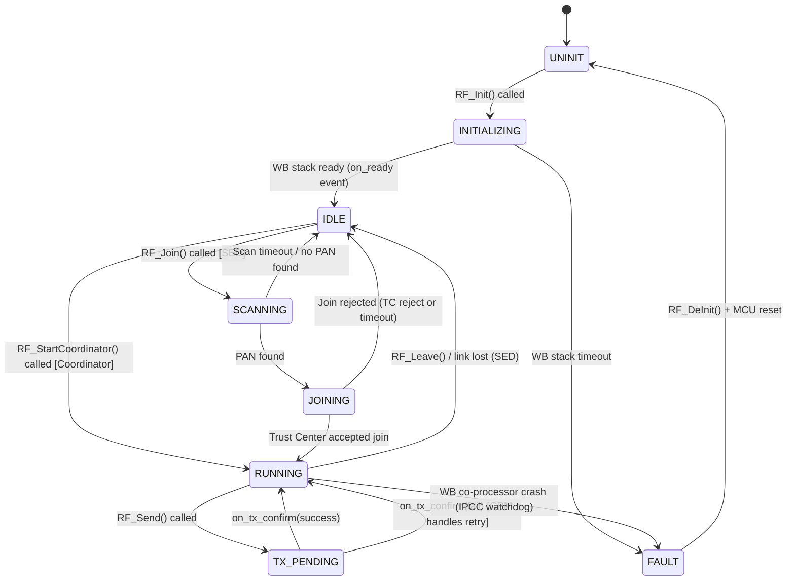

# 5.11 RF Driver API

> **Project:** ParkSense — Full-Stack IoT Parking Occupancy System
> **Date:** 2026-03-21
> **Author:** Arturo Vargas Cuevas
> **↑ Parent:** [[5-firmware-architecture-design]]
> **↑ Upstream:** [[3.1-hardware-selection]] (STM32WB5MMGH6TR), [[5.2-memory-map]], [[5.10-communication-protocol-module]] (caller)
> **↓ Downstream:** [[5.10-communication-protocol-module]], [[5.15-application-design]]

---

## 1. Purpose

The RF Driver is a hardware abstraction layer (HAL) over the STM32WB5MMGH6TR Zigbee radio co-processor. It provides a clean C API to the CPM module (and application) without exposing STM32WB-specific Zigbee stack primitives.

The same driver API is used on both Node and Gateway. The **role** (SED vs. Coordinator) is configured at init time via the `rf_config_t` struct.

---

## 2. Hardware Architecture

```
STM32U585AII6Q (Application processor)
        │
        │  IPCC (Inter-Processor Communication Controller)
        │  + shared SRAM region (Mailbox)
        ▼
STM32WB5MMGH6TR (Zigbee + BLE co-processor)
        │
        │  IEEE 802.15.4 RF (2.4 GHz)
        ▼
    Antenna / Over-the-air
```

The STM32WB runs ST's proprietary Zigbee 3.0 OpenThread firmware. The application processor communicates with it exclusively via:
- **IPCC hardware** (interrupt-based message passing)
- **Shared mailbox SRAM** (defined by ST's Zigbee API)

The RF Driver abstracts this into simple function calls.

---

## 3. Driver Configuration

### 3.1 Role Selection

```c
/* drivers/rf/rf_driver.h */

typedef enum {
    RF_ROLE_END_DEVICE   = 0,   /* Node: Zigbee Sleepy End Device (SED) */
    RF_ROLE_COORDINATOR  = 1,   /* Gateway: Zigbee Coordinator / Trust Center */
} rf_role_t;

typedef struct {
    rf_role_t    role;              /* SED or Coordinator */
    uint16_t     pan_id;            /* PAN ID (set by coordinator; used by SED on join) */
    uint8_t      channel;           /* 802.15.4 channel (11–26); typical: 15 or 20 */
    uint16_t     node_id;           /* Short address (coordinator assigns; SED uses 0xFFFF until joined) */
    uint8_t      install_code[16];  /* [SED only] Install Code for secure join */
    bool         rx_on_when_idle;   /* true = router; false = sleepy end device */
} rf_config_t;
```

### 3.2 Callbacks

All RF events are delivered asynchronously via registered callbacks. Callbacks execute in the IPCC interrupt context — they must be short and non-blocking (set a flag or enqueue; no processing).

```c
/* Called when a data frame is received (any source address) */
typedef void (*rf_rx_cb_t)(const rf_frame_t *frame);

/* Called when a previously sent frame is acknowledged (or failed) */
typedef void (*rf_tx_confirm_cb_t)(bool success, uint8_t seq_num);

/* Called when network join status changes (SED only) */
typedef void (*rf_join_cb_t)(bool joined, uint16_t assigned_short_addr);

/* Called when a new node joins the PAN (Coordinator only) */
typedef void (*rf_node_join_cb_t)(uint64_t eui64, uint16_t short_addr, bool join_ok);
```

---

## 4. Public API

### 4.1 Initialization and Life Cycle

```c
/**
 * @brief Initialize RF driver and Zigbee stack co-processor.
 *        Starts IPCC, loads STM32WB Zigbee firmware (if not pre-loaded),
 *        configures role and channel.
 *        Blocks until STM32WB Zigbee stack is ready (≤ 500 ms).
 * @param config  Pointer to configuration struct
 * @return PS_OK on success
 *         PS_ERR_INIT if WB co-processor does not respond
 *         PS_ERR_PARAM if config is NULL or invalid
 */
ps_status_t RF_Init(const rf_config_t *config);

/**
 * @brief Register event callbacks. Must be called after RF_Init().
 *        Any callback may be NULL if not needed.
 */
void RF_RegisterCallbacks(rf_rx_cb_t        on_rx,
                          rf_tx_confirm_cb_t on_tx_confirm,
                          rf_join_cb_t       on_join,
                          rf_node_join_cb_t  on_node_join);

/**
 * @brief De-initialize RF driver and put STM32WB into low power.
 *        Leaves active PAN (sends Disassociation if joined).
 */
void RF_DeInit(void);
```

### 4.2 Network Management

```c
/**
 * @brief [SED only] Scan for PAN with matching pan_id and initiate join.
 *        Non-blocking. Result delivered via on_join callback.
 *        Uses Install Code for Trust Center authentication.
 * @return PS_OK if scan started
 *         PS_ERR_BUSY if already scanning or joined
 */
ps_status_t RF_Join(void);

/**
 * @brief [SED only] Leave the current PAN.
 *        Sends Disassociation to coordinator. on_join(false, 0) is called.
 * @return PS_OK
 */
ps_status_t RF_Leave(void);

/**
 * @brief [Coordinator only] Start PAN on configured channel and PAN ID.
 *        Non-blocking. Coordinator is ready immediately after return.
 * @return PS_OK on success
 */
ps_status_t RF_StartCoordinator(void);

/**
 * @brief [Coordinator only] Register (EUI-64, Install Code) pair in Trust Center.
 *        Must be called before the target node attempts to join.
 * @param eui64         64-bit device address (from provisioning QR code)
 * @param install_code  16-byte Install Code
 * @return PS_OK | PS_ERR_FULL (TC table full) | PS_ERR_PARAM
 */
ps_status_t RF_TC_RegisterNode(uint64_t eui64, const uint8_t install_code[16]);
```

### 4.3 Data Transmission

```c
/**
 * @brief Send a data frame to a destination node.
 *        Non-blocking. Confirmation delivered via on_tx_confirm callback.
 *        The Zigbee stack handles MAC-layer retries (separate from CPM retries).
 * @param dst_addr  16-bit short address of destination (0x0000 = coordinator)
 * @param data      Payload bytes
 * @param len       Payload length (max 84 bytes — see 5.12 §8.4)
 * @param seq_num   Application sequence number (echoed in on_tx_confirm)
 * @return PS_OK if frame accepted by Zigbee stack
 *         PS_ERR_BUSY if Zigbee stack TX queue is full
 *         PS_ERR_PARAM if len > RF_MAX_PAYLOAD
 */
ps_status_t RF_Send(uint16_t dst_addr,
                    const uint8_t *data, uint16_t len,
                    uint8_t seq_num);

#define RF_MAX_PAYLOAD  84   /* max CPM payload per 802.15.4 frame; see 5.12 §8.4 */
```

### 4.4 Status and Diagnostics

```c
/**
 * @brief Query current network join state (SED) or PAN running state (Coordinator).
 * @return true if network is up and operational
 */
bool RF_IsConnected(void);

/**
 * @brief Query the short address currently assigned to this device.
 *        Returns 0xFFFF if not joined.
 */
uint16_t RF_GetShortAddr(void);

/**
 * @brief Get the RSSI of the last received frame (signed dBm).
 *        Valid only after at least one frame has been received.
 */
int8_t RF_GetLastRSSI(void);

/**
 * @brief Get the LQI (Link Quality Indicator) of the last received frame (0–255).
 */
uint8_t RF_GetLastLQI(void);

/**
 * @brief Get the 64-bit EUI-64 (IEEE MAC address) of this device.
 *        Derived from STM32 UID (unique device identifier) at init.
 */
uint64_t RF_GetEUI64(void);
```

---

## 5. RF Driver Internal State Machine

The RF driver is not directly visible to callers, but understanding its internal states helps with debugging.



---

## 6. Error Codes

| Code | Meaning | Typical Cause |
|------|---------|--------------|
| `RF_OK` | Success | — |
| `RF_ERR_INIT` | WB co-processor init failed | IPCC not responding; WB firmware not loaded |
| `RF_ERR_TIMEOUT` | Operation timeout | WB processing delay > 500 ms |
| `RF_ERR_NACK` | Join rejected by Trust Center | EUI-64 not registered; Install Code mismatch |
| `RF_ERR_BUSY` | TX queue full in WB stack | High traffic; back-pressure |
| `RF_ERR_EMPTY` | RX queue empty | No data available (poll mode, if used) |
| `RF_ERR_JOIN` | Network join failed | No coordinator found on scan |

---

## 7. Usage Example — Node Firmware

```c
/* Initialization sequence in app_node.c */
void App_RF_Init(void) {
    rf_config_t cfg = {
        .role            = RF_ROLE_END_DEVICE,
        .pan_id          = PS_ZIGBEE_PAN_ID,      /* compile-time constant */
        .channel         = PS_ZIGBEE_CHANNEL,
        .node_id         = config.node_id,
        .rx_on_when_idle = false,                  /* Sleepy End Device */
    };
    /* Copy Install Code from CONFIG_FLASH */
    memcpy(cfg.install_code, config.install_code, 16);

    if (RF_Init(&cfg) != PS_OK) {
        App_FaultHandler(FAULT_RF_JOIN);
    }

    /* CPM module registers its own callback internally via RF_RegisterCallbacks */
    CPM_Init(config.node_id);

    /* Start join — non-blocking */
    RF_Join();
    /* App waits for g_rf_joined flag set by CPM's on_join handler */
}
```

## 8. Usage Example — Gateway Firmware

```c
/* Initialization sequence in app_gateway.c */
void App_RF_Init(void) {
    rf_config_t cfg = {
        .role    = RF_ROLE_COORDINATOR,
        .pan_id  = PS_ZIGBEE_PAN_ID,
        .channel = PS_ZIGBEE_CHANNEL,
        .node_id = 0x0000,              /* Coordinator is always 0x0000 */
    };

    if (RF_Init(&cfg) != PS_OK) {
        App_FaultHandler(FAULT_RF_JOIN);
    }

    CPM_Init(0x0000);

    /* Register provisioned nodes (loaded from gateway config DB) */
    for (int i = 0; i < provisioned_count; i++) {
        RF_TC_RegisterNode(provisioned[i].eui64,
                           provisioned[i].install_code);
    }

    RF_StartCoordinator();
}
```
