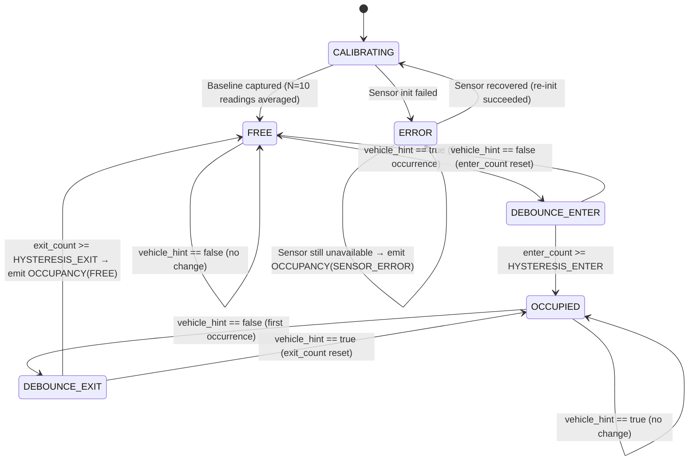

# 5.13 Parking Detection Module (PDM) Design

> **Project:** ParkSense — Full-Stack IoT Parking Occupancy System
> **Date:** 2026-03-21
> **Author:** Arturo Vargas Cuevas
> **↑ Parent:** [[5-firmware-architecture-design]]
> **↑ Upstream:** [[5.14-sensor-drivers-api]] (sensor inputs), [[5.5-data-structures]] (PDM types)
> **↓ Downstream:** [[5.10-communication-protocol-module]] (consumer of PDM state changes), [[5.15-application-design]] (integration)

---

## 1. Purpose

The Parking Detection Module (PDM) is the core intelligence of the IoT Node. It is responsible for:

1. Reading sensor data from ToF and/or Magnetometer drivers
2. Fusing sensor data into a single occupancy decision
3. Applying hysteresis to eliminate false transitions (e.g., a vehicle slowly rolling over the sensor)
4. Managing calibration baseline values
5. Outputting a stable occupancy state to the CPM module for RF transmission

The PDM is entirely target-aware: it adapts its algorithm based on which sensors are compiled in (`PS_SENSOR_TOF`, `PS_SENSOR_MAG`) per the build target (`ps_target_t`).

---

## 2. Design Constraints

| Constraint | Value | Source |
|------------|-------|--------|
| Sensing period | One reading per 30 s wake cycle | RTC alarm drives measure cycle (see [[5.3-execution-model]]) |
| Occupancy state output | `PDM_STATE_FREE` or `PDM_STATE_OCCUPIED` | Binary — no probability output |
| Hysteresis enter count | 3 consecutive wake cycles (90 s) | `PDM_HYSTERESIS_ENTER` |
| Hysteresis exit count | 5 consecutive wake cycles (150 s) | `PDM_HYSTERESIS_EXIT` |
| CPM packet only on state change | Yes | Avoids RF traffic when no change occurs |
| Hardware variant | `NODE_TOF_MAG`, `NODE_TOF_ONLY`, `NODE_MAG_ONLY` | CMake `PS_SENSOR_*` flags |

---

## 3. Sensor Inputs

### 3.1 ToF (VL53L5CX)

The VL53L5CX is an 8×8 zone Time-of-Flight sensor. ParkSense uses it in **1×1 zone mode** (single central zone) to measure the distance to the nearest object directly above the sensor.

| Reading | Meaning |
|---------|---------|
| Distance ≤ `tof_threshold_mm` | Object present (vehicle overhead) → occupancy hint |
| Distance > `tof_threshold_mm` | No object nearby → free hint |
| Distance = 0 or error code | Sensor error → fallback to magnetometer |

`tof_threshold_mm` is stored in `pdm_calibration_t.tof_baseline_mm` and computed during calibration as `empty_distance_mm - TOF_TRIGGER_OFFSET_MM` where `TOF_TRIGGER_OFFSET_MM = 200` (20 cm clearance guard).

### 3.2 Magnetometer (IIS2MDCTR)

The magnetometer detects the disturbance in the Earth's magnetic field caused by a vehicle's ferrous mass.

| Reading | Meaning |
|---------|---------|
| `|delta_xyz| > mag_threshold_mGauss` | Magnetic disturbance → occupancy hint |
| `|delta_xyz| ≤ mag_threshold_mGauss` | Stable field → free hint |

`delta_xyz` is computed against the calibrated baseline (`pdm_calibration_t.mag_baseline_{x,y,z}`):

```c
int32_t delta = abs(data.x_mGauss - cal.mag_baseline_x)
              + abs(data.y_mGauss - cal.mag_baseline_y)
              + abs(data.z_mGauss - cal.mag_baseline_z);
bool disturbed = (delta > MAG_THRESHOLD_MGAUSS);  /* default: 150 mGauss */
```

---

## 4. Sensor Fusion Logic

### 4.1 Target `NODE_TOF_MAG` (Both Sensors)

Two sensors provide independent votes. The fusion is **OR-gated**: the space is considered occupied if **either** sensor reports occupancy. This maximizes sensitivity (fewer missed detections) at the cost of potentially more false positives from sensor noise — managed by the hysteresis filter.

```c
bool vehicle_hint = tof_occupied_hint || mag_occupied_hint;
```

**Rationale for OR:**
- A vehicle parked offset from center may be missed by ToF (which looks straight up) but detected by the magnetometer
- A vehicle with a plastic underbody may be detected by ToF but not magnetometer
- OR fusion ensures neither sensor alone can create a false negative

**Alternative considered:** AND-gate (require both sensors → lower false positives). Rejected because it would increase false negatives in partial coverage scenarios.

### 4.2 Target `NODE_TOF_ONLY`

```c
bool vehicle_hint = tof_occupied_hint;
```

### 4.3 Target `NODE_MAG_ONLY`

```c
bool vehicle_hint = mag_occupied_hint;
```

---

## 5. Hysteresis Filter

Raw `vehicle_hint` changes faster than a parking event truly occurs. A vehicle slowly rolling in may briefly interrupt the ToF beam, and vibration may momentarily disturb the magnetometer. The hysteresis filter requires N consecutive consistent readings before committing to a state transition.

```c
/* pdm_fsm.c */
void PDM_UpdateHysteresis(pdm_fsm_ctx_t *ctx, bool vehicle_hint) {
    if (vehicle_hint) {
        ctx->exit_count  = 0;
        ctx->enter_count = (ctx->enter_count < PDM_HYSTERESIS_ENTER)
                           ? ctx->enter_count + 1
                           : PDM_HYSTERESIS_ENTER;
    } else {
        ctx->enter_count = 0;
        ctx->exit_count  = (ctx->exit_count < PDM_HYSTERESIS_EXIT)
                           ? ctx->exit_count + 1
                           : PDM_HYSTERESIS_EXIT;
    }
}

bool PDM_ShouldEnterOccupied(const pdm_fsm_ctx_t *ctx) {
    return ctx->enter_count >= PDM_HYSTERESIS_ENTER;   /* default: 3 */
}

bool PDM_ShouldExitOccupied(const pdm_fsm_ctx_t *ctx) {
    return ctx->exit_count >= PDM_HYSTERESIS_EXIT;     /* default: 5 */
}
```

With `SLEEP_INTERVAL_S = 30` and `PDM_HYSTERESIS_ENTER = 3`, a state transition requires 3 consecutive wake cycles (90 s) of consistent sensor agreement — slow enough to reject pedestrians, shopping carts, and transient triggers, while remaining responsive to actual parking events. Exit hysteresis (`PDM_HYSTERESIS_EXIT = 5`, 150 s) is higher to prevent flicker from engine vibration stop or temporary gaps.

---

## 6. PDM State Machine



### 6.1 State Transitions with Actions

| From | To | Condition | Action |
|------|----|-----------|--------|
| `CALIBRATING` | `FREE` | Baseline capture complete | Store `pdm_calibration_t` to flash |
| `FREE` | `DEBOUNCE_ENTER` | First `vehicle_hint == true` | Start enter_count |
| `DEBOUNCE_ENTER` | `OCCUPIED` | `enter_count >= 3` | **Emit OCCUPANCY(OCCUPIED) via CPM** |
| `DEBOUNCE_ENTER` | `FREE` | `vehicle_hint == false` | Reset enter_count |
| `OCCUPIED` | `DEBOUNCE_EXIT` | First `vehicle_hint == false` | Start exit_count |
| `DEBOUNCE_EXIT` | `FREE` | `exit_count >= 3` | **Emit OCCUPANCY(FREE) via CPM** |
| `DEBOUNCE_EXIT` | `OCCUPIED` | `vehicle_hint == true` | Reset exit_count |
| Any | `ERROR` | Sensor init or read fails N consecutive times | **Emit OCCUPANCY(SENSOR_ERROR) via CPM** |
| `ERROR` | `CALIBRATING` | Sensor recovery (re-init OK) | Attempt re-calibration |

---

## 7. Calibration Procedure

Calibration captures the "empty space" baseline for both sensors. It must be run when the parking space is empty.

### 7.1 Trigger Conditions

Calibration is triggered:
1. **Factory first boot:** `config.config_crc` fails validation → space is empty at installation time
2. **Manual trigger:** Special CPM command from gateway (Phase 2 enhancement)
3. **After sensor error recovery**

### 7.2 Calibration Algorithm

```c
/* pdm_calibration.c */
ps_status_t PDM_CalibrateBaseline(pdm_calibration_t *cal) {
    int32_t mag_accum_x = 0, mag_accum_y = 0, mag_accum_z = 0;
    int32_t tof_accum   = 0;
    uint8_t valid_samples = 0;

    for (uint8_t i = 0; i < PDM_CALIBRATION_SAMPLES; i++) {  /* N=10 */
        HAL_Delay(SENSOR_POLL_PERIOD_MS);

#if PS_SENSOR_MAG
        mag_data_t mag;
        if (MAG_Read(&mag) == MAG_OK) {
            mag_accum_x += mag.x_mGauss;
            mag_accum_y += mag.y_mGauss;
            mag_accum_z += mag.z_mGauss;
        }
#endif

#if PS_SENSOR_TOF
        uint16_t tof_mm;
        if (TOF_ReadDistance(&tof_mm) == TOF_OK) {
            tof_accum += tof_mm;
        }
#endif
        valid_samples++;
    }

    if (valid_samples < PDM_CALIBRATION_SAMPLES / 2) {
        return PS_ERR_IO;  /* too many bad reads during calibration */
    }

    cal->mag_baseline_x   = (int16_t)(mag_accum_x / valid_samples);
    cal->mag_baseline_y   = (int16_t)(mag_accum_y / valid_samples);
    cal->mag_baseline_z   = (int16_t)(mag_accum_z / valid_samples);
    cal->tof_baseline_mm  = (uint16_t)(tof_accum / valid_samples);
    cal->config_crc       = HAL_CRC_Calculate(&hcrc, (uint32_t *)cal,
                                               (sizeof(*cal) - 4) / 4);
    return PS_OK;
}
```

Calibration results are written to `CONFIG_FLASH` by the BSP layer and cached in SRAM2 `.retained` section.

---

## 8. Error Handling

| Error Scenario | Recovery | PDM Output |
|----------------|----------|-----------|
| ToF init failure | Retry 3× at 1 s; if `NODE_TOF_MAG`, switch to MAG_ONLY mode | Continue if MAG OK |
| ToF read timeout (single) | Skip reading this cycle; use last known hint | No state change |
| ToF read timeout (5 consecutive) | Log `FAULT_TOF_TIMEOUT`; treat as if sensor absent | Switch to mag-only |
| Mag init failure | Retry 3×; if `NODE_TOF_MAG`, switch to TOF_ONLY mode | Continue if ToF OK |
| Mag read error (single) | Skip reading; use last known hint | No state change |
| Both sensors failed | Log `FAULT_TOF_INIT + FAULT_MAG_INIT`; enter PDM_ERROR state | Emit `CPM_OCC_ERROR` |
| Calibration CRC invalid on boot | Re-run calibration (space must be empty) | Enter CALIBRATING |

---

## 9. Public API (`pdm/pdm.h`)

```c
#ifndef PDM_H
#define PDM_H

#include "ps_types.h"
#include "pdm_types.h"

/**
 * @brief Initialize PDM. Reads calibration from flash, inits sensors.
 *        If calibration invalid, starts calibration sequence automatically.
 * @return PS_OK | PS_ERR_INIT (sensors not available)
 */
ps_status_t PDM_Init(void);

/**
 * @brief Run one PDM cycle: poll sensors, update FSM, emit CPM packet if state changed.
 *        Must be called by application scheduler every SENSOR_POLL_PERIOD_MS.
 */
void PDM_Tick(void);

/**
 * @brief Get current stable occupancy state (after hysteresis).
 */
pdm_state_t PDM_GetState(void);

/**
 * @brief Force re-calibration. Blocks until calibration complete (~1 s).
 *        Space must be empty when called.
 * @return PS_OK | PS_ERR_IO (sensor error during calibration)
 */
ps_status_t PDM_Recalibrate(void);

/**
 * @brief Register callback invoked on every stable state transition
 *        (FREE→OCCUPIED or OCCUPIED→FREE or →ERROR).
 *        Called from PDM_Tick() context (main loop, not ISR).
 */
typedef void (*pdm_state_cb_t)(pdm_state_t new_state);
void PDM_RegisterStateCallback(pdm_state_cb_t cb);

/**
 * @brief Return sensor health bitmask (bit0=ToF OK, bit1=Mag OK).
 *        Used by CPM heartbeat builder.
 */
uint8_t PDM_GetSensorStatus(void);

/**
 * @brief Return number of sensor errors since last reset (saturating at 255).
 */
uint8_t PDM_GetFaultCount(void);

#endif /* PDM_H */
```

---

## 10. Configuration Constants

| Constant | Default | Description |
|----------|---------|-------------|
| `PDM_HYSTERESIS_ENTER` | 3 | Consecutive wake cycles (90 s) to transition FREE→OCCUPIED |
| `PDM_HYSTERESIS_EXIT` | 5 | Consecutive wake cycles (150 s) to transition OCCUPIED→FREE |
| `PDM_CALIBRATION_SAMPLES` | 10 | Readings averaged for baseline calibration (at 100 ms intervals during calibration only) |
| `TOF_TRIGGER_OFFSET_MM` | 200 | Clearance margin below empty-space baseline (20 cm) |
| `MAG_THRESHOLD_MGAUSS` | 150 | Magnetic disturbance threshold for vehicle detection (mGauss) |
| `PDM_SENSOR_RETRY_MAX` | 3 | Times to retry sensor init before declaring failure |
| `PDM_CONSECUTIVE_ERROR_LIMIT` | 5 | Consecutive read errors before entering ERROR state |
