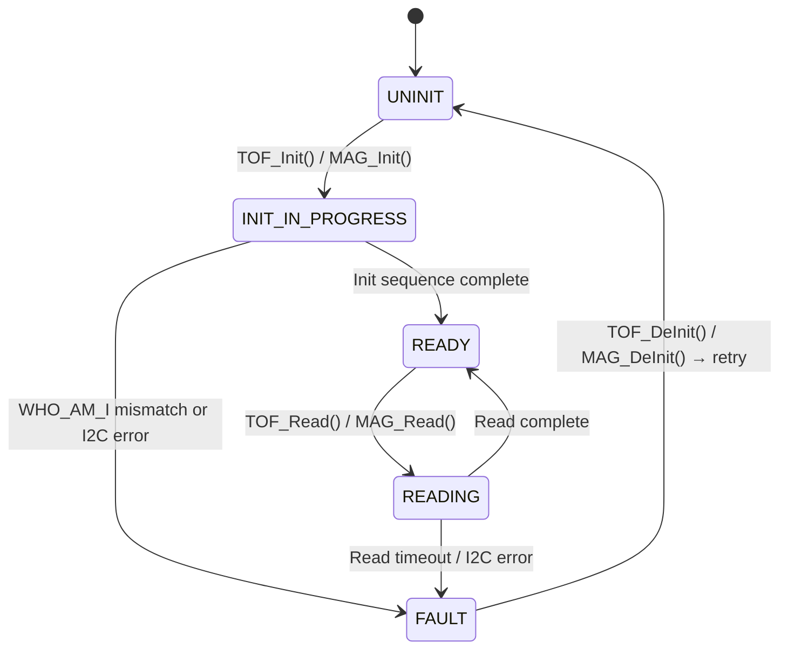

# 5.14 Sensor Drivers API Design

> **Project:** ParkSense — Full-Stack IoT Parking Occupancy System
> **Date:** 2026-03-21
> **Author:** Arturo Vargas Cuevas
> **↑ Parent:** [[5-firmware-architecture-design]]
> **↑ Upstream:** [[3.1-hardware-selection]] (sensor selection), [[5.2-memory-map]] (I2C peripherals)
> **↓ Downstream:** [[5.13-parking-detection-design]] (consumer), [[5.15-application-design]] (init sequence)

---

## 1. Purpose

This document defines the hardware abstraction layer (HAL) C APIs for the two parking detection sensors. The APIs are designed so that the Parking Detection Module ([[5.13-parking-detection-design]]) interacts only with these driver interfaces — never with vendor SDK internals directly.

Both drivers are **conditionally compiled** based on build target:

```cmake
# CMake — node sensor configuration
target_compile_definitions(firmware_node_tof_mag  PRIVATE PS_SENSOR_TOF=1 PS_SENSOR_MAG=1)
target_compile_definitions(firmware_node_tof_only  PRIVATE PS_SENSOR_TOF=1 PS_SENSOR_MAG=0)
target_compile_definitions(firmware_node_mag_only  PRIVATE PS_SENSOR_TOF=0 PS_SENSOR_MAG=1)
```

---

## 2. Hardware Connections

### 2.1 VL53L5CX — Time-of-Flight Sensor

| Signal | STM32U585 Pin | Peripheral | Notes |
|--------|--------------|-----------|-------|
| SDA | PB9 | I2C1_SDA | 400 kHz Fast-mode |
| SCL | PB8 | I2C1_SCL | 400 kHz |
| LPn (Low Power) | PB14 | GPIO output | Active low; pull high to enable |
| INT | PB13 | EXTI13 | Active low interrupt on data ready |
| PWREN | — | Via LPn | No separate power enable pin on module |
| I2C Address | 0x52 (8-bit) / 0x29 (7-bit) | — | Default; configurable via I²C command |

**Vendor SDK:** `vl53l5cx_api.h` (ST VL53L5CX ULD driver, platform-specific I2C and delay functions provided in `platform.c`).

### 2.2 IIS2MDCTR — Magnetometer

| Signal | STM32U585 Pin | Peripheral | Notes |
|--------|--------------|-----------|-------|
| SDA | PB9 | I2C1_SDA | Shared I2C bus with VL53L5CX |
| SCL | PB8 | I2C1_SCL | 400 kHz |
| DRDY | PB12 | EXTI12 | Data Ready interrupt |
| I2C Address | 0x3C (8-bit) / 0x1E (7-bit) | — | Fixed; no pin to change |

**Vendor SDK:** ST IIS2MDCTR driver from STM32CubeU5 pack (`iis2mdctr_reg.h`, `iis2mdctr_reg.c`).

---

## 3. ToF Driver API (`drivers/tof/tof_driver.h`)

### 3.1 Initialization

```c
/**
 * @brief Initialize the VL53L5CX sensor.
 *        - Enables LPn GPIO (powers on sensor)
 *        - Runs VL53L5CX firmware upload via I2C (~100 ms)
 *        - Configures 1×1 zone mode (single ranging zone)
 *        - Sets ranging period to SENSOR_POLL_PERIOD_MS
 *        - Starts continuous ranging
 * @return TOF_OK on success
 *         TOF_ERR_INIT if sensor not found (I2C NACK)
 *         TOF_ERR_TIMEOUT if firmware upload times out (> 5 s)
 */
tof_err_t TOF_Init(void);

/**
 * @brief De-initialize and power off the sensor (LPn low).
 *        Stops ranging, disables EXTI interrupt.
 */
void TOF_DeInit(void);
```

### 3.2 Reading

```c
/**
 * @brief Read occupancy distance from the latest ranging result.
 *        Should be called after the data-ready interrupt fires, or polled.
 *        Returns the minimum distance across all valid zones (1×1 mode: 1 zone).
 * @param distance_mm  Output: distance to nearest target in mm
 *                     Returns 0 if no target detected within max range
 * @return TOF_OK on success
 *         TOF_ERR_TIMEOUT if no new data available (sensor polled too fast)
 *         TOF_ERR_INVALID if sensor reports invalid result (bad sigma)
 */
tof_err_t TOF_ReadDistance(uint16_t *distance_mm);

/**
 * @brief Higher-level: return occupancy status based on distance vs. threshold.
 *        Threshold = calibrated baseline minus TOF_TRIGGER_OFFSET_MM.
 * @param threshold_mm  The trigger threshold (from pdm_calibration_t)
 * @param status        Output: TOF_FREE | TOF_OCCUPIED | TOF_INVALID
 * @return TOF_OK | TOF_ERR_TIMEOUT | TOF_ERR_INVALID
 */
tof_err_t TOF_GetOccupancyStatus(uint16_t threshold_mm, tof_status_t *status);

/**
 * @brief Read raw ranging results from vendor SDK (full VL53L5CX_ResultsData).
 *        Used only by calibration routines that need unprocessed data.
 * @param results  Pointer to a VL53L5CX_ResultsData struct (caller-allocated)
 * @return TOF_OK | TOF_ERR_TIMEOUT
 */
tof_err_t TOF_ReadRaw(VL53L5CX_ResultsData *results);
```

### 3.3 Data Ready Interrupt

```c
/**
 * @brief Register callback invoked from EXTI13 ISR when data-ready fires.
 *        Callback runs in ISR context — must be minimal (set a flag only).
 *        If NULL, driver operates in polling mode (PDM calls TOF_ReadDistance periodically).
 */
typedef void (*tof_data_ready_cb_t)(void);
void TOF_RegisterDataReadyCallback(tof_data_ready_cb_t cb);
```

**ParkSense usage:** Polling mode (callback = NULL). The PDM_Tick() runs every 100 ms and calls `TOF_ReadDistance()` directly. The `TOF_DRDY` interrupt is not used, simplifying the execution model.

### 3.4 Diagnostics

```c
/** @return true if sensor initialized and responding */
bool TOF_IsReady(void);

/**
 * @brief Perform a self-test (vendor SDK provided).
 *        Takes ~500 ms. Only call during init or recovery, not in main loop.
 * @return TOF_OK | TOF_ERR_INIT
 */
tof_err_t TOF_SelfTest(void);
```

### 3.5 Configuration Constants

```c
/* tof_driver.h */
#define TOF_I2C_ADDR_7BIT       0x29
#define TOF_MAX_RANGE_MM        4000    /* VL53L5CX max ranging distance (4 m) */
#define TOF_MIN_RANGE_MM        20      /* Minimum valid distance (2 cm) */
#define TOF_RANGING_TIME_MS     100     /* Ranging period = poll period */
#define TOF_TRIGGER_OFFSET_MM   200     /* 20 cm clearance below baseline */
#define TOF_SIGMA_LIMIT_PCT     10      /* Max measurement sigma % for valid reading */
```

---

## 4. Magnetometer Driver API (`drivers/mag/mag_driver.h`)

### 4.1 Initialization

```c
/**
 * @brief Initialize the IIS2MDCTR magnetometer.
 *        - Detects sensor on I2C (WHO_AM_I register = 0x40)
 *        - Sets Output Data Rate to 10 Hz (ODR_10Hz)
 *        - Enables temperature compensation
 *        - Enables continuous measurement mode
 *        - Arms DRDY interrupt (optional, see §4.3)
 * @return MAG_OK on success
 *         MAG_ERR_INIT if WHO_AM_I mismatch (sensor not present)
 *         MAG_ERR_IO if I2C communication fails
 */
mag_err_t MAG_Init(void);

/**
 * @brief De-initialize and put magnetometer in power-down mode.
 */
void MAG_DeInit(void);
```

### 4.2 Reading

```c
/**
 * @brief Read latest XYZ magnetic field values.
 *        Blocks until data ready (polls STATUS_REG) with 200 ms timeout.
 * @param data  Output: X, Y, Z in mGauss (int16_t each)
 * @return MAG_OK | MAG_ERR_IO | MAG_ERR_TIMEOUT
 */
mag_err_t MAG_Read(mag_data_t *data);

/**
 * @brief Higher-level: compute disturbance from baseline and return status.
 * @param baseline   Calibrated baseline (from pdm_calibration_t)
 * @param threshold  Disturbance threshold in mGauss (MAG_THRESHOLD_MGAUSS)
 * @param status     Output: MAG_CLEAR | MAG_DISTURBED | MAG_ERROR
 * @return MAG_OK | MAG_ERR_IO
 */
mag_err_t MAG_GetOccupancyStatus(const mag_data_t *baseline,
                                  uint16_t threshold_mGauss,
                                  mag_status_t *status);
```

### 4.3 Interrupt (Optional)

```c
/**
 * @brief Register data-ready callback (EXTI12, from DRDY pin).
 *        ISR context — set flag only.
 *        If NULL, driver uses polled mode (MAG_Read() polls STATUS_REG).
 */
typedef void (*mag_data_ready_cb_t)(void);
void MAG_RegisterDataReadyCallback(mag_data_ready_cb_t cb);
```

**ParkSense usage:** Polled mode only (callback = NULL). Matches the 100 ms tick of PDM_Tick().

### 4.4 Diagnostics

```c
/** @return true if sensor initialized and responding */
bool MAG_IsReady(void);

/**
 * @brief Read raw registers for diagnostics (returns STATUS_REG, OUTX, OUTY, OUTZ).
 *        Used during calibration and factory test only.
 */
mag_err_t MAG_ReadRaw(uint8_t *reg_status, mag_data_t *data);
```

### 4.5 Configuration Constants

```c
/* mag_driver.h */
#define MAG_I2C_ADDR_7BIT       0x1E
#define MAG_WHO_AM_I_VAL        0x40    /* IIS2MDCTR WHO_AM_I value */
#define MAG_ODR_HZ              10      /* Output Data Rate: 10 Hz */
#define MAG_THRESHOLD_MGAUSS    150     /* Default disturbance threshold */
#define MAG_READ_TIMEOUT_MS     200     /* Max wait for data-ready during polled read */
```

---

## 5. Shared I2C Bus Arbitration

Both sensors share I2C1. The driver layer manages bus access:

- All I2C operations are **blocking** (HAL_I2C_Mem_Read/Write with timeout)
- No concurrent access occurs — PDM_Tick() calls ToF, then Mag, sequentially
- I2C bus timeout = 100 ms per transaction; failure triggers `PS_ERR_IO` and sensor error logic
- If I2C bus becomes stuck (SDA held low), BSP recovery: toggle SCL 9× then STOP condition (implemented in `bsp_i2c_recover()`)

---

## 6. Driver Internal State Machines

Both drivers have a minimal internal state to track initialization:



---

## 7. Vendor SDK Integration Notes

### 7.1 VL53L5CX Platform Adaptation

The VL53L5CX ULD driver requires a platform file (`platform.c`) implementing:

```c
uint8_t RdMulti(VL53L5CX_Platform *p, uint16_t reg, uint8_t *buf, uint32_t len);
uint8_t WrMulti(VL53L5CX_Platform *p, uint16_t reg, uint8_t *buf, uint32_t len);
uint8_t Reset_Sensor(VL53L5CX_Platform *p);
void    SwapBuffer(uint8_t *buf, uint16_t n);
uint8_t WaitMs(VL53L5CX_Platform *p, uint32_t ms);
```

These are implemented in `drivers/tof/platform.c` using STM32CubeU5 HAL I2C functions.

### 7.2 IIS2MDCTR Platform Adaptation

The IIS2MDCTR driver requires:

```c
int32_t platform_write(void *handle, uint8_t reg, const uint8_t *buf, uint16_t len);
int32_t platform_read(void *handle, uint8_t reg, uint8_t *buf, uint16_t len);
```

Implemented in `drivers/mag/mag_platform.c` using HAL_I2C_Mem_Write/Read.

---

## 8. Summary: PDM ↔ Sensor Driver Call Map

```
PDM_Tick() [every 100 ms]
  ├── (if PS_SENSOR_TOF)  TOF_GetOccupancyStatus(threshold, &tof_status)
  │       └── TOF_ReadDistance() → VL53L5CX ULD → I2C → sensor
  │
  ├── (if PS_SENSOR_MAG)  MAG_GetOccupancyStatus(baseline, threshold, &mag_status)
  │       └── MAG_Read() → IIS2MDCTR SDK → I2C → sensor
  │
  └── PDM_FuseAndUpdate(tof_status, mag_status) → state machine → CPM_SendOccupancy()

PDM_Init()
  ├── TOF_Init() (if PS_SENSOR_TOF)
  ├── MAG_Init() (if PS_SENSOR_MAG)
  └── PDM_CalibrateBaseline() (if CONFIG_FLASH invalid)
```
