# 5.15 Application Design

> **Project:** ParkSense — Full-Stack IoT Parking Occupancy System
> **Date:** 2026-03-21
> **Author:** Arturo Vargas Cuevas
> **↑ Parent:** [[5-firmware-architecture-design]]
> **↑ Parent:** [[5-firmware-architecture-design]]
> **↑ Upstream:** All 5.x module design documents
> **↓ Downstream:** [[5.16-server-design]] (receives data from gateway app)

---

## 1. Purpose

This document describes the top-level application structure for both ParkSense targets. It answers:
- What order are modules initialized?
- What does the main loop do?
- How do modules call each other?
- What tasks run on what period?

The source entry point is `app_node.c` (Node) and `app_gateway.c` (Gateway). Both follow the same cooperative super-loop pattern (see [[5.3-execution-model]]).

---

## 2. Module Dependency Graph

```
                    ┌─────────────────────┐
                    │   app_node.c /       │
                    │   app_gateway.c      │
                    └──────────┬──────────┘
                               │ calls
          ┌────────────────────┼────────────────────┐
          ▼                    ▼                    ▼
   ┌─────────────┐    ┌──────────────┐    ┌──────────────────┐
   │  pdm.c      │    │  cpm.c       │    │  app_fault.c     │
   │ (Node only) │    │ (Node + GW)  │    │ (Node + GW)      │
   └──────┬──────┘    └──────┬───────┘    └──────────────────┘
          │                  │
    ┌─────┴──────┐     ┌─────┴──────────────────────┐
    ▼            ▼     ▼                             ▼
┌───────┐  ┌────────┐ ┌─────────────┐   ┌─────────────────────┐
│tof_   │  │mag_    │ │ rf_driver.c │   │ cpm_server.c (GW)   │
│driver │  │driver  │ │ (Node + GW) │   │ wifi_driver.c (GW)  │
└───────┘  └────────┘ └─────────────┘   └─────────────────────┘
    │            │           │
    └────────────┘           │
       I2C1 hardware     IPCC/STM32WB
```

---

## 3. Node Application (`app_node.c`)

### 3.1 Initialization Sequence

```c
int main(void) {
    /* 1. Hardware initialization (CMSIS / HAL) */
    HAL_Init();
    SystemClock_Config();       /* 160 MHz PLL */
    MX_GPIO_Init();
    MX_I2C1_Init();
    MX_CRC_Init();
    MX_HASH_Init();             /* used by OTA verify */
    MX_IWDG_Init();             /* 4 s watchdog */

    /* 2. BSP: load config from CONFIG_FLASH */
    ps_status_t s = BSP_LoadConfig(&g_config);
    if (s != PS_OK) {
        App_FaultHandler(FAULT_CONFIG_CRC);  /* halt or reset */
    }

    /* 3. Fault log */
    FaultLog_Init();

    /* 4. Parking Detection Module */
    s = PDM_Init();
    if (s != PS_OK) {
        /* Sensor init failed — continue if at least one sensor OK,
           otherwise log fault and enter degraded mode */
        FaultLog_Write(FAULT_TOF_INIT);
    }

    /* 5. RF Driver */
    rf_config_t rf_cfg = {
        .role            = RF_ROLE_END_DEVICE,
        .pan_id          = PS_ZIGBEE_PAN_ID,
        .channel         = PS_ZIGBEE_CHANNEL,
        .node_id         = g_config.node_id,
        .rx_on_when_idle = false,
    };
    memcpy(rf_cfg.install_code, g_config.install_code, 16);
    s = RF_Init(&rf_cfg);
    if (s != PS_OK) { FaultLog_Write(FAULT_RF_JOIN); }

    /* 6. Communication Protocol Module */
    CPM_Init(g_config.node_id);
    PDM_RegisterStateCallback(App_OnOccupancyChange);

    /* 7. Start Zigbee join (non-blocking) */
    RF_Join();

    /* 8. Scheduler setup (sub-tasks only — CPM retransmit, fault flush) */
    App_SchedulerInit();

    /* 9. Super loop — RTC alarm-driven measure cycle */
    while (1) {
        HAL_IWDG_Refresh(&hiwdg);

        if (g_rtc_alarm_flag) {
            g_rtc_alarm_flag = false;
            App_MeasureCycle();             /* sensor read → PDM → CPM TX → wait ACK */
            App_EnterStop2(SLEEP_INTERVAL_S);  /* RTC alarm in 30 s → next wake */
        }

        SCHED_Run();  /* drives CPM_Tick, heartbeat, fault flush during active phase */
    }
}
```

### 3.2 RTC-Driven Measure Cycle

The main sensing cycle is **not** driven by the tick-based scheduler. `SysTick` is frozen during Stop 2, so `HAL_GetTick()` does not increment during the 30 s sleep. Instead, the RTC alarm ISR sets `g_rtc_alarm_flag`, and the super loop calls `App_MeasureCycle()` directly.

```c
void App_MeasureCycle(void) {
    /* 1. Wake sensors */
    TOF_Wake();
    MAG_Wake();

    /* 2. Read sensors (single reading per wake cycle) */
    tof_data_t tof;
    mag_data_t mag;
    TOF_Start();
    TOF_GetResults(&tof);       /* ~35 ms: ranging + I2C burst */
    MAG_Read(&mag);             /* ~1 ms: 6-byte I2C read */

    /* 3. PDM update — single call per wake cycle.
     *    Hysteresis counts across wake cycles (N_ENTER=3 = 90 s, M_EXIT=5 = 150 s).
     *    If state changes, PDM calls App_OnOccupancyChange() via registered callback. */
    PDM_Update(&tof, &mag);

    /* 4. If CPM has a pending TX (from occupancy change or heartbeat),
     *    run CPM_Tick in a polling loop until TX+ACK completes or times out */
    uint32_t deadline = HAL_GetTick() + CPM_TX_DEADLINE_MS;  /* ~3 s max */
    while (!CPM_IsIdle() && (HAL_GetTick() < deadline)) {
        CPM_Tick();
        HAL_IWDG_Refresh(&hiwdg);
    }

    /* 5. Sleep sensors + RF */
    TOF_Sleep();
    MAG_Sleep();
    RF_Sleep();
}
```

### 3.3 Scheduler Task Table (Node — Sub-Tasks Only)

The scheduler handles only tasks that run during the brief active phase (~60 ms). The main measure cycle is RTC-driven, not scheduler-driven.

| Task | Period | Function | Notes |
|------|--------|----------|-------|
| Heartbeat TX | 60 000 ms | `App_SendHeartbeat()` | Enqueues heartbeat to CPM queue; TX happens in measure cycle |
| Fault log flush | 5 000 ms | `FaultLog_Flush()` | Writes staged fault record to FAULT_FLASH |
| RF join watchdog | 30 000 ms | `App_CheckJoinStatus()` | Checks Zigbee join state; retries if disconnected |

> **Note:** `PDM_Tick()` and `CPM_Tick()` are **not** in the scheduler. PDM runs once per wake in `App_MeasureCycle()`. CPM runs in a polling loop within `App_MeasureCycle()` until TX completes.

> **Note:** Scheduler period timers are approximate on the node because `HAL_GetTick()` does not increment during Stop 2 sleep. Heartbeat and join watchdog fire on the first wake cycle after their period elapses. For a 30 s sleep and 60 s heartbeat period, the heartbeat fires every other wake cycle — which is correct behavior.

```c
void App_SchedulerInit(void) {
    SCHED_Register(App_SendHeartbeat,  60000);
    SCHED_Register(FaultLog_Flush,      5000);
    SCHED_Register(App_CheckJoinStatus, 30000);
}
```

### 3.4 Occupancy Change Callback → CPM Send

```c
/* Called from PDM_Update() on stable state transition */
void App_OnOccupancyChange(pdm_state_t new_state) {
    uint8_t occ;
    switch (new_state) {
        case PDM_STATE_OCCUPIED: occ = CPM_OCC_OCCUPIED; break;
        case PDM_STATE_FREE:     occ = CPM_OCC_FREE;     break;
        default:                 occ = CPM_OCC_ERROR;    break;
    }
    CPM_SendOccupancy(g_config.space_id, occ);
    /* CPM TX happens in the polling loop inside App_MeasureCycle() */
}
```

### 3.5 Heartbeat Task

```c
void App_SendHeartbeat(void) {
    CPM_SendHeartbeat(
        HAL_GetTick() / 1000,           /* uptime_sec */
        PDM_GetSensorStatus(),           /* bit0=ToF OK, bit1=Mag OK */
        PDM_GetFaultCount()              /* faults since reset */
    );
}
```

### 3.6 Node Application State Machine

```mermaid
stateDiagram-v2
    [*] --> BOOTING

    BOOTING --> CALIBRATING : Sensors OK; config loaded
    BOOTING --> DEGRADED : Sensor init failed (partial)
    BOOTING --> FAULT_HALT : Both sensors failed AND config invalid

    CALIBRATING --> JOINING : Calibration complete (or loaded from flash)
    CALIBRATING --> JOINING : Skip calibration (valid cal in flash)

    JOINING --> RUNNING : RF_Join succeeded (on_join callback: joined=true)
    JOINING --> JOINING : Retry after 30 s (join watchdog)

    RUNNING --> RUNNING : Normal operation (PDM_Tick → CPM_Tick)
    RUNNING --> JOINING : Link lost (gateway silent > 2× heartbeat period)
    RUNNING --> DEGRADED : Sensor error during operation

    DEGRADED --> RUNNING : Sensor recovered
    DEGRADED --> FAULT_HALT : Degraded for > 5 minutes (all sensors failed)

    FAULT_HALT --> [*] : IWDG reset (if fault_count < 3) → BOOTING
```



---

## 4. Gateway Application (`app_gateway.c`)

### 4.1 Initialization Sequence

```c
int main(void) {
    /* 1. Hardware init */
    HAL_Init();
    SystemClock_Config();
    MX_GPIO_Init();
    MX_UART_Init();         /* debug UART (disabled in PRODUCTION) */
    MX_SPI1_Init();         /* EMW3080B WiFi module */
    MX_CRC_Init();
    MX_IWDG_Init();

    /* 2. BSP config load */
    BSP_LoadConfig(&g_gw_config);

    /* 3. Fault log */
    FaultLog_Init();

    /* 4. WiFi driver */
    wifi_config_t wifi_cfg;
    /* WiFi SSID/PSK loaded from SRAM3_S (Secure World) by BSP */
    BSP_GetWifiCredentials(wifi_cfg.ssid, wifi_cfg.password);
    WIFI_Init(&wifi_cfg);
    /* WiFi connect is async — WIFI_Tick() drives connection state machine */

    /* 5. RF Driver (Coordinator) */
    rf_config_t rf_cfg = {
        .role    = RF_ROLE_COORDINATOR,
        .pan_id  = PS_ZIGBEE_PAN_ID,
        .channel = PS_ZIGBEE_CHANNEL,
        .node_id = 0x0000,
    };
    RF_Init(&rf_cfg);
    RF_StartCoordinator();

    /* 6. Load provisioned node list from gateway DB */
    GW_DB_Load(&g_node_registry);
    for (int i = 0; i < g_node_registry.count; i++) {
        RF_TC_RegisterNode(g_node_registry.nodes[i].eui64,
                           g_node_registry.nodes[i].install_code);
    }

    /* 7. CPM module (Gateway mode has server forwarding) */
    CPM_Init(0x0000);
    CPM_RegisterOccupancyCallback(App_OnOccupancyReceived);
    CPM_RegisterHeartbeatCallback(App_OnHeartbeatReceived);

    /* 8. Scheduler */
    App_GW_SchedulerInit();

    /* 9. Super loop */
    while (1) {
        HAL_IWDG_Refresh(&hiwdg);
        SCHED_Run();
    }
}
```

### 4.2 Scheduler Task Table (Gateway)

| Task | Period | Function | Priority |
|------|--------|----------|---------|
| CPM tick (retransmit + server TX) | 10 ms | `CPM_Tick()` | Highest |
| WiFi tick (connection state machine) | 100 ms | `WIFI_Tick()` | High |
| Node heartbeat watchdog | 10 000 ms | `App_CheckNodeHeartbeats()` | Normal |
| Fault log flush | 5 000 ms | `FaultLog_Flush()` | Low |
| NTP sync (via WiFi) | 3 600 000 ms (1 hr) | `App_SyncNTP()` | Low |

### 4.3 Occupancy Receive Flow

```c
/* Called from CPM_OnRxFrame() — main loop context (not ISR) */
void App_OnOccupancyReceived(const cpm_packet_t *pkt, int8_t rssi) {
    /* 1. Stamp timestamp from gateway NTP clock */
    cpm_packet_t stamped = *pkt;
    stamped.timestamp    = App_GetNTPTime();

    /* 2. Update local space state table */
    GW_SpaceTable_Update(pkt->space_id, pkt->occupancy);

    /* 3. Update node "last seen" timestamp in registry */
    GW_DB_UpdateNodeLastSeen(pkt->node_id, stamped.timestamp, rssi);

    /* 4. Log (debug UART in DEV/RELEASE builds only) */
    LOG_INFO("OCC: node=%04X space=%d occ=%d rssi=%d",
             pkt->node_id, pkt->space_id, pkt->occupancy, rssi);

    /* CPM module automatically:
       - Sends L2 ACK back to node
       - Enqueues to server_tx_queue for HTTPS forwarding */
}
```

### 4.4 Gateway Space State Table

The Gateway maintains a RAM table of the last known state of each registered parking space:

```c
/* app_gateway.h */
#define GW_MAX_SPACES  256

typedef struct {
    uint16_t space_id;
    uint8_t  occupancy;         /* CPM_OCC_FREE | CPM_OCC_OCCUPIED | CPM_OCC_ERROR */
    uint16_t node_id;           /* which node reports this space */
    uint32_t last_update;       /* Unix timestamp of last CPM packet */
    int8_t   last_rssi;
    bool     active;            /* false = space not provisioned */
} gw_space_entry_t;

typedef struct {
    gw_space_entry_t spaces[GW_MAX_SPACES];
    uint8_t          count;
} gw_space_table_t;
```

This table is the source of truth for the gateway. When the server requests current state (Phase 2 polling endpoint), the gateway sends the full table. For Phase 1, the table is only forwarded event-by-event as CPM OCCUPANCY packets arrive.

---

## 5. Inter-Module Call Graph (Full System)

```
NODE FIRMWARE                          GATEWAY FIRMWARE
─────────────────────────────────────  ────────────────────────────────────────
PDM_Tick() [100 ms]                    CPM_Tick() [10 ms]
  ├─ TOF_GetOccupancyStatus()            ├─ RF_Send() (L2 ACK to node)
  ├─ MAG_GetOccupancyStatus()            ├─ cpm_server_tx_queue dequeue
  ├─ PDM_FuseAndUpdate()                 │   └─ WIFI_HTTPSPost() → server :8443
  │   └─ pdm_state_cb (if state change)  └─ (retransmit not needed on GW TX)
  │       └─ App_OnOccupancyChange()
  │           └─ CPM_SendOccupancy()     WIFI_Tick() [100 ms]
  │               → enqueue to TX queue    ├─ wifi_fsm state machine
  │                                        └─ TLS reconnect if dropped
CPM_Tick() [10 ms]
  ├─ TX queue: dequeue + RF_Send()       CPM_OnRxFrame() [ISR → deferred]
  ├─ ACK timeout check                     ├─ CRC-16 validate
  └─ backoff timer                         ├─ decode msg_type
                                           ├─ App_OnOccupancyReceived()
RF_Driver (IPCC interrupt)                 │   ├─ GW_SpaceTable_Update()
  └─ CPM_OnRxFrame(frame) [ACK]           │   └─ server_tx_queue enqueue
      └─ clear retransmit context         └─ RF_Send() (L2 ACK)
```

---

## 6. Cooperative Scheduler Implementation

Both Node and Gateway share the same scheduler (`app/app_scheduler.c`):

```c
/* app_scheduler.c */
void SCHED_Run(void) {
    uint32_t now = HAL_GetTick();
    for (uint8_t i = 0; i < g_sched.count; i++) {
        sched_task_t *t = &g_sched.tasks[i];
        if (t->enabled && (now - t->last_tick) >= t->period_ms) {
            t->last_tick = now;
            t->fn();
        }
    }
}
```

**Properties:**
- No preemption — each task runs to completion before the next
- Tasks must not block for more than their own period (violations logged as `FAULT_SCHED_OVERRUN` in Phase 2)
- IWDG refresh happens at the top of the while(1) — even if a task is slow, the watchdog resets the system if any task blocks for > 4 s

---

## 7. Error and Fault Propagation

All modules report faults through a unified path:

```
Sensor error / RF error / TX failure
  → FaultLog_Write(fault_code_t)    ← writes fault_record_t to FAULT_FLASH
  → App_FaultHandler(fault_code_t)  ← decides: retry / degrade / halt
      ├── Recoverable: log + continue
      ├── Retryable: log + re-init module
      └── Fatal: log + IWDG reset (if fault_count < 3) or HALT
```

Fatal fault → HALT path:
```c
void App_FaultHandler(fault_code_t code) {
    FaultLog_Write(code);
    uint8_t fault_count = FaultLog_IncrementBootCount();
    if (fault_count < 3) {
        /* Force IWDG reset — will retry from bootloader */
        while (1) {}    /* IWDG fires in 4 s */
    } else {
        /* Terminal: blink LED pattern and halt */
        App_ErrorBlink(code);
        while (1) { HAL_IWDG_Refresh(&hiwdg); }  /* Never reset again; wait for factory */
    }
}
```
